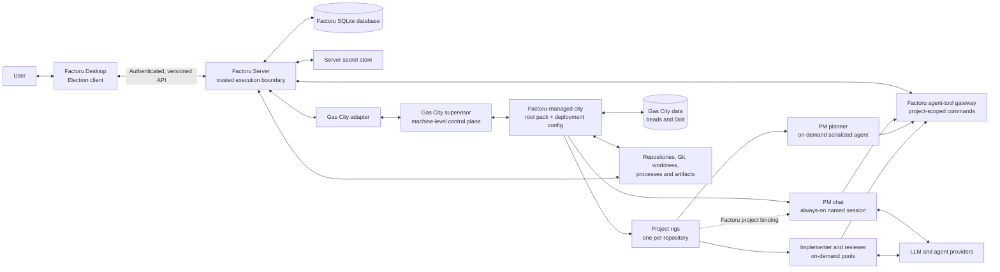
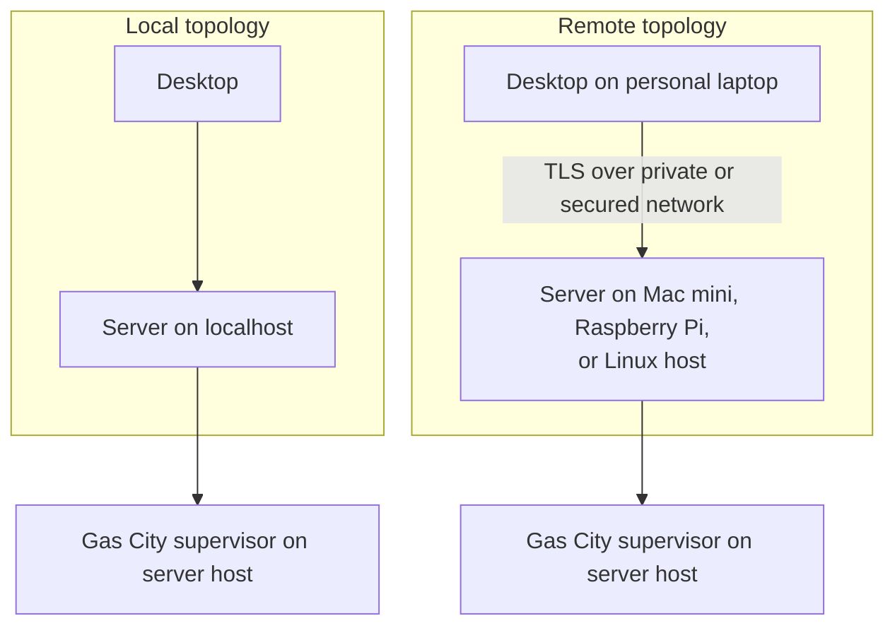
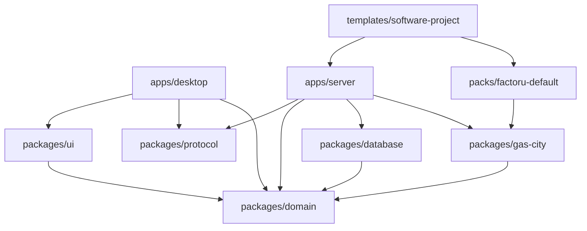
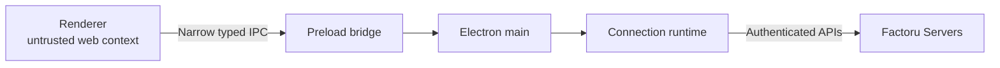
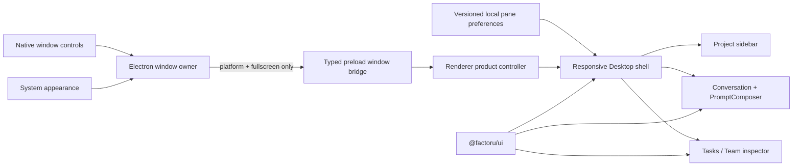
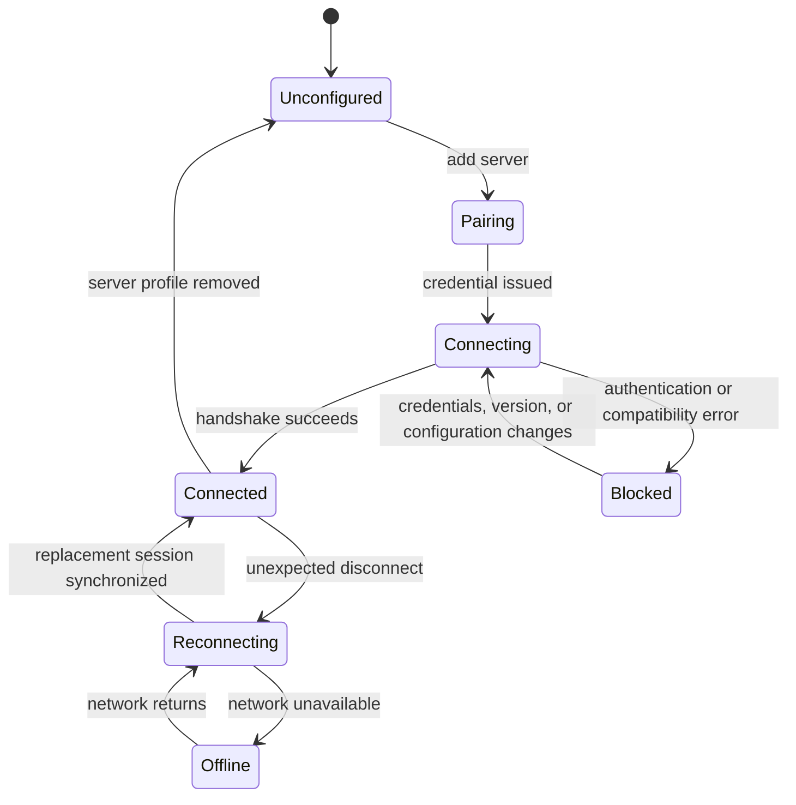
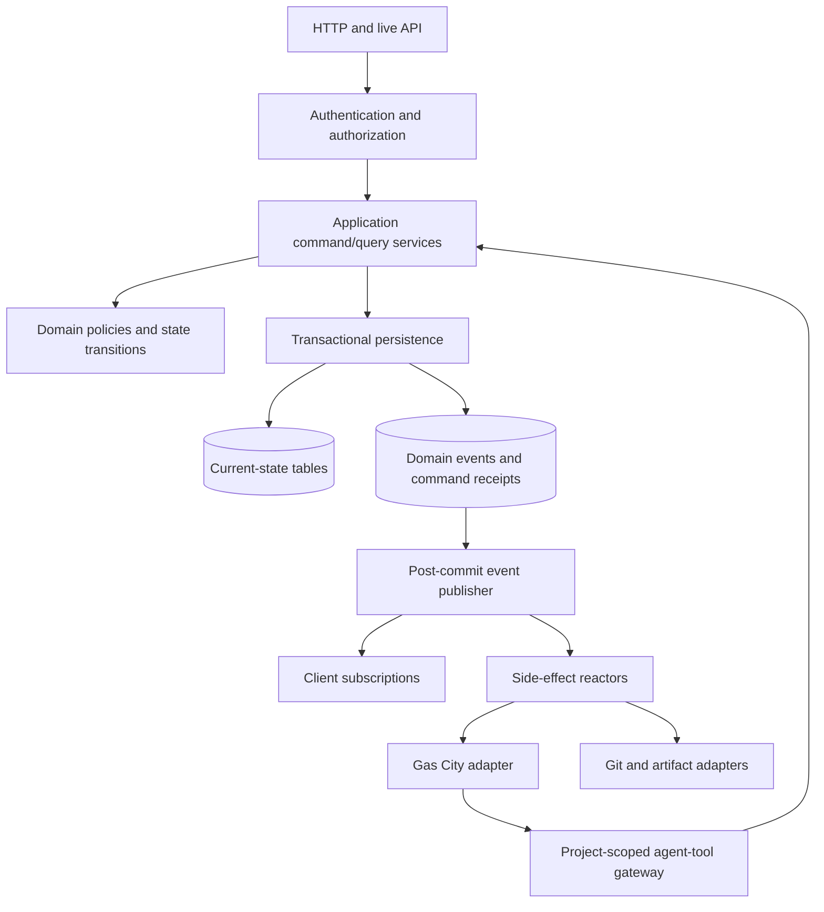
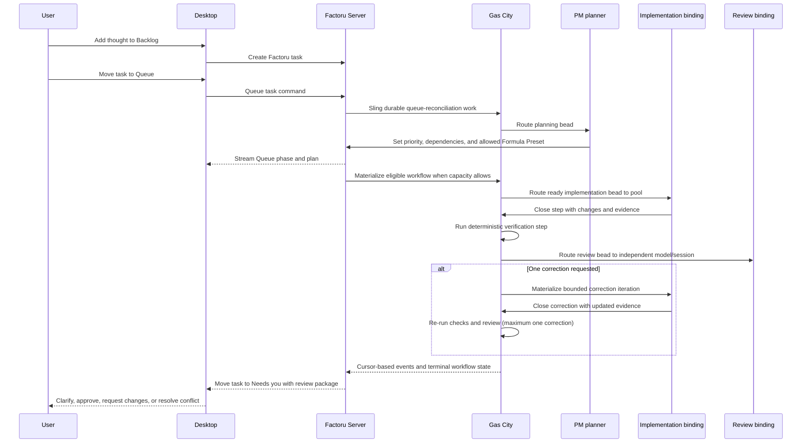
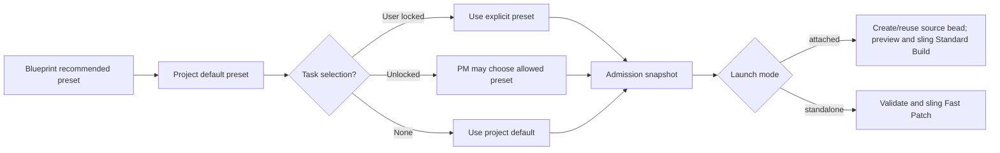

# Factoru Architecture

> Document type: living implementation map
> Last reviewed: 2026-08-12
> Runtime implementation status: Milestone 7 production paths are connected and
> automated-test covered; provider-backed Fast Patch acceptance passed, while
> Standard Build plus live Claude/Codex image-delivery and remote reconnect
> acceptance remain pending; Milestone 8 is next

This document describes both the architecture Factoru intends to build and the
parts that actually exist. It must change with the code. Product scope and
delivery order live in [ROADMAP.md](./ROADMAP.md); the deferred graph vision
lives in [future/graph-orchestration.md](./future/graph-orchestration.md).

## Status legend

Every architectural component and major capability uses one of these labels:

| Label | Meaning |
| --- | --- |
| **Implemented** | Production code exists, is connected to the real system, and has proportionate verification. |
| **Partial** | Some production code exists, but the described boundary or behavior is incomplete. |
| **Planned** | Accepted architecture for a roadmap milestone, but no production implementation exists. |
| **Deferred** | Product direction intentionally outside the current milestones. |
| **Validate** | A spike or decision is required before this can become the accepted architecture. |

Do not interpret a diagram as proof that a component exists. The implementation
inventory below is authoritative.

## Current implementation inventory

| Area | Status | Current reality | Next proof |
| --- | --- | --- | --- |
| Monorepo | **Implemented** | pnpm workspace with a pnpm-managed Node 22.13.0 development runtime, both applications, protocol/domain/config/database/Gas City/UI packages, versioned templates and pack sources, scripts, boundary linting, shared builds/tests, Linux/macOS CI, isolated per-worktree state/ports/pairing, a source-preview `factoru-server` operator launcher, an explicit provider-selected city bootstrap, a read-only 64-bit Linux remote-host preflight, an idempotent checksum-pinned Debian-family source bootstrap, plus a disposable-repository-root override for safe project acceptance. | Add only milestone-owned boundaries as their real paths connect. |
| Factoru Server | **Implemented** | Fastify connects SQLite-backed remote pairing and private loopback enrollment, trusted devices, authenticated one-time WebSocket tickets, durable projects/workspaces/tasks, idempotent product commands, and event/outbox reactors while remaining loopback-bound. One connection now carries authorized shell/workspace/conversation/run subscriptions with snapshots, 500-event replay, live markers, 15-second heartbeats, scoped gap fallback, and 1 MiB socket backpressure. Rich PM turns reconcile structured Gas City projections to the authoritative transcript; authenticated HTTP image routes validate and store bytes externally behind opaque metadata and short-lived host-local grants. The serial delivery path and operator CLI remain as previously accepted. | Milestone 9 completes Standard Build acceptance, packaged lifecycle, restore/recovery, logs, service management, and operational hardening; remote mid-response and both-provider image acceptance remain explicit carry-over evidence. |
| Shared protocol | **Implemented** | Protocol v4 in `packages/protocol` owns runtime-validated health/handshake, pairing/enrollment, projects, Blueprint/Team/Formula-Preset catalog, model catalog, devices, workspaces, tasks, Queue/run evidence, and typed clients. It adds scoped stream resources/events, rich conversation lifecycle/content parts, bounded history/cancel/retry/context-reset, and opaque image-artifact contracts. The project-v2 aliases and generic project subscription remain negotiated compatibility surfaces. | Remove compatibility aliases only in a later negotiated version and compress stream payloads only from measured pressure. |
| Factoru Desktop | **Partial** | Electron main persists server-ID-bound profiles, encrypted credentials, per-profile caches/cursors, a compound active-project reference, and one authenticated live session per saved server ([ADR 0016](./adr/0016-concurrent-desktop-server-connections.md), [ADR 0017](./adr/0017-factory-independent-project-catalog.md)). Protocol-v4 snapshots/deltas patch only the named shell/workspace/conversation/run cache; older servers retain the broad-refetch fallback. The frameless responsive shell ([ADR 0020](./adr/0020-desktop-shell-and-ui-foundation.md)) now renders sanitized rich text, code, lists, tables, safe links, structured tools, streaming/error/usage state, stop/retry, stable autoscroll/unread behavior, reduced motion, and the confirmed fresh-context flow from [ADR 0022](./adr/0022-conversation-context-reset-preserves-transcript.md). Its composer supports picker/paste/drop, validation, previews, upload state/retry/cancel, mixed turns, and image-only turns through narrow preload methods; credentials and server paths remain outside the renderer. | Managed launch, packaged/remote visual acceptance, Standard Build UX, and live remote reconnect evidence move to Milestone 9. |
| Gas City adapter | **Partial** | `packages/gas-city` remains pinned to 1.4.0 and keeps raw DTOs/provider options inside the boundary. It now contract-checks structured session transcript/stream/close paths, sends external-message attachments, retains the target session for cancellation, and maps provider-neutral partial text/tool/usage blocks while discarding thinking blocks. Final extmsg transcript records remain authoritative. Recorded 1.4.0 contract fixtures cover Codex/Claude-neutral shapes, but live image delivery through both harnesses is not yet accepted. The 2026-08-12 attempt was blocked by missing Claude authentication and a Homebrew Beads/Dolt cross-era initialization failure. | Complete the pinned compatible dependency and both-provider live attachment/reconnect matrix; Milestone 9 also completes attached-launch provider/restart acceptance. |
| Agent-tool bridge | **Implemented** | Factoru installs both harness MCP configs from `session_setup_script`. The server projects its current loopback origin into private, schema-versioned city runtime state so isolated ports reach the correct bootstrap. Setup requests a short-lived credential bound by the server to the exact rig, project, role, and Gas City session; the model never supplies it as an argument. The bridge exposes structured task tools, while server policy enforces role/project scope, request replay, and a redacted audit record ([ADR 0010](./adr/0010-agent-tool-transport.md)). The live PM path completed audited search/create/update/queue calls. | Revalidate tool bootstrap from packaged installations in Milestone 9. |
| Factoru Gas City pack | **Partial** | `packs/factoru-default` 0.4.2 retains the accepted bounded `software-delivery` path for Fast Patch, adds a thin `standard-build` overlay on pinned upstream `gc.build-basic`, and supplies the scoped PM conversation reply command. The overlay binds decomposed work to Factoru's capsule, caps serial units at 20, and inserts trusted verification before upstream review; both pack imports are SHA-locked. Fast Patch completed 10/10 benchmark tasks plus the conversation-originated loop, while Standard Build currently has static and adapter verification only. | Lint and run Standard Build with pinned Gas City 1.4.0 and a real provider. |
| Factoru database | **Implemented** | `@factoru/database` uses `better-sqlite3`, WAL/foreign keys/busy handling, forward-only SQL migrations, identity binding, transactional receipts/events/outbox, checkpoint, and online backup. Migration 0008 adds durable conversation turns, versioned content parts, monotonic conversation stream events, opaque artifact metadata, and expiring delivery grants while preserving older messages. Migrations 0009–0011 add context revisions, context-scoped provider sequences, and durable chat-history entries without deleting the transcript. Turn start/projection/final/cancel/fail/reset transitions and replay cursors are transactional and tested. | Milestone 9 completes packaged backup/restore and operational recovery drills. |
| Authentication and pairing | **Partial** | Hashed one-time remote pairing codes, private restart-scoped same-machine enrollment proofs, hashed revocable owner tokens, method scopes, 60-second one-time connection tickets, rate limiting, active-socket revocation, and OS-encrypted desktop storage are connected and tested ([ADR 0013](./adr/0013-local-desktop-enrollment.md)). Artifact reads/writes recheck project/conversation ownership; Gas City receives only an expiring host-local grant. The renderer never receives enrollment proof, long-lived token, server path, or delivery grant. | Milestone 9 validates the HTTPS proxy path and packaged local-service lifecycle. |
| Projects | **Partial** | Named projects contain an ordered repository collection and, for new projects, one stable server-owned directory under `$HOME/factoru-projects`. Every remote clone and clean local import is placed below that directory's `repositories/` child, leaving the project root available for later project-level instruction files. HTTPS/SSH URLs receive a bounded non-interactive access check before persistence; Git/OpenSSH credentials remain owned by the unprivileged server account. Existing projects keep their recorded paths as unmanaged legacy projects. Each repository has its own branch/index preview, rig binding, durable outbox item, and bounded setup retry. Failed attempts publish their error, attempt count, and next retry time; a partial managed-clone registration may unstage only known Gas City-generated paths before retrying, while unrelated staged work remains blocked. The first repository is the primary serial execution rig ([ADR 0018](./adr/0018-managed-project-directories.md)). | Validate packaged multi-rig creation/removal, service-account credential lifecycle, backup recovery, and explicit per-task rig routing. |
| Multi-factory project execution | **Deferred** | Desktop identifies each project by its one authoritative home factory and server-local project ID; additional factories are not replicas or execution targets yet. | Define server-to-server trust, per-factory repository mappings, task placement, cancellation, health, and recovery before attaching execution factories. |
| Project Manager chat | **Partial** | Every project receives one deterministic Factoru conversation and a city-local Gas City chat identity. User turns and image parts persist before bounded delivery; assistant start/text/tool/usage projections stream from Gas City's structured transcript and reconcile to the final extmsg sequence. Bounded history, stop/cancel, retry, terminal late-frame protection, and exact turn/message/content-part IDs are connected. A confirmed fresh-context command closes the previous provider session, rotates only the Gas City external conversation identity/cursor, preserves all Factoru messages and durable memory, opens a clean current chat, and exposes earlier revisions as dated read-only history with independent pagination ([ADR 0022](./adr/0022-conversation-context-reset-preserves-transcript.md)). A separate serialized planner remains responsive. Automated lifecycle, adapter, and direct Desktop UI tests pass; real two-harness image and remote mid-response reconnect acceptance remain pending. | Complete that operational matrix, then revalidate packaged lifecycle in Milestone 9. |
| Four-state tasks | **Implemented** | The domain and protocol admit exactly `backlog`, `queue`, `in_progress`, and `needs_you`; SQLite persists active tasks, terminal resolutions, exact Needs-you actions, dependencies, history, run correlations, simple duplicate scores, WIP one, and coalesced Queue intent. Authenticated idempotent direct and PM tool commands are connected. The responsive desktop board supports Backlog capture/editing, Queue movement and phase badges, exact Needs-you requests, terminal resolution, and explicit merge decisions. Queue work dispatches with an idempotency key to one serialized Formula and is observed to terminal state; the provider-backed conversation path reached acceptance without manual board management. | Tune only from packaged usability and production evidence. |
| Blueprint and Team catalog | **Implemented** | Versioned `Standard Software Project` and `Fast Patch` Project Blueprints compose fixed Project Manager/Software Engineer Team profiles, pinned packs, allowed Formula Presets, recommended defaults, role-scoped tools, memory, and serial capacity. Desktop edits Blueprint-seeded project defaults, task overrides, and every Team model slot through linked choices loaded from the factory's configured Gas City providers; the server enforces allowlists and user locks. Legacy Factory Template/Worker Type responses are protocol-v2 aliases only ([ADR 0019](./adr/0019-blueprints-formula-presets-and-project-manager-boundary.md)). | Add roles, presets, providers, or capacity only from measured need and in milestone order. |
| Internal review | **Implemented** | The production formula routes review to a distinct agent binding and persists its report; capsule finalization includes it in the review package. Eleven live runs produced specific independent verification notes and no unresolved risks. | Tune reviewer policy from production findings. |
| Human review | **Implemented** | Completed runs move to `needs_you` with a diff/check/review/usage package and explicit approve/request-changes/archive controls. Eleven real provider-produced packages were adjudicated and accepted. | Validate richer Gas City-native run evidence in Milestone 8 and packaged UI ergonomics in Milestone 9. |
| Task-run capsule | **Implemented** | Factoru Server owns one deterministic branch/worktree and external control/evidence directory per run, passes the same capsule to implementer/reviewer, safely adopts it after restart, rebases, reruns trusted checks, and refuses dirty/conflicted/invalid capsules. Eleven live runs left the source repository head and worktree unchanged. | Add complete non-Git leases and service-container isolation only when Milestone 10 concurrency requires them. |
| Conversation artifact storage | **Implemented** | Opaque project/conversation-scoped IDs and SQLite metadata own content hash, MIME, dimensions, provenance, creator, status, quota accounting, and 30-day retention. Bytes live in mode-restricted server storage outside SQLite. Authenticated binary upload/download/delete plus expiring host-local delivery grants enforce signature/MIME, 8 MiB, 8192px, four-images-per-turn, 256 MiB project quota, ownership, and no path disclosure; referenced artifacts cannot be deleted and unused expired bytes are collected. | Complete live Claude/Codex delivery plus packaged backup/retention acceptance. |
| Service-container isolation | **Deferred** | Tier-two task-specific project services are defined but not scheduled before concurrency. | In Milestone 10, run two capsules with distinct Compose, port, and database identities under resource limits. |
| Full-worker container | **Deferred** | Optional tier three, not the default or one container per session. | Prove provider hooks, credentials, caches, tools, ownership, and security on Linux. |
| Parallel orchestration | **Deferred** | The initial WIP limit is one. | Milestone 10 must run two and then three isolated tasks without increasing user effort. |
| Custom formulas | **Deferred** | Formula registry compatibility is a design constraint. | Milestone 11 defines import, validation, trust, versioning, preview, and rollback. |
| Graph Studio | **Deferred** | Described only in the future graph-orchestration note. | Revalidate after real formula and node usage exists. |

## Current implementation sequence

The former Milestones 0–7 are now the **Delivered Foundation implementation**: one connected
development-from-source path covering the walking skeleton, real Gas City gate,
persistence and authenticated remote protocol, Desktop shell, persistent PM
chat/planner, four-state tasks, the provider-backed Fast Patch operational spike,
and the serial production loop. The Blueprint-driven catalog extends that
foundation with Project Blueprints, selectable Formula Presets, and the attached
Standard Build path plus scoped resilient streams, rich conversation turns, and
image artifacts. Standard Build, remote mid-response reconnect, and live image
delivery through both initial harnesses remain operational acceptance gaps.

The forward sequence is:

1. **Milestone 8 — Gas City-Native Orchestration Depth:** run/session/Formula
   projections, durable decomposition, specialist review and synthesis, and
   improved PM reconciliation while WIP remains one.
2. **Milestone 9 — Packaging and Dependable Operation:** signed Desktop and
   packaged Server/CLI, Standard Build provider acceptance, supported-host
   installation, backup/restore, recovery, diagnostics, and upgrades.
3. **Milestone 10 — Safe Concurrency and Capsules:** complete resource leases and
   service isolation, then raise independently admitted task workflows from two
   to three with serialized integration.
4. **Milestone 11 — Adaptive Workflows and Trusted Extensibility:** independently
   scheduled Formula units, curated specialist roles, safe preset customization,
   trusted pack import, and opt-in maintenance Orders.

Provider-backed foundation evidence remains in
[the Milestones 5–6 acceptance report](./spikes/milestones-5-6-acceptance.md).

## Architectural drivers

1. **Remote-first execution.** The code, credentials, agents, and durable state
   may live on an always-on machine different from the desktop.
2. **Conversation-first control with manual capture.** Chat is the main control
   surface, while Backlog is a deliberately low-friction user-editable thought
   dump. Moving a thought to Queue asks the Project Manager to turn it into
   schedulable work.
3. **Live conversation without split truth.** Incremental assistant and tool
   state should feel immediate, but reconnect must resolve to Factoru's durable
   transcript and scoped server projections.
4. **Durable autonomous work.** Desktop disconnects, server restarts, and agent
   failures must not erase accepted commands or completed work.
5. **One owner per mutable fact.** Factoru, Gas City, Git, and the operating
   system must not each maintain competing authoritative state.
6. **Typed and versioned boundaries.** Desktop and server may update at
   different times, so compatibility must be explicit.
7. **Isolation before concurrency.** Parallel work is enabled only after
   worktrees and runtime resources have deterministic ownership and cleanup.
8. **Human attention is constrained.** More workers are not useful if Needs you
   becomes a larger, noisier queue.
9. **Gas City primitives stay visible at the integration boundary.** Factoru
   adapts cities, rigs, agents, sessions, beads, formulas, packs, convoys, and
   events instead of rebuilding a second orchestration engine.
10. **One progressively capable experience.** Factoru presents an opinionated,
   formula-native UX with curated defaults. Formula, bead, session, and capsule
   detail is disclosed in the same project/task surfaces over time, not through
   separate simple and advanced product modes.

## System context

Component status in this context diagram follows the implementation inventory;
the diagram itself does not imply implementation.



The server is the security and execution boundary. The desktop never receives
provider credentials and never performs direct database, Gas City, Git,
filesystem, or shell operations.

Factoru Server is also the boundary between Gas City agents and Factoru product
state. Agents receive narrow project-scoped tools; they never open Factoru's
SQLite database.

## Deployment model

Factoru has one runtime architecture and two ways to deploy it.



The same server artifact, protocol, persistence, and task semantics apply in
both modes. “Run on this device” is a desktop-managed installation and lifecycle
convenience, not an embedded alternate backend. In development, Desktop and
Server share only the path to a private, restart-scoped enrollment descriptor;
Electron main exchanges that proof for a normal revocable device credential.
Packaged install and managed launch remain Milestone 9 work.

**Partial developer-preview path.** An operator may run the source Server on a
64-bit Linux arm64/x64 host and manually forward its loopback port through SSH
to a loopback port on the Desktop machine. HTTP exists only at those loopback
ends; SSH encrypts the network leg. This is not a Factoru SSH adapter or managed
service, does not enable trusted-proxy mode, and never forwards Gas City,
agent-tool, or Dolt listeners. After cloning, the repository-owned
`scripts/remote-bootstrap.sh` installs missing base packages, user-local pinned
Node/pnpm and checksum-pinned Gas City/Dolt/Beads artifacts, then invokes the
read-only `factoru-server doctor` command through `pnpm remote:preflight`. It
also installs a source-bound `factoru-server` launcher. The CLI owns explicit
city/provider initialization and readiness, foreground launch, local status,
Factoru-correlated activity, pairing/SSH instructions, and verified SQLite
backup. Provider login remains provider-owned, and project model slots remain
Factoru project settings. Linux arm64 and Raspberry Pi remain unvalidated
([ADR 0015](./adr/0015-manual-ssh-preview-transport.md)).

The source CLI is a partial Milestone 9 operational surface, not a packaged
artifact or service manager. Its `sessions` view reads Factoru-owned planning,
Queue, and delivery correlations. Gas City 1.4 exposes no stable global session
listing, so Factoru does not scrape `gc`/tmux human output or claim visibility
into unrelated provider-native sessions. Release archives will eventually put
the same executable in `RUverse/homebrew-tap`; no formula points at mutable
`dev` source or ships before checksummed artifacts exist
([ADR 0005](./adr/0005-packaging.md)).

The CLI also exposes a read-only `repositories check` diagnostic. It executes
the same bounded, non-interactive `git ls-remote` probe used by authenticated
Desktop onboarding, as the operating-system user running Server. It honors
that account's OpenSSH configuration, known hosts, agent socket, and Git
credential helpers but never imports, stores, returns, or repairs credentials.

### Stable server identity

**Partial.** Each Factoru Server receives a stable `server_id` on first start.
Desktop connection profiles bind credentials and cached data to this identity,
not merely to a hostname that may change. Projects are server-local entities.

Implemented today: the id is generated once and stored in a `server-id` file in
the server data directory, created with an exclusive write so concurrent starts
cannot produce two identities. A malformed file is an error rather than a reason
to become a different server. SQLite refuses a mismatched identity, while
Desktop profiles, encrypted credentials, cached projections, and endpoint-spoof
checks are all keyed by that stable ID.

### Access and launch are separate

**Partial.** How the desktop reaches a server is distinct from how that server
was started:

- access may be localhost, private-network HTTPS, user-provided HTTPS, or later
  a Factoru-managed SSH/tunnel adapter; a manual operator-managed SSH forward is
  available only for the documented source preview;
- launch may be a pre-existing service, desktop-managed local service,
  container, or later a desktop-assisted remote installation.

All access methods terminate at the same authenticated Factoru Server API.

### Gas City host compatibility

**Validate.** Gas City publishes macOS arm64/amd64 and Linux arm64/amd64 release
artifacts, but the `gc` binary is not the whole runtime. Current installation
documentation also requires Git, tmux, jq, Dolt, the Beads CLI (`bd`), and
`flock`, plus at least one configured agent harness. Factoru maintains a tested
compatibility manifest for the pinned Gas City release and dependencies rather
than accepting any binaries found on `PATH`.

Server readiness distinguishes: Factoru healthy, Gas City supervisor reachable,
dedicated city ready, bead store ready, required pack resolved, each rig healthy,
and each configured harness/model ready. A failed orchestration dependency must
not make project/task history unavailable.

The source-deployment bootstrap and preflight reuse the adapter's pinned
dependency manifest, including each tool's actual version-command syntax. The
bootstrap owns exact install releases for Gas City, Dolt, and Beads while the
preflight reports Linux architecture, Node/pnpm pins, runtime/tool versions,
provider authentication, memory, and disk headroom without creating Factoru
identity or database state. Passing it is necessary but not sufficient for a
Raspberry Pi support claim.

## Monorepo and dependency boundaries



| Component | Status | Responsibility |
| --- | --- | --- |
| `apps/desktop` | **Partial** | Electron main owns kind-aware friendly-name profiles, automatic protected local enrollment, encrypted credentials, authenticated per-factory live transport, compound project references, aggregate workspace/run caches and cursors, first-launch preference state, frameless native window configuration, live system-theme synchronization, and explicitly targeted named IPC. Preload adds only typed platform/fullscreen state beside the existing product bridge. The renderer owns versioned pane preferences and implements the responsive shell, aggregate factory management, one-home-factory multi-repository onboarding, merged project/PM/Team surfaces, Blueprint creation choices, workflow defaults/overrides, the four-state board, and progressively disclosed run evidence. Packaged local install remains later. |
| `apps/server` | **Implemented** | Fastify serves health/auth/live methods, project/workspace/task services, idempotent commands, outbox/reactors, the loopback agent-tool gateway, Queue planning, and the serial execution loop. The server owns Blueprint/default resolution, task user-lock enforcement, immutable admission snapshots, preset capability validation, capsule creation/adoption, trusted checks, final integration validation, review packaging, and decision transitions. Standard Build's real-provider proof remains pending. |
| `packages/protocol` | **Implemented** | Protocol v3 runtime-validates compatibility, authentication, Blueprint/Team/Formula-Preset catalog and selection, projects, workspaces, rich conversations/content parts, opaque artifacts, bounded resource subscriptions, tasks, Queue/run evidence, commands, snapshots/cursors, and explicit run actions. Former Factory Template and Worker Type response fields remain compatibility aliases. |
| `packages/domain` | **Implemented** | Server identity, client connection state, built-in Project Blueprint/Formula Preset/Team invariants, allowlist and default-precedence rules, Formula capability policy, the four task states, Queue phases, exact Needs-you actions, terminal resolutions, and deterministic candidate scoring are implemented. |
| `packages/config` | **Implemented** | Shared TypeScript compiler configuration for every workspace package. |
| `packages/database` | **Implemented** | SQLite connection policy, seven forward migrations, transactional event/outbox writes, backup/reopen recovery, Blueprint/project/task workflow selection, immutable run snapshots, and full serial execution evidence plus transition persistence. |
| `packages/gas-city` | **Partial** | Factoru-owned orchestration port over Gas City 1.4.0. It adds provider-neutral structured conversation projection, external-message attachment delivery, session correlation/cancellation, and required served paths without terminal parsing or direct provider sessions. Contract fixtures pass; live two-harness image acceptance and attached Standard Build provider acceptance remain. |
| `packages/ui` | **Implemented** | Semantic system-theme tokens, owned component styles, and compiled React Button/IconButton, Tabs, Badge, Card, Field, Dialog, Drawer, Tooltip, EmptyState, SplitView/ResizeHandle, and PromptComposer primitives. Base UI supplies accessible composite behavior, Lucide supplies icons, and React is a peer dependency. The package contains no transport, Electron, product-state, or server logic. |
| `packs/factoru-default` | **Partial** | Version 0.4.0 contains Factoru's roles, probes, scoped task tools, Queue reconciliation, the provider-accepted `software-delivery` formula, and a thin SHA-pinned `standard-build` extension of upstream `gc.build-basic`. Static tests cover locks, caps, verification ordering, and publishing policy; pinned-runtime/provider acceptance for the inherited overlay is pending. |
| `templates/` | **Implemented** | The versioned Blueprint schema plus `Standard Software Project` and `Fast Patch` manifests define pinned pack locks, fixed Team profiles, allowed Formula Presets, recommended defaults, model slots, memory/tool policy, and WIP-one capacity. Catalog invariants and manifest/domain synchronization are tested. |

`apps/desktop` depends on `packages/domain` directly for the client connection
state machine, which is framework-independent product logic rather than a visual
primitive. It does not reach `packages/database` or `packages/gas-city`, and the
renderer reaches nothing privileged at all.

`packages/domain` must not know about Electron, React, SQLite drivers, network
transports, provider SDKs, or Gas City wire formats. Complexity belongs at the
adapter boundary. `packages/protocol` deliberately does not depend on
`packages/domain` either: it owns the wire format, and the server converts
validated wire values into domain value objects at its boundary. These rules are
enforced as ESLint `no-restricted-imports` rules, so a violation fails
`pnpm lint`.

Planned packages exist as directories with a README naming the milestone that
introduces them. They have no package manifest, so nothing in the workspace can
depend on an empty boundary.

## Desktop architecture

**Partial.** The three trust levels, server-ID-bound profiles, OS-encrypted
credential storage, authenticated live runtime, and offline project cache exist;
managed local server lifecycle and packaged remote acceptance remain. Electron
has three trust levels:



- **Renderer:** React UI and local presentation state only. This includes a
  versioned sidebar width, inspector width, explicit sidebar-collapse choice,
  transient responsive-drawer state, and controlled message draft. Node
  integration is disabled and context isolation is enabled.
- **Preload:** a small allowlisted API. Its Desktop-window surface exposes only
  normalized platform identity, fullscreen state, and a cleanup-safe state
  subscription. It does not expose raw IPC, filesystem, shell, arbitrary window
  mutation, or arbitrary request construction.
- **Main:** windows, updates, OS credential storage, local server lifecycle, and
  connection-profile persistence.
- **Connection runtime:** one owner for authentication, retry/backoff, snapshots,
  subscriptions, compatibility state, and offline caches across independent
  per-profile sessions. Compound project references route commands to the
  authoritative home factory independently of renderer filtering.

React components do not create sockets, retries, or RPC clients. They consume
domain-specific query, command, and subscription interfaces.

The window and renderer composition is:



The 48px header is draggable except for explicitly non-draggable interactive
controls. macOS uses the hidden style with explicitly positioned traffic lights; Windows and Linux use the
native title-bar overlay. Pane limits and the responsive thresholds are derived
from one layout configuration. Width resolution shrinks both inline side panes
proportionally above their minimums before allowing the conversation below
480px. At narrower widths Base UI dialogs render the same pane content as
focus-managed drawers; these automatic modes never mutate the saved explicit
collapse choice. Renderer theme tokens follow `prefers-color-scheme`, while
Electron main synchronizes native background and overlay symbols from
`nativeTheme` ([ADR 0020](./adr/0020-desktop-shell-and-ui-foundation.md)).

Implemented today: `contextIsolation` is on, `nodeIntegration` is off, the
renderer is sandboxed, and navigation and window-open requests are denied by the
policy described under [security boundaries](#security-boundaries). The preload
bridge exposes named connection, profile, repository, native folder selection,
project, conversation, Team/model, memory, planner, and device operations—never
raw IPC or transport handles. Electron main owns profiles, encrypted tokens, tickets, per-profile
live sockets, retry/coalesced synchronization, cursors, and per-project
workspace cache writes. All profiles connect at startup. Desktop aggregates
their cached projects by `{ factoryId, projectId }`; the factory control filters
that catalog while the open project and its command destination remain stable
([ADR 0016](./adr/0016-concurrent-desktop-server-connections.md),
[ADR 0017](./adr/0017-factory-independent-project-catalog.md)).

Retry policy follows the state machine rather than a single timer: `offline` and
`reconnecting` poll, while `blocked` stops polling entirely because an
incompatible protocol, a rejected credential, or an invalid response cannot be
resolved by trying again. A blocked connection resumes only on an explicit
refresh or a configuration change.

### Connection state machine

**Implemented** in `packages/domain` and exercised by the profile/pairing runtime.
Transport health and data synchronization are
related but distinct.



Cached projects/tasks may remain visible while offline, but they must be labeled
as cached. A socket being open does not mean every subscription is synchronized.

## Server architecture

**Partial.** Factoru Server is a modular monolith. It should remain one process
and one deployment until evidence requires otherwise.

Implemented today: a Fastify HTTP/live surface
([ADR 0002](./adr/0002-server-framework.md)) bound to localhost. Health and
handshake are public; pairing, ticket issuance, project/workspace queries, and
mutations are authenticated and scoped. Requests and responses are validated
with shared protocol schemas, and both not-found and error handlers return the
structured `Problem` envelope so no client receives an unstructured failure.



### Commands, state, and events

**Implemented for the Delivered Foundation.** Factoru uses the same transactional
state-plus-event model for project, workspace, task, merge-decision, and agent-
tool mutations:

1. Every mutation arrives as a typed command with a unique `command_id`.
2. Authentication and project authorization run before domain decisions.
3. Domain logic validates the transition without performing external side
   effects.
4. One short SQLite transaction updates authoritative state, appends audit/domain
   events, records the command receipt, and adds any outbox work.
5. Events become visible to subscribers only after commit.
6. Reactors consume committed intent and perform Gas City or Git side
   effects, reporting outcomes through new idempotent commands.

This adopts T3 Code's strongest reliability properties—total ordering where
needed, command receipts, pure decisions, transactional projection, and
post-commit side effects—without initially requiring every Factoru read model to
be rebuilt exclusively from an event log.

Never hold a database transaction open while waiting for a model, Gas City,
Git, a test process, or the network.

### Project and repository onboarding

**Partial.** Project creation is one named aggregate command containing an
ordered set of repository sources. Desktop first requires one connected home
factory and targets every repository discovery/preview/create operation to that
stable server ID. Existing folders carry a server-issued preview fingerprint;
remote sources carry only an HTTPS/SSH URL because clone placement is
server-owned. Desktop asks the selected factory to validate each URL before staging it,
and `projects.create` revalidates every unique remote URL before product state is
written. The command transaction then persists the project, all desired
repository/rig bindings, one primary designation, events, receipt, and one
outbox item per repository before any remote clone or rig-registration
mutation begins ([ADR 0014](./adr/0014-multi-repository-projects.md),
[ADR 0018](./adr/0018-managed-project-directories.md)).

For every new project, Server derives a stable
`$HOME/factoru-projects/<project-slug>-<project-id>/` directory. The project
root is reserved for later project-level metadata and instruction files; the
provisioning reactor places every repository below `repositories/`. Remote
sources are cloned there. Existing local folders must be completely clean and
are cloned locally without hard links so Gas City mutates only the managed copy.
The reactor discovers each checked-out default branch, revalidates index safety,
updates the desired repository record, and registers each rig.
Project setup becomes `ready` only when every rig is ready; one exhausted rig
places the project in `needs_attention` with repository-specific evidence, and
retry revalidates failed remote access before requeueing only failed
repositories. Desktop preserves failed creation drafts, shows per-repository
provisioning evidence, shows each failed attempt and its next automatic retry,
and leaves cached state readable while an offline home
factory blocks mutations. Current task admission uses the first,
primary rig so this onboarding change does not silently invent cross-repository
task routing.

Gas City rig initialization can fail after staging its own `.beads/**` and
`.gitignore` changes. On a later attempt, Factoru may unstage only those known
paths when the repository belongs to a managed project directory; it never
deletes their contents. Any other staged path continues to block registration.
Legacy/unmanaged repositories never receive this automatic reconciliation.

On local macOS, Electron main owns the native directory dialog and permits it
only for Local Factory. It sends the
chosen absolute path directly through the authenticated project operation; the
renderer receives only the approved root ID, relative path, branch, and safety
preview. A desktop connected to another host can use repository URLs or browse
the server's approved import roots; a client-local folder outside those roots
is rejected. Source roots authorize imports, not managed clone placement.
Desktop aggregates the resulting server-owned projects by compound
`{ factoryId, projectId }` identity. This cache is not authoritative and does
not alter the server protocol or SQLite schema
([ADR 0017](./adr/0017-factory-independent-project-catalog.md)).

### SQLite ownership

**Implemented for the Delivered Foundation state.** Only Factoru Server opens the
database file, which lives on local server storage. Initial requirements:

- SQLite WAL mode using a pinned version containing applicable WAL fixes;
- foreign keys enabled;
- short serialized write transactions and configured busy handling;
- forward-only migrations with migration tests;
- online, consistent backups;
- explicit checkpoint and disk-full monitoring;
- stable IDs, optimistic entity versions, and idempotency keys;
- cursor pagination and indexes matching real UI queries;
- large logs, diffs, and artifacts stored outside rows with durable metadata.

Milestones 2–3 create server metadata, trusted devices, pairing codes, projects,
rig bindings, generic command receipts, domain events, outbox items, projection
cursors, Factory settings, Team role/model bindings, conversations/messages,
provenance-aware memory, serialized planner probes, and migrations. Milestone 4
adds tasks, dependencies, task runs, Queue reconciliation, merge proposals,
short-lived agent credentials, and agent-tool audit records.

Migration 0005 adds the authoritative ordered `project_repositories`
collection, one primary repository constraint, per-repository rig/provisioning
state, and a forward backfill from every legacy project/rig row. Legacy primary
columns remain the execution compatibility projection until task routing is
repository-aware.

Migration 0007 forward-migrates software projects to the Standard Software
Project Blueprint. It adds the project workflow default, task preset/source/lock
fields, and immutable run snapshot fields. Active legacy runs and their tasks
remain Fast Patch; unlocked queued work becomes Standard Build; the Software
Engineer design binding inherits the former PM planning binding.

### Team profiles, agents, models, memory, and tools

**Partial.** The fixed Factory/Team/model path, production role-scoped task
tools, and serial execution evidence are implemented. Bounded memory retrieval,
prompt injection, deletion, and poisoning defenses remain. A Factoru **Team role
profile** is a product-level Factory profile, not a Gas City primitive. Gas City
still launches every live agent. One profile may compose several Gas City agent
templates and Formula Presets:

| Team profile field | Purpose |
| --- | --- |
| Identity | Stable Factoru ID, name, description, and project scope |
| Agent bindings | Gas City templates used for chat, planning, implementation, review, or synthesis |
| Prompt policy | Versioned pack prompt plus Factoru project/role instructions |
| Model bindings | Project Manager has `chat` and `planning`; Software Engineer has `design`, `implementation`, and `review`, each resolved to a Gas City harness/model/upstream configuration |
| Tool policy | Allowlisted Factoru tools and repository/runtime capabilities per agent binding |
| Memory policy | Which project, role, task, and run memories the binding may read or propose updates to |
| Workflow use | Formula Presets map workflow roles to these model slots; a Team profile is not itself a Formula |
| Capacity | Factoru execution cap plus mapped Gas City agent/rig/workspace session ceilings |

A versioned **Project Blueprint** composes pinned packs, fixed Team profiles,
allowed Formula Presets, a recommended project default, tool/memory policy,
capacity, and UI metadata. A **Formula Preset** is the friendly, validated
configuration of a Gas City Formula: formula/pack pins, variables, model-role
mapping, capabilities, limits, and `attached` or `standalone` launch mode. The
built-in Standard Software Project and Fast Patch Blueprints use
`factoru-default`; arbitrary imports remain deferred trusted-code work. See
[ADR 0019](./adr/0019-blueprints-formula-presets-and-project-manager-boundary.md).

Initial Factoru tool policy is role-specific:

| Agent binding | Factoru tools |
| --- | --- |
| PM chat | Read project/task status, create/edit Backlog thoughts, request Queue movement, search memory, propose memory updates |
| PM planner | Search/reconcile/merge/split tasks, set priority/order/dependencies/resource intent, choose an allowed Formula Preset for an unlocked task, inspect capacity/runs, request clarification |
| Software implementer | Read immutable task/run plan, inspect capsule/config, report progress/evidence/artifacts, search permitted memory |
| Software reviewer | Read request/plan/diff/check evidence, submit structured verdict/findings, search permitted memory; no task-priority or merge authority |

Repository editing, tests, and Git operations remain explicit harness/capsule
capabilities rather than generic Factoru database tools.

The visible **Project Manager** type maps to two Gas City agents: one generated
city-scoped, always-on chat identity per project and one imported rig-scoped,
on-demand `project-manager-planner` with a maximum of one active planning
session. The split is required by the pinned external-message binding contract
and is recorded in
[ADR 0012](./adr/0012-project-manager-runtime-identities.md). The visible
**Software Engineer** profile maps design/decomposition, implementation, and
independent review roles. It can therefore use one model for `design`, Claude
for `implementation`, and Codex for `review`; a Formula Preset maps each step to
the corresponding agent. Fast Patch uses implementation/review, while Standard
Build additionally uses design. One Gas City agent still has one effective
harness/model configuration for a session.

Gas City-managed agents/sessions are Factoru's durable worker boundary; Factoru
does not introduce a separate `Subagent` entity. If a provider harness spawns a
native Claude/Codex subagent inside one step, that helper remains opaque and
bounded by the parent step's capsule, permissions, retry budget, and cost. Work
that needs independent status, scheduling, model choice, memory, recovery,
review, or isolation must instead become a bead routed to a Gas City agent/pool.

Gas City separates five runtime axes: harness (historically the agent
`provider` field), model, upstream model service, transport (`tmux` or ACP where
supported), and city-wide session runtime. `packages/gas-city` projects a
Factoru binding to Gas City's `provider` plus `option_defaults.model` fields;
provider-specific option schemas remain on the server side. Unsupported
combinations fail reconciliation before the desired config becomes healthy.

For Team configuration, `packages/gas-city` reads Gas City 1.4's
`GET /v0/city/{cityName}/providers/public` projection. It retains only
city-configured providers and the `model` select option's value, label, and
effective configured default. Factoru Server normalizes that safe data into the
protocol
workspace model catalog; provider flags, commands, environment, other raw
option schemas, and credentials never cross the adapter. Catalog failure does
not make project history unavailable: the workspace remains readable with an
explicit unavailable catalog state.

“Worker memory” is not a shared context window. Pool sessions are independent
processes and Gas City deliberately gives them no direct shared memory or
handles. Factoru defines four durable layers:

1. **Project memory:** repository facts, decisions, conventions, and user goals
   shared according to policy.
2. **Role memory:** lessons and preferences scoped to one Team role in one
   project.
3. **Task/run context:** the task snapshot, bead history, artifacts, decisions,
   and handoffs for one execution.
4. **Session transcript:** Gas City/provider conversation history for one live
   identity; useful for resume and audit but not the sole durable memory.

Project and role memories are Factoru entities with provenance, versions, and
bounded retrieval. Agents use scoped `memory.search` and `memory.propose_update`
tools; models do not silently append permanent memory. Prompt rendering injects
only a bounded relevant summary, while beads carry current work and handoffs.

Tool delivery is **Implemented** for the initial Claude and Codex harnesses.
Gas City catalogues pack MCP configuration but does not attach it to live
sessions, so Factoru installs each harness's MCP config from
`session_setup_script`. The server issues a short-lived credential bound to the
exact rig, project, role, and Gas City session, and the loopback gateway presents
one audited, role-scoped contract. Packaged installations must revalidate that
bootstrap. Raw tools are never granted merely because a model requested them.

## Protocol architecture

**Implemented for the Delivered Foundation; recorded in
[ADR 0003](./adr/0003-api-transport-and-protocol.md) and
[ADR 0021](./adr/0021-scoped-streams-over-existing-websocket.md).**
Use a small HTTP surface for health, pairing, token exchange, and operational
or artifact transfer plus a typed live connection for commands, queries, and
subscriptions.

Implemented today: `packages/protocol` owns Zod schemas, the advertised protocol
version range, the negotiation rule, the `Problem` error envelope, and a typed
client. Both peers validate at runtime from the same schemas, and the client
re-checks compatibility against its own range instead of trusting the server's
verdict. Pairing and ticket exchange use HTTP; a typed, authenticated WebSocket
carries scoped queries, idempotent commands, project/workspace snapshots,
conversation/Worker/model/memory/planner operations, cursor replay, and live
product events.

Protocol-v3 peers retain one supervised authenticated connection per factory
and use separately authorized, bounded resources for:

- the factory/project shell and its aggregate health/project changes;
- one active project workspace;
- one conversation with bounded historical turn pagination; and
- one active Formula run with user-facing stage/tool/evidence deltas.

Each implemented stream contract defines its snapshot, sequence cursor, replay window,
catch-up-complete/live marker, heartbeat, buffer/backpressure limit, gap
response, and scoped snapshot fallback. Conversation events use stable turn,
message, content-part, and tool-operation IDs and distinguish assistant
`started`, text `delta`, `completed`, `cancelled`, and `failed` states. Deltas
are projections; the completed Factoru message is authoritative and replaces
the partial projection idempotently.

Image bytes cross implemented authenticated HTTP endpoints as opaque artifact handles.
The live protocol carries only versioned content-part metadata, upload state,
and authorized download references. Upload and download methods are scoped to
the exact project/conversation and never reveal server paths, provider URLs, or
credentials. Capability negotiation keeps older peers on the protocol-v2
generic event/refetch path and advertises rich stream/artifact support explicitly.

The protocol must provide:

- runtime schema validation on both sides;
- `server_id`, protocol version, application version, and capability handshake;
- method-level authorization rather than “connected means fully trusted”;
- unary queries distinct from durable subscriptions;
- command IDs and idempotent retry behavior;
- monotonic event sequence/cursor and snapshot-plus-delta resynchronization;
- bounded subscriptions by project/task instead of full-database broadcasts;
- structured errors that distinguish retryable transport failures from blocked
  authentication, configuration, and compatibility states;
- forward-compatible decoding for additive server capabilities where safe.

Desktop/server compatibility should be negotiated, not inferred from identical
package versions. A deployment may update one side before the other.

Protocol v2 workspaces carry the optional normalized model catalog under the
`model-catalog-v1` capability. Older cached workspaces decode to an explicit
unavailable catalog, and the catalog remains a recoverable Gas City projection
rather than independently editable Desktop state.

Protocol v2 is the compatibility bridge for the terminology change. Its
authoritative fields are Project Blueprint, Team, Formula Preset, project
default, and task override. Former Factory Template and Worker Type response
fields are decoded as read-only aliases so one mixed-version Desktop/Server
pair can reconnect. Protocol-v2 Desktop uses `team.updateModelBinding`; Server
accepts the former `workers.updateModelBinding` command only as a protocol-v1
peer alias. Workflow/default mutations target only the new methods.

## Core product flows

### Pair a desktop

**Partial; implemented locally and awaiting remote acceptance.** Remote setup
exchanges a short-lived, one-time pairing code for a revocable device session.
Same-machine setup ([ADR 0013](./adr/0013-local-desktop-enrollment.md)) instead
uses a private `0600`, restart-scoped proof discovered by Electron main and
accepted only over loopback. It never crosses into renderer state. Both paths
produce the same server-ID-bound device token. Long-lived credentials are stored
in the desktop OS credential store, not renderer storage. WebSocket
authentication uses a short-lived connection ticket so long-lived tokens do
not appear in URLs.

### Backlog capture and Queue reconciliation

**Implemented.** Backlog is a user-editable thought dump. A user can create or edit
a Backlog card directly with minimal structure, and the Project Manager may add
cards from conversation. No Gas City execution bead is required while an item
remains in Backlog.

The transactional Factoru portion is implemented: moving a card from Backlog to
Queue is an explicit command meaning “turn this
into planned, schedulable work.” In one Factoru transaction it changes the
status, records the user action, and enqueues an idempotent
`queue.reconcile` outbox item. Pending requests coalesce through a monotonically
increasing project Queue revision; changes during a running pass create or
coalesce exactly one follow-up record. The reactor creates or reuses a
durable Gas City planning bead routed to `project-manager-planner`; it does not
nudge or interrupt the chat session.

Repeated edits and bursts of Queue changes coalesce by project/version into one
pending reconciliation pass. The planner may use scoped tools to:

```text
search/merge/split tasks
clarify acceptance criteria
set priority and Queue order
add/remove task dependencies and resource locks
choose an allowed Formula Preset for an unlocked task
mark ready, waiting for dependency/capacity, or needs clarification
inspect workers, runs, capsules, and capacity
```

The desktop renders these records as a responsive two-by-two board, collapsing
to one readable column per state at narrow window widths. It supports direct
capture, edit, Queue movement, status changes, terminal resolutions, and user
accept/reject controls for ambiguous merge proposals. The four Kanban statuses
remain stable. Queue planning detail is a separate machine-managed phase—
`awaiting_triage`, `triaging`, `ready`,
`waiting_dependency`, or `waiting_capacity`—shown as a card badge rather than a
new column. PM planning does not move the task to `in_progress`; that status is
reserved for accepted execution. If clarification is required, the task moves
to `needs_you` with an exact question.

The chat session and planning agent may run concurrently because they are
different Gas City identities. Queue reconciliation itself is serialized to one
planner per project to avoid racing priority, merge, and dependency decisions.
The planner is event-driven—Queue changes, dependency changes, run outcomes,
and newly available capacity request a pass—rather than an unbounded token-
consuming loop.

### Conversation to task

**Implemented through task intent.** Each project
conversation has a stable Factoru conversation ID and is bound through Gas
City's external-messaging protocol to that project's generated city-scoped
Project Manager identity.

The documented client-registration plus per-conversation SSE `subscribe` stream
**does not exist in Gas City 1.4.0**. The surface that does exist is a durable
transcript cursor:

| Path | Purpose |
| --- | --- |
| `POST /v0/city/{city}/extmsg/adapters` | Register an adapter; optional `callback_url` and `Idempotency-Key` |
| `POST /v0/city/{city}/extmsg/bind` | Bind a conversation to an `agent_name` or `session_id` |
| `POST /v0/city/{city}/extmsg/inbound` | Deliver one user turn |
| `POST /v0/city/{city}/extmsg/outbound` | Publish one session-owned assistant reply through the registered adapter |
| `GET /v0/city/{city}/extmsg/transcript` | Read replies with `after_sequence` and `limit` |
| `POST /v0/city/{city}/extmsg/transcript/ack` | Acknowledge consumption |

Factoru binds to an **agent name** rather than a session ID so the identity is
stable while Gas City replaces sessions. Accepted user messages, bounded
delivery attempts, assistant messages, delivery state, and transcript sequence
are persisted in Factoru SQLite. The reactor resumes reads after that sequence,
deduplicates replay, and publishes product events. The generated chat identity
carries only its own Factoru conversation reference. Its versioned
`gc factoru reply-current` pack command resolves the latest delivered inbound
turn, posts the answer to `extmsg/outbound`, and uses a stable per-turn/body
idempotency key. It accepts Gas City's delivery-time conversation hint only
when it matches the generated session scope. Factoru registers the host-local
callback **base**; Gas City
appends its provider-owned `/publish` suffix before calling the Factoru
acceptance route. Registering the suffixed route itself would incorrectly target
`/publish/publish`. Gas City records the accepted reply in its durable
transcript, and the ordinary cursor sync makes it visible to the desktop. The
callback validates the exact Factoru account,
conversation, and rig and never lets the agent write SQLite directly. The
desktop never receives a Gas City address or token. The generated
identity/config decision is in
[ADR 0012](./adr/0012-project-manager-runtime-identities.md); the transport is in
[ADR 0007](./adr/0007-gas-city-compatibility-and-transport.md).

**Implemented:** Factoru adds a durable turn lifecycle above this
transcript path. Versioned message content parts carry text, image-artifact
references, and structured tool activity. Assistant and tool deltas are
resumable projections with stable IDs; the final Factoru transcript record is
authoritative and replaces the partial projection idempotently. Desktop
subscribes to the active conversation with bounded historical pagination rather
than refreshing the whole workspace for each delta.

Image bytes enter and leave through authenticated Factoru HTTP routes. The
database owns opaque artifact identity, project/conversation authorization,
content hash, MIME/dimensions, provenance, upload state, and retention; the
server artifact store owns bytes. The renderer and live protocol receive no
server path. Only the Gas City adapter may translate an authorized artifact into
the served runtime's supported attachment shape, after a validated
harness/model capability check. An unsupported or unproven vision path blocks
dispatch with a specific action rather than silently dropping the image.
Contract fixtures cover the served provider-neutral shapes; real Claude/Codex
image delivery remains an explicit operational acceptance gap.

The Project Manager uses a Factoru-owned, project-scoped tool surface to inspect
a bounded set of active/recent reconciliation candidates and request structured
intent:

```text
create task | update existing task | propose merge | ask clarification | no task
```

The chat agent may create a thought in Backlog or explicitly queue it when the
user asks. The tool gateway validates the agent identity and project scope, then
applies task changes through ordinary idempotent commands. A model never writes
the database or sends trusted SQL/commands directly. Ambiguous merges remain
pending until the user accepts or rejects them; only an accepted proposal
resolves the source as `superseded`. Chat prose is not parsed as the authoritative
mutation when a structured tool call exists.

### Task execution and review

**Implemented.** The first production flow has a WIP limit of one and completed
provider-backed acceptance across a Factoru service reconstruction.



The user configures the Software Engineer Team profile's design,
implementation, and review model bindings through configured-provider/model
selectors whose choices come from the home factory. Selecting a provider picks
its effective configured default while preserving an existing binding that is no
longer advertised. “Multi-agent review” means
independent agents, sessions, and contexts; the reviewer is a binding inside
the Software Engineer profile, not a third top-level Team role.

### Gas City boundary

**Implemented for the serial development path; live attachment acceptance and
Milestone 9 packaged-host validation remain.** Factoru uses Gas City's native
model rather than treating it as a generic job runner. The adapter performs guarded, adoptive
`rig add → import install → reload` reconciliation, real provider dispatch and
observation, restart adoption, cancellation, usage folding, structured session
transcripts, external-message attachments, and strict Formula validation. The
adapter requires the served transcript/stream/close paths and has recorded
contract coverage for partial text/tool/usage plus attachment delivery. Live
Claude/Codex image delivery remains pending; if the pinned range cannot satisfy
that path, an upgrade is accepted only with the full compatibility suite.
Milestone 8 adds run, Formula, bead, convoy, session-stream,
structured-transcript, stage, usage, and cost projections without leaking raw
DTOs or creating a second orchestrator. Milestone 9 then revalidates
installation, recovery, and upgrades on packaged macOS and Linux targets.

#### Runtime topology

- A Gas City **supervisor** is a machine-level control plane and may host cities
  unrelated to Factoru. Factoru must not stop or reconfigure the entire
  supervisor as though it owns the host.
- Each Factoru Server creates or adopts exactly one dedicated **city**, named
  from its stable `server_id` and rooted under the Factoru server data directory.
- The Factoru city is the local root **pack** plus deployment details. It imports
  a version-pinned `factoru-default` pack. Portable behavior belongs in the
  pack; deployment choices belong in `city.toml`; machine-local paths and
  runtime state belong in `.gc/`/site bindings.
- Each Factoru project contains one or more repository-backed Gas City **rigs**.
  Factoru persists an ordered repository collection with one primary rig plus
  city name, rig name, bead prefix, branch, source, and provisioning state as
  external references, not product identity. The proven serial task path uses
  the primary rig until explicit task-to-rig routing is implemented.
- Gas City uses one city-level Dolt-backed bead store. Rig prefixes are enforced
  as hard query filters by the normal `bd` path, but all rig data is physically
  in the same store and can be reached by a sufficiently privileged process
  that bypasses that query layer. This is logical routing, not an adversarial
  security boundary. The store is separate from Factoru SQLite.

The integration deliberately preserves Gas City's three configuration layers:

| Layer | Factoru location/ownership | Contents |
| --- | --- | --- |
| Portable pack | Versioned `packs/factoru-default` source and pinned deployed import | Agents, prompts, formulas, tool metadata/harness wiring assets, the idempotent PM reply command, doctor checks, and reusable assets |
| City deployment | Factoru-managed city root | Root `pack.toml`, `city.toml`, rig declarations, provider/harness registrations, runtime policy, and import lock |
| Machine-local site/runtime | City `.gc/` and Gas City-managed runtime directories | Rig path bindings, caches, sockets, logs, sessions, generated state, Gas City worktrees, and Factoru's recoverable private projection of the Factoru origin, Gas City origin, and city name |

The development harness projects the absolute versioned pack path independently
of pnpm's per-package working directory. It can initialize this topology only after the tester
explicitly supplies one or more provider names. It uses pinned Gas City 1.4.0
commands to create the city without starting it, adds the local
`factoru-default` pack as a pinned import, and on later starts replaces only
the Factoru-owned root and registered-rig bindings, removing rig pins first so
Gas City's combined lock graph never mixes deployment SHAs. The city and its
rigs therefore follow the current trusted server deployment instead of retaining an older commit pin. It then installs imports
and registers the city with `--no-auto-restart` so it never restarts a drifting machine-wide
supervisor that may host unrelated cities. This is a testing path, not a decision
about the production first-run provider experience.

Registering a rig also creates Gas City/Beads metadata in the repository (for
example `.beads/` configuration pointing to the city endpoint). Project setup
must preview, verify, and document this mutation; project removal must not
silently delete it or user work. After registration, the adapter attaches the
Factoru pack to the rig using the exact source and optional version already
pinned by the root city's `[imports.factoru]`; resolving the development
worktree again could select a different Git commit and create an incompatible
lock graph.

Gas City's six primitives and related runtime concepts map to Factoru as follows:

| Gas City concept | Gas City meaning | Factoru use | Product/UI rule |
| --- | --- | --- | --- |
| City | Root pack plus one machine deployment | Dedicated orchestration environment for one Factoru Server | Hidden under server health/settings; not a user project |
| Rig | Registered external project/repository and bead namespace | One rig per repository; one or more ordered rigs per Factoru project | The project remains the user-facing identity; UI marks the primary execution rig |
| Pack | Versioned agents, formulas, orders, prompts, commands, tools, and checks | `factoru-default` supplies Factoru's orchestration behavior | Custom packs are trusted code and require a later explicit trust flow |
| Agent | One configured runtime role: prompt, scope, harness, model, tools/hooks, work query, and pool policy | Low-level chat, planner, designer, implementer, and reviewer bindings behind Factoru Team profiles | Team edits the product profile; it does not expose raw TOML initially |
| Session | One live disposable instance of an agent | PM chat is always-on; planning is serialized on demand; design/implement/review roles are on demand | A session is not a Team profile or a Factoru device/login session |
| Bead | Durable universal work unit | Workflow root and step execution state | Never render every bead as a Kanban task |
| Formula | Reusable method compiled into a routed bead graph | Queue reconciliation, Fast Patch, and Standard Build methods composed from several roles | A Formula Preset configures it; it is not a Team profile |
| Convoy | Grouping bead with `tracks` edges | Later groups decomposed work and feeds drain/fan-out | Not an MVP task list or status column |
| Event | Immutable sequenced observation | Source for run projection, recovery, logs, and health | Factoru translates it into bounded product events |
| Order | Trigger plus formula or trusted exec action | Later scheduled maintenance/automation | Not used to select user tasks; Factoru owns Queue/WIP policy |

#### Agent and session shape

The default pack contains rig-scoped `project-manager-chat` source material,
`project-manager-planner`, `software-implementer`, and `software-reviewer`
agents. Gas City 1.4.0 external-message bindings require a city-scoped agent, so
Factoru generates one deterministic city-local chat agent per project and a
root-pack `mode="always"` named session for it. The portable chat definition is
the versioned prompt/policy source, not the live rig target. The planner has
`max_active_sessions=1`; implementer and reviewer templates are on-demand pools.
Factoru applies project model choices through bounded root-pack/city managed
blocks, structurally adopts generated chat sessions normalized outside those
markers by Gas City import installation, and reloads only after a byte change
([ADR 0012](./adr/0012-project-manager-runtime-identities.md)).
Gas City 1.4.0 rig patches address the pack-local agent key, so these generated
patches use bare role names while Formula routes retain their binding-qualified
runtime identities.

Do not configure a pool minimum on the chat template. Gas City treats an
always-on named session and `min_active_sessions` as independent sources of live
sessions and its doctor warns about accidental combinations. Chat continuity and
planning concurrency therefore use different agent templates even though the
Factoru UI groups them as one Project Manager Team profile.

Agents coordinate indirectly through routed work, beads, and mail; Factoru does
not add direct agent-to-agent process handles. The Project Manager's exception is
not direct worker control: it calls Factoru product tools to reconcile tasks,
chooses an allowed Formula Preset for an unlocked task, and expresses task
dependencies. Gas City routes ready formula steps to a role/pool and chooses
concrete session identities. This keeps authorization outside prompts and keeps
runtime assignment in the orchestrator.

The Factoru Project Manager is Mayor-equivalent in the product sense, but it is
not Gas City's unrestricted `gc.mayor`. Factoru imports upstream roles and build
formulas at a pinned pack SHA without binding the Mayor skill. PM chat and
planning act only through authenticated project/role-scoped Factoru tools;
Factoru Server remains the sole owner of task admission, capability checks,
scheduling, and audit history. Direct bead creation or formula launch from PM
prompts would bypass that boundary and is forbidden
([ADR 0019](./adr/0019-blueprints-formula-presets-and-project-manager-boundary.md)).

#### Task and bead correlation

A Factoru task is product intent and may have zero, one, or many attempts. A
task may inherit its project's default Formula Preset or carry an explicit
selection source and user lock. Each `task_run` immutably snapshots the resolved
preset ID/version, Blueprint version, Formula name/hash, resolved variables,
pack-lock digest, selected Gas City city/rig, optional source bead, workflow-root
bead, optional convoy, starting event cursor, request/correlation IDs, terminal
disposition, and artifact references. Formula step beads stay Gas City-owned
execution detail. Current admission always selects the project's primary rig;
repository-aware task planning and cross-rig Formula routing remain a separate
bounded change.

There is intentionally no one-to-one status mapping:

- Factoru `backlog` has no Gas City work; `queue` may have a correlated PM
  planning bead but no implementation workflow until its plan is accepted;
- Factoru enters `in_progress` only after a run is accepted and correlated;
- Gas City `open`, derived `blocked`/`deferred`, `in_progress`, and `closed`
  describe execution readiness, not Kanban policy;
- a closed workflow produces a review package and moves the Factoru task to
  `needs_you`; failed, cancelled, or exhausted workflows also move there with a
  precise requested action unless policy safely requeues them.

Duplicate-task reconciliation occurs before dispatch in Factoru. It must not be
implemented by merging arbitrary Gas City beads.

#### Formula Preset selection and run lifecycle

The catalog resolves one workflow without creating a second orchestration
graph:



The Blueprint recommendation seeds a new project's default. Later Blueprint
changes do not rewrite the project. A user-locked task choice always wins;
otherwise the PM may select only from that project's Blueprint allowlist during
reconciliation. Admission snapshots the result, so changing either default
cannot mutate an existing run.

`factoru-default` 0.4.0 supplies Queue reconciliation plus two delivery paths:

- **Fast Patch** is the `fast-patch` preset over the unchanged
  `software-delivery` Formula. Its standalone contract is prepare → implement
  through `implementation` → deterministic check → independent `review` → at
  most one correction/recheck/review → finalize.
- **Standard Build** is the `standard-build` preset over a thin Factoru overlay
  extending pinned upstream `gc.build-basic`. It retains requirements, design,
  decomposition, implementation, upstream review, and finalization; maps
  planning/decomposition to the Software Engineer `design` slot; binds every
  unit to the Factoru capsule; caps the same-session/shared serial drain at 20
  units; and inserts trusted Factoru verification with two total attempts before
  upstream review. Its attached launch previews inherited formula resolution at
  rig scope, idempotently creates a feature source bead with task/run/capsule
  metadata, then attaches and slings the formula.

Both presets run at WIP one inside one Factoru-owned task capsule. Push and pull
request variables are forced false. Interactive gates, automatic publication,
parallel workers, arbitrary imports, and separate Gas City worktrees remain out
of scope. Standard Build is **Partial** until a pinned-runtime real-provider run
proves verification correction, PM chat responsiveness, restart recovery, and
that the source checkout is not mutated.

Use `check` for bounded judgment/correction loops and `retry` only for classified
transient failures. Retried bodies must be idempotent because Gas City's control
plane is idempotent but an agent's external side effects are not. The formula's
compiler requirement, resolved pack/formula version, variables, routes, and
budgets are validated and recorded before dispatch.

Validation is stricter than syntax acceptance in the pinned Gas City release.
Factoru must reject or compensate for constructs the current Formula v2 runtime
accepts but does not fully enforce: `until` re-executes only once, gate type and
`waits_for` modes have no bundled runtime consumer, and variable `type` is not
enforced. Prefer `check` for bounded iteration and `drain` for fan-out, enforce
Factoru variable schemas before materialization, honor the drain unit cap, and
do not route v2 work through `gc converge`. Rig-scoped formulas are cooked and
slung in the rig store the target reads; cross-store routing is treated as a
configuration error, not retried against another scope.

A Formula owns the reusable execution method, not the whole user experience.
Factoru continues to own chat, Backlog and Kanban state, Team profiles, Factory
policy, permissions, durable memory, human decisions, and the task/run
projection around it. The UI initially shows concise stages and evidence, then
progressively exposes the selected run's Formula graph, beads, sessions,
dependencies, and controls in those same surfaces. There is no simple/advanced
mode boundary or alternate state model.

#### Parallelism and capacity

**Deferred until capsules, but part of the accepted model.** The project Factory
setting is `max_parallel_implementation_workers`. Setting it to three means at
most three `software-implementer` sessions may execute three eligible task units
at once; it does not promise three will always run.

The Project Manager decides logical eligibility by recording Factoru task
dependencies, resource conflicts/locks, allowed Formula Preset, and priority. It
does not choose `SE 1` or `SE 2`. Factoru validates the plan and admits ready
tasks up to the project cap. Gas City then enforces materialized `needs` edges,
routes ready beads to the implementer pool, and scales concrete sessions up to
the mapped `max_active_sessions` limit.

Gas City also has rig- and workspace-level total session caps. Factoru reserves
capacity for the PM chat, serialized planner, reviewers, and control sessions so
the user-facing implementation cap is not accidentally consumed by the
always-on PM. The effective limit is always the minimum of Factoru policy, Gas
City role/rig/workspace caps, provider quotas, healthy capsule capacity, and
host CPU, memory, storage-I/O, and service pressure.

Four cloud-model implementation sessions on an 8 GB Raspberry Pi-class Linux
host are a benchmark target, not an architectural guarantee. The Linux arm64
spike must measure representative builds and task-specific services from one
through four sessions plus Dolt/backup growth and compaction cost; runtime
admission reduces effective capacity when host headroom is insufficient.

Cross-task dependencies remain authoritative Factoru product relations. When a
run or convoy is materialized, the adapter snapshots them into Gas City `needs`
edges; that execution snapshot is then Gas City-owned and is not separately
edited from both systems. Formula v2 drain with `context="separate"` is the
preferred later fan-out mechanism after tier-one capsules are proven.

Factoru dispatches accepted tasks explicitly with the typed supervisor control
plane (the equivalent of formula sling). Gas City **orders** do not consume the
Factoru Queue in the MVP, because that would create a second scheduler. Later,
orders may run maintenance or event-driven automation that has an explicit
Factoru policy.

#### Adapter contract

The adapter prefers Gas City's typed REST/SSE API. The authoritative OpenAPI
contract is pinned from the tested Gas City release/repository link identified
by the API reference, not assumed from the documentation site's generic
`/api-reference/openapi.json` path. Factoru pins the `gc` CLI and API contract to
the same release and generates clients from that artifact.

Adapter implementation may use three mechanisms behind the same Factoru-owned
operations, selected only from evidence in the pinned contract: typed REST/SSE
for supported runtime operations; validated generation/patching plus controller
reload for Factoru-owned desired configuration; and `gc --json` for proven
install/doctor or compatibility gaps. An operation name below does not promise
one particular transport. Human-readable CLI output is never parsed, and
Factoru never edits Gas City-generated runtime state as configuration.

The adapter exposes Factoru-owned operations such as:

```text
validateInstallation
ensureSupervisor
ensureCity
installAndPinPack
registerRig (including the rig-scoped pinned Factoru pack import)
listModelProviders
applyWorkerTypeBindings
ensureProjectManagerChatSession
sendProjectManagerTurn
observeProjectManagerReplies
requestQueueReconciliation
observePlanningWork
readCapacity
validateFormula
startRun
readRunUsage
observeRun
cancelRun
recoverRuns
describeRun
```

Mutation requests carry Gas City's required anti-CSRF header; request IDs are
captured for diagnostics; Problem Details error codes are mapped to stable
Factoru errors. Event and reply SSE consumers persist sequence cursors and resume
with supported cursor/`Last-Event-ID` semantics. A `202 Accepted` is not treated
as completion; Factoru correlates the terminal request event or reconciles the
resource after restart.

Gas City IDs and payloads remain inside the adapter or dedicated persistence
records. The operational spike must test named-session chat, tool authorization,
Formula and rig endpoint coverage, event replay, duplicate delivery, restart
adoption, cancellation, partial failure, config reload, upgrades, `.beads/`
effects on existing repositories, and Linux arm64 before Raspberry Pi is
declared supported.

### Worktree capsules

**Implemented for tier one; later tiers deferred.** A capsule is one Factoru-owned
resource-lease identity for one task run or independently scheduled Formula
unit. It is not created per ephemeral agent session. Implementation, checks, and
review for the same run use the same capsule/worktree, with role-appropriate
write permissions and auditable access.

The connected tier-one service creates a deterministic Factoru branch and Git
worktree below the server data directory, keeps its control/evidence directory
outside that worktree, installs only a fixed bridge to the server-generated
verification executable, and validates the capsule manifest on adoption. At
workflow completion it requires a clean worktree, rebases onto the current base
branch, aborts and requests exact conflict recovery on failure, reruns checks,
and only then assembles the human review package. Cleanup policy remains pending
operator acceptance; archive therefore hides evidence without deleting it.

| Tier | Isolation | Roadmap policy |
| --- | --- | --- |
| **1 — Worktree** | Git worktree/branch plus Factoru port, environment, process, log, health, lock, artifact, and cleanup leases | Required for the single-task production loop and before concurrency |
| **2 — Project services** | Tier one plus task-specific Docker Compose identity, application-service containers, networks, volumes, database namespace, and CPU/memory/log limits | Added for projects whose runtime services need isolation |
| **3 — Full worker** | Tier two plus the provider harness and agent tools inside the capsule container | Optional later hardening; never one container per ephemeral session by default |

**Resolved by the Milestone 1 gate; recorded in
[ADR 0008](./adr/0008-worktree-ownership.md).** The preferred split assumed Gas
City owns worktree creation and cleanup. A real two-step Formula v2 run created
**no worktree at all**: `git worktree list` showed only the main worktree, and
both the implementer and reviewer ran in the rig's primary repository path.

What the gate observed is precisely that **an ordinary non-drain workflow
creates no worktree**. The explanation — that Gas City creates them for
`[steps.drain] context = "separate"` fan-out units — comes from the Formula
guide and was not itself exercised, because the probe formula uses no drain.
The decision below only depends on the observation, not on the explanation.

The accepted ownership for the single-task loop is the architecture's documented
fallback, adopted on evidence:

- **Factoru** creates and removes the Git worktree and branch for one task run,
  and passes the validated path to Gas City as the run's working directory;
- **Factoru** also owns the capsule record and every non-Git lease: ports,
  process supervision, service containers, databases, logs, limits, health,
  retention, and cleanup policy;
- the implementer and reviewer steps of one run share that worktree, with
  role-appropriate permissions;
- no lifecycle operation has two owners. Factoru does not adopt `drain` fan-out
  merely to obtain a worktree.

Milestone 10 must re-examine this before intra-task fan-out: real parallelism through `drain` with
`context = "separate"` would make Gas City create worktrees too, which is
exactly the dual ownership this forbids. That change is made as one decision,
not incrementally.

Tier two keeps the Gas City/provider session on the host and containerizes the
project runtime. This avoids passing broad Docker access and provider credentials
into every worker while still isolating the services most likely to collide.
Tier three must prove provider hooks, authentication, caches, tool transport,
filesystem ownership, network policy, and Linux compatibility before adoption.
No worker receives the Docker socket or privileged mode merely to manage its own
capsule.

## State ownership

| State | Authoritative owner | Factoru may store |
| --- | --- | --- |
| Projects, Blueprint identity/version, project workflow default, tasks, task dependencies, task preset source/user lock, Team model bindings, and capacity policy | Factoru database | Authoritative records and history |
| Project and role memory | Factoru database/artifact store | Authoritative versioned entries, provenance, summaries, and retrieval metadata |
| Pairing credentials and sessions | Factoru Server authentication store | Authoritative hashes/metadata; secrets in appropriate secret stores |
| Project Manager message history | Factoru database | Authoritative product transcript; Gas City transcript/binding references for delivery and recovery |
| Conversation image artifacts | Factoru Server artifact storage plus Factoru database metadata | Authoritative bytes, opaque identity, project/conversation authorization, content hash, MIME/dimensions, provenance, upload state, and retention |
| Gas City city, rig, pack, agent, and session runtime | Gas City configuration/supervisor | Desired Factoru configuration, external IDs, health, and last reconciliation result |
| Configured provider/model catalog | Gas City provider configuration and public provider projection | Recoverable safe value/label/default choices in workspace/Desktop caches; never provider commands, flags, environment, or credentials |
| Admitted Formula execution and bead readiness | Gas City | Immutable preset/Blueprint/formula/variable/pack snapshot plus source/workflow/convoy/bead IDs, cursors, cached projection, and summarized evidence |
| Commits, branches, and diffs | Git | References, intended lifecycle, cached summaries |
| Worktree lifecycle | Factoru Server and Git ([ADR 0008](./adr/0008-worktree-ownership.md)) | Task/capsule/run correlation, path reference, health, and cleanup outcome |
| Capsule identity, resource leases, limits, and retention policy | Factoru database | Authoritative desired allocation and lifecycle history |
| Live processes, containers, ports, networks, volumes, and database instances | OS/container runtime | Runtime handles/PIDs, observed health, usage, and reconciliation state |
| Provider credentials | Server secret store/provider CLI | References and redacted availability only |
| Large logs and artifacts | Server artifact storage | Metadata, content hash, size, retention, and access policy |
| Desktop connection profiles | Desktop main process | Server identity, endpoint hints, credential references, cache cursors |

Cached external state must be reconstructible. No UI projection may become an
independently editable second truth.

## Reliability and recovery

**Partial.** Milestones 2–6 implement transactional command
receipts/events/outbox, bounded provisioning and chat-delivery retries,
immediate outbox recovery, project/transcript/run cursor resumption, coalesced
desktop synchronization, planner and delivery cancellation/observation, online
verified backups, and active-run adoption across service reconstruction. In the
connected serial path:

- idempotent commands survive retries after uncertain responses;
- accepted intent is persisted before external work starts;
- server startup replays incomplete outbox work and reconciles active Gas City
  runs, the dedicated city, every project repository/rig registration, and
  Project Manager sessions;
- Gas City event and external-message streams resume from persisted cursors and
  tolerate duplicate delivery;
- repeated Queue changes coalesce without running concurrent planners for the
  same project/version, and stale planning writes fail optimistic checks;
- permanent memory updates retain source/provenance and cannot silently
  overwrite a newer user or agent revision;
- subscriptions resume from a cursor or request a fresh bounded snapshot;
- task/run state changes include causation and correlation IDs;
- every retry and agent correction loop is bounded and observable;
- cancellation is a durable requested state followed by a confirmed outcome;
- task completion is not inferred solely from a provider stream ending;

Implemented Milestone 7 client-stream recovery rules:

- each shell/workspace/conversation/run subscription resumes from a monotonic
  cursor within a bounded replay window and explicitly announces when it is
  live;
- gaps outside the window trigger only the affected resource snapshot;
- a completed conversation message idempotently replaces partial text/tool
  projections, and reconnect never duplicates content parts;
- interrupted uploads can be retried or cancelled, abandoned bytes are
  collected by policy, and artifact authorization is rechecked on every read.
- context reset is rejected during an active turn; otherwise the prior Gas City
  session closes before Factoru rotates the external conversation identity,
  resets only its provider cursor, increments the durable context revision, and
  opens a clean current chat while retaining prior revisions as on-demand,
  read-only chat history and preserving project memory.

Milestone 9 retains the operational recovery work:

- packaged online backup and restore drills are acceptance criteria;
- Gas City/Dolt disk growth is measured per task/run and alerted before storage
  pressure; health reports compaction eligibility, last successful compaction,
  quarantine, backup growth, and free-space headroom;
- the pinned Dolt pack's maintenance order may run compaction under explicit
  Factoru operational policy. Recovery planning accounts for full-GC requiring
  writers to stop and potentially about twice the current store size in free
  space;
- logs and metrics identify server, project, task, run, and command without
  including secrets or raw sensitive prompts by default.

## Security boundaries

**Partial.** The server remains loopback-bound. Remote access terminates HTTPS at
an explicitly trusted loopback proxy/private overlay
([ADR 0011](./adr/0011-milestone-2-remote-access-and-project-onboarding.md));
native TLS and non-loopback Factoru binding are deferred. Pairing, device-token
authentication, one-time WebSocket tickets, and method scopes are implemented.
Health and handshake remain unauthenticated by design and expose no project
state; Gas City and Dolt remain host-local.

For source previews, a manual SSH local forward may instead connect Desktop
loopback HTTP to Server loopback HTTP while SSH protects the network leg. This
does not enable trusted proxy handling and forwards only Factoru Server
([ADR 0015](./adr/0015-manual-ssh-preview-transport.md)).

The renderer trust boundary is implemented: context isolation on, node
integration off, sandbox on, and a preload bridge that exposes only named
connection/profile/project/device operations rather than raw IPC.
Renderer-initiated navigation is
allowed only to the exact origin of the development renderer, compared by parsed
origin rather than string prefix, and window-open requests are always denied —
their URL reaches the operating system's default handler only when it is `http:`
or `https:`, so renderer content cannot launch local files or custom-protocol
applications.

Initial trust boundaries:

- the renderer is untrusted relative to Electron main;
- every desktop/server payload is untrusted until decoded;
- Gas City's direct remote read plane is unauthenticated, and `X-GC-Request` is
  an anti-CSRF presence check rather than authorization. Factoru therefore keeps
  every supervisor/controller and managed Dolt listener on loopback or an
  equivalent private host boundary, never exposes or reverse-proxies those
  listeners to desktops, and performs remote access only through Factoru's
  authenticated API;
- the host-local Gas City supervisor and every city reachable by a host-running
  agent are one single-operator trust domain for the MVP. Rig-prefix filtering
  prevents accidental normal-CLI crossings but is not confidentiality or
  adversarial authorization. Coexisting unrelated cities are supported only
  when the operator accepts that trust domain; Factoru surfaces a warning and
  never claims cross-city secrecy;
- backlog text, task fields, bead/mail content, memory proposals, and all model
  output are untrusted data and can only request allowlisted domain tools;
- every agent-tool credential is short-lived or revocable, bound to one project
  and role, and accepted only on a server-local/internal listener;
- project/role-scoped Factoru tool authorization protects Factoru product state;
  it does not turn Gas City's host-local CLI, API, or shared Dolt store into a
  project sandbox, and product copy must not imply otherwise;
- repository source paths, including paths returned by the Electron native
  folder chooser, are canonicalized and validated against registered import
  roots; managed destinations are independently constrained below the configured
  Factoru projects root;
- remote clone inputs accept only HTTPS, SSH URLs, or SCP-style SSH references,
  reject embedded credentials, use argument-safe Git execution, and place
  deterministic managed clones below each project's server-owned directory;
- remote access probes and clones disable interactive Git, credential, and SSH
  prompts, preserve the server account's standard OpenSSH and Git credential
  configuration, classify sanitized failures, and never auto-accept an unknown
  host key;
- project commands are declared configuration, not arbitrary model-generated
  shell strings;
- remote pairing codes are short-lived secrets; local enrollment proofs rotate
  on restart, stay in private regular files, and are accepted only on loopback;
- device sessions from either enrollment path are revocable;
- provider/repository credentials never enter renderer state or normal logs;
- artifact download paths use opaque IDs rather than filesystem paths;
- Project Blueprint manifests, city config, Formula v2 files, pack commands, MCP
  configuration, imported packs, and exec/session-provider scripts are trusted
  configuration or executable dependencies; they must be pinned, reviewed, and
  never assembled from untrusted task text.

Tier-one worktrees and tier-two project-service containers are collision and
failure-isolation mechanisms, not a sandbox for a malicious host-running agent:
that agent can still reach host-local control planes allowed to its OS user.
Only a tier-three worker with the agent inside an unprivileged container (or
equivalent runtime), explicit filesystem mounts, no Docker socket, and default-
deny access to Factoru/Gas City/Dolt listeners may claim an agent security
boundary. Repositories remain trusted single-tenant code until that tier is
proven.

## What Factoru learns from T3 Code

This analysis reviewed T3 Code's repository and maintainer documentation on
2026-08-04. T3 Code remains a reference; no source code or dependency is copied
by this decision.

| T3 Code approach | Lesson for Factoru | Decision |
| --- | --- | --- |
| Server owns providers, Git, terminals, filesystem, and durable sessions; clients use one authenticated RPC boundary. | A remote-capable agent product needs one clear execution boundary. | **Adopt.** Factoru Desktop remains an unprivileged client. |
| Shared runtime-validated contracts and typed unary/streaming RPC. | Schema drift and ad-hoc push messages become expensive quickly. | **Adopt the principle.** Select the smallest suitable TypeScript library in an ADR. |
| One connection supervisor owns retries, offline state, credentials, and session replacement. | Multiple retry owners create lying UI and duplicate work. | **Adopt.** The supervisor owns a keyed session per saved server; transport attempts remain single-shot per profile. |
| Stable environment identity is separate from changing endpoints. | Hostnames and LAN addresses are not durable identities. | **Adopt** as `server_id` plus client connection profiles. |
| Access method is separate from server launch method. | SSH, Tailscale, localhost, and tunnels should not fork product semantics. | **Adopt.** Start with localhost and user-secured remote HTTPS. |
| Method-level scopes plus one-time pairing and revocable sessions. | Possessing a socket must not authorize every privileged action. | **Adopt**, initially with a smaller Factoru scope set. |
| Commands become persisted events and projections in one transaction; command receipts make retries idempotent. | This gives strong crash/retry behavior and ordered state changes. | **Adapt.** Use authoritative state tables plus event/outbox and receipts first; consider full event sourcing only with evidence. |
| Side effects run in queue-backed reactors after intent is committed. | Provider/Git failures should not corrupt domain transactions. | **Adopt.** Outcomes re-enter through commands. |
| Provider driver registry normalizes several agent runtimes. | Team roles must not be coupled to one provider protocol. | **Adapt.** Gas City owns provider runtimes; Factoru normalizes Team model bindings and capabilities at its adapter. |
| Hidden Git checkpoints bracket agent turns and support exact diff/revert. | Review and recovery need durable baselines, not only working-tree snapshots. | **Adapt.** Evaluate checkpoints together with task worktrees and Gas City ownership. |
| Worktree-specific state and stable derived development ports. | Development tooling itself must not collide across worktrees. | **Adopt in the Milestone 0 walking skeleton**, including per-worktree server data directories. |
| Bounded subscriptions and cached/offline projections. | Broadcasting or hydrating all history will eventually hurt responsiveness. | **Adopt.** Design cursor pagination and project/task subscriptions initially. |
| Electron is a shell around a separately runnable server/web runtime. | Local and remote operation should share one backend artifact. | **Adopt the deployment principle**, while building Factoru's original UI. |
| Effect, Effect RPC, Atom state, and a fully event-sourced orchestration engine. | These solve real problems but introduce a substantial conceptual stack. | **Do not copy automatically.** Choose them only if a focused spike beats simpler alternatives. |
| Web, desktop, mobile, relays, SSH launch, multiple VCS hosts, terminals, and many providers. | Mature breadth is useful evidence, but it is not Factoru's starting scope. | **Defer.** Protect the single-task product loop. |

Two especially important operational lessons:

1. T3 Code's repository rules isolate development state inside each worktree and
   derive stable ports from the worktree. Factoru must do this for its own
   monorepo before it tries to offer capsules to users.
2. T3 Code has already needed to bound catch-up replay and avoid full-database
   snapshot hydration. Factoru should begin with cursor-based bounded sync rather
   than discover that constraint after accumulating task history.

T3 Code's current documents are not perfectly synchronized: an older provider
architecture page says only Codex is implemented, while its maintained overview,
README, package dependencies, and provider registry describe five built-in
drivers. Factoru therefore treats architecture status as a maintained inventory,
not prose that can remain untouched after implementation changes.

## Decision and validation register

Accepted decisions live in [`docs/adr/`](./adr/README.md). ADRs 0001–0020 record
the monorepo toolchain, server and protocol boundaries, database and packaging,
per-worktree state, Gas City integration, remote onboarding, Project Manager
runtime identities, private local enrollment, multi-repository projects, and
the manual SSH source-preview transport, concurrent Desktop connections, and
the factory-independent project catalog, managed project directories, the
Blueprint/Formula-Preset/Project-Manager boundary, and the frameless responsive
Desktop shell/UI foundation.

| Decision | Status | Required evidence |
| --- | --- | --- |
| Server framework and runtime | **Accepted** — [ADR 0002](./adr/0002-server-framework.md) | Fastify now serves the full authenticated serial application path, including live updates and cancellation. Packaged macOS/Linux lifecycle validation remains. |
| Protocol/RPC library | **Accepted, implemented** — [ADR 0003](./adr/0003-api-transport-and-protocol.md), [ADR 0021](./adr/0021-scoped-streams-over-existing-websocket.md) | HTTP/JSON plus the existing authenticated WebSocket use shared runtime-validated schemas. Protocol v3 adds bounded resource subscriptions, cursor replay/gap fallback, live markers, heartbeat, and backpressure without a second Effect/RPC stack. |
| Conversation stream lifecycle | **Implemented; remote acceptance pending** | Stable turn/message/content-part/tool IDs, snapshot → cursor replay → live delivery, bounded history, gap fallback, cancellation/retry, terminal late-frame protection, and authoritative final reconciliation are connected and automated-test covered. Remote mid-response reconnect remains operational evidence. |
| Conversation image artifacts | **Implemented; provider acceptance pending** | Authenticated binary HTTP transfer, opaque scoped handles, external byte storage, SQLite metadata/authorization, validation/quotas/retention, Desktop composition, and adapter delivery are connected and tested. Live Gas City delivery through both Claude and Codex remains explicit evidence. |
| SQLite driver and migration tool | **Accepted, partially proven** — [ADR 0004](./adr/0004-database-and-migrations.md) | `better-sqlite3` with hand-written forward-only migrations now passes WAL, foreign-key, busy handling, rollback, identity binding, checkpoint, online-backup, integrity-restore, and restart tests. Native packaging and recovery benchmarks on every early target remain. |
| Desktop and server packaging | **Accepted, partially implemented** — [ADR 0005](./adr/0005-packaging.md) | The Server has one operator command surface and the Linux bootstrap installs its source-bound launcher. electron-builder, bundled per-platform Server archives, container image, RUverse Homebrew formula, signing, notarization, service lifecycle, and packaged acceptance remain Milestone 9 evidence. |
| Desktop shell and UI foundation | **Accepted, implemented** — [ADR 0020](./adr/0020-desktop-shell-and-ui-foundation.md) | Hidden native-control window chrome, live system appearance, the narrow platform/fullscreen bridge, central pane constraints, versioned renderer-local preferences, keyboard/pointer resizing, responsive focus-managed drawers, shared React primitives, and controlled composer semantics are connected and covered by unit/component tests. Rich streaming/image UX is Milestone 7 evidence; packaged macOS and Linux visual acceptance is Milestone 9 evidence. |
| Team binding compiler | **Implemented for initial bindings** — [ADR 0012](./adr/0012-project-manager-runtime-identities.md) | Provider and `option_defaults.model` bindings project `chat`, `planning`, `design`, `implementation`, and `review` to the correct city/rig agents without leaking raw config into the domain. The Team UI now consumes only Gas City's safe configured-provider/model projection and automatically selects effective configured defaults. Fast Patch roles completed live delivery; expanding beyond the Codex/Claude compatibility matrix remains later work. |
| Gas City supervision/install strategy | **Validate** | The source preview now has an idempotent checksum-pinned Linux arm64/x64 dependency bootstrap, correct per-tool version probes, and explicit CLI-owned initial city/provider setup plus structured readiness. Packaged macOS/Linux installs, upgrades, health, and recovery remain. |
| Dedicated city and project-rig lifecycle | **Accepted, partially proven** | Stable naming, guarded rig registration, `.beads/` disclosure, unrelated-city coexistence, and service recovery passed development acceptance. Packaged creation/removal, backup recovery, and multi-host operation remain. |
| Multi-repository project ownership | **Accepted, partially proven** — [ADR 0014](./adr/0014-multi-repository-projects.md) | Forward migration, multi-rig persistence/provisioning, projects-v2 schemas, non-interactive URL access validation, server-user Git/OpenSSH integration, sanitized recovery UX, focused creation UI, and native macOS folder selection are implemented and locally verified. Packaged service-account credential lifecycle, multi-host native-picker messaging, removal, and task-to-rig routing remain. |
| Desktop project catalog and home-factory routing | **Accepted, implemented** — [ADR 0017](./adr/0017-factory-independent-project-catalog.md) | Desktop aggregates cached projects by compound factory/project identity, persists the open project separately from filtering, and explicitly targets every privileged operation. Multi-factory execution remains deferred. |
| Supervisor trust-domain deployment | **Validate** | Loopback-only listeners, warning for unrelated cities, and whether confidential coexistence requires a dedicated OS user/supervisor. |
| Project Manager session isolation | **Accepted, partially proven** — [ADR 0012](./adr/0012-project-manager-runtime-identities.md) | A stable project-local named agent completed live conversation and tool calls, and Factoru resumed its transcript cursor. Concurrent multi-project provider acceptance and packaged restart drills remain. |
| Project Manager chat/planner split | **Implemented for the serial path** — [ADR 0012](./adr/0012-project-manager-runtime-identities.md) | Durable chat and coalesced Queue reconciliation use separate identities; the live PM created, queued, and planned the Milestone 6 task without manual board scheduling. Packaged lifecycle validation remains. |
| Factoru agent-tool transport | **Accepted** — [ADR 0010](./adr/0010-agent-tool-transport.md) | Factoru writes each harness's MCP config from `session_setup_script` with a per-session, role-scoped credential. The server projects its loopback origin through private city runtime state so setup follows isolated ports. Proven through Claude and Codex. Gas City catalogues pack MCP but does not attach it, exactly as suspected. |
| Durable memory storage/retrieval | **Partial** | Provenance-required versioned project/role storage and Desktop editing exist. Bounded retrieval/prompt injection, deletion, relevance, and resistance to poisoned model content remain. |
| Capacity mapping | **Implemented at WIP one; parallel mapping Validate** | Serial admission and Needs-you backpressure are connected. Mapping a higher Factoru cap to agent/rig/workspace limits while reserving PM, reviewer, and control capacity remains Milestone 10 evidence. |
| Project Blueprint and Formula Preset catalog | **Implemented for built-ins** — [ADR 0019](./adr/0019-blueprints-formula-presets-and-project-manager-boundary.md) | Versioned manifests compose SHA-pinned packs, fixed Team/model slots, allowed presets, recommended defaults, tool/memory policies, launch/capability policies, and WIP-one capacity. Server/default/task precedence, user locks, migration, and immutable run snapshots are tested. Arbitrary trusted imports remain deferred. |
| Default pack installation and patching | **Partial** — [ADR 0012](./adr/0012-project-manager-runtime-identities.md) | Worker model updates generate bounded idempotent city/root-pack regions, preserve unrelated config, reload on change, and resolve under Gas City 1.4.0; a live soft reload passed acceptance. Packaged rollback and doctor acceptance remain. |
| Gas City API compatibility policy | **Accepted** — [ADR 0007](./adr/0007-gas-city-compatibility-and-transport.md) | Pinned to 1.4.0 with a `>=1.4.0 <1.5.0` range. The authoritative contract is the OpenAPI document served by the running supervisor at `/openapi.json`, which diverges from the documentation site. |
| Formula resolution and capability validation | **Partial** — [ADR 0019](./adr/0019-blueprints-formula-presets-and-project-manager-boundary.md) | Standalone dispatch parses exact local source and enforces the accepted Formula v2 subset. Attached dispatch previews inherited formulas at rig scope before idempotent source-bead creation. Preset policy rejects disallowed publishing, interactive gates, launch modes, and drains above 20. Fast Patch completed ten provider-backed runs; inherited Standard Build still needs pinned-runtime/provider acceptance. |
| Gas City versus Factoru capsule lifecycle | **Accepted** — [ADR 0008](./adr/0008-worktree-ownership.md) | A real run created no worktree, because Gas City only creates them for `drain` fan-out units. Factoru owns worktree lifecycle for the single-task loop; separate-context fan-out ownership must be re-examined in Milestone 10 before Milestone 11 activation. |
| Rig registration safety | **Accepted** — [ADR 0009](./adr/0009-rig-registration-safety.md) | `gc rig add` commits to the target repository and captured a staged user change. Factoru requires a clean index and discloses every mutation. |
| Tier-two container policy | **Validate** | Compose identity, ports, volumes/databases, limits, logs, secrets, health, recovery, and cleanup on macOS and Linux without exposing the Docker socket to workers. |
| Raspberry Pi capacity | **Validate** | Linux arm64 benchmark with representative builds/services and one through four cloud-model sessions on an 8 GB host; derive safe dynamic admission thresholds. |
| Dolt growth and compaction | **Validate** | Per-run store/backup growth, early disk warning, compactor order behavior, quarantine, and a full-GC recovery drill with sufficient headroom. |
| Local server lifecycle | **Validate** | Login service versus managed process versus container UX and failure recovery. |
| Remote TLS onboarding | **Accepted, awaiting remote acceptance** — [ADR 0011](./adr/0011-milestone-2-remote-access-and-project-onboarding.md) | Operator-controlled HTTPS overlay/reverse proxy forwards only Factoru from loopback; native TLS lifecycle is deferred. |
| Manual SSH source-preview transport | **Accepted, awaiting Linux acceptance** — [ADR 0015](./adr/0015-manual-ssh-preview-transport.md) | The runbook, one-command dependency bootstrap, operator CLI launcher, provider/city configuration, status/activity, and pairing/tunnel output exist; a Linux arm64 host must still complete pairing, restart, update, and full provider-backed delivery without exposing host-local control planes. |

Record accepted choices as ADRs under `docs/adr/` and update this document's
status and diagrams in the same change.

## References

- [T3 Code repository](https://github.com/pingdotgg/t3code)
- [T3 Code architecture overview](https://github.com/pingdotgg/t3code/blob/main/docs/internals/overview.md)
- [T3 Code workspace layout](https://github.com/pingdotgg/t3code/blob/main/docs/internals/workspace-layout.md)
- [T3 Code connection runtime](https://github.com/pingdotgg/t3code/blob/main/docs/architecture/connection-runtime.md)
- [T3 Code remote architecture](https://github.com/pingdotgg/t3code/blob/main/docs/internals/remote.md)
- [T3 Code environment authentication](https://github.com/pingdotgg/t3code/blob/main/docs/internals/environment-auth.md)
- [T3 Code source control](https://github.com/pingdotgg/t3code/blob/main/docs/user/source-control.md)
- [T3 Code repository instructions](https://github.com/pingdotgg/t3code/blob/main/AGENTS.md)
- [Gas City documentation](https://docs.gascity.com/)
- [Gas City tutorials](https://docs.gascity.com/tutorials)
- [How Gas City works](https://docs.gascity.com/getting-started/how-gas-city-works)
- [Gas City dashboard and loopback security posture](https://docs.gascity.com/getting-started/dashboard)
- [Gas City installation and runtime dependencies](https://docs.gascity.com/getting-started/installation)
- [Gas City connected clients](https://docs.gascity.com/guides/connected-clients)
- [Gas City context, state, history, roles, and identity](https://docs.gascity.com/guides/capabilities-for-coding-agent-users)
- [Gas City configuration reference](https://docs.gascity.com/reference/config)
- [Gas City packs](https://docs.gascity.com/guides/understanding-packs)
- [Gas City agents tutorial](https://docs.gascity.com/tutorials/02-agents)
- [Gas City sessions tutorial](https://docs.gascity.com/tutorials/03-sessions)
- [Gas City formulas](https://docs.gascity.com/guides/understanding-formulas)
- [Gas City Formula v2 specification](https://docs.gascity.com/reference/specs/formula-spec-v2)
- [Gas City supervisor API](https://docs.gascity.com/reference/api)
- [Gas City bead storage topology](https://docs.gascity.com/reference/internal/beads-topology)
- [Gas City command trust boundaries](https://docs.gascity.com/reference/trust-boundaries)
- [Gas City direct-hardened deployment and unauthenticated read plane](https://docs.gascity.com/runbooks/remote-hardened-city)
- [Gas City Dolt bloat recovery and prevention](https://docs.gascity.com/troubleshooting/dolt-bloat-recovery)
- [Docker resource constraints](https://docs.docker.com/engine/containers/resource_constraints/)
- [Factoru roadmap](./ROADMAP.md)
- [Factoru decision records](./adr/README.md)
- [Factoru deferred graph orchestration](./future/graph-orchestration.md)
