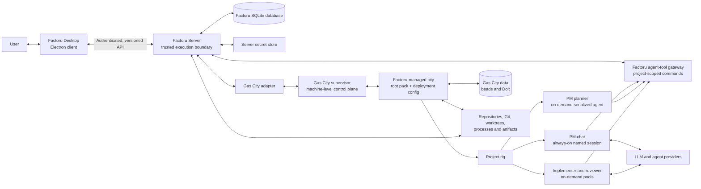
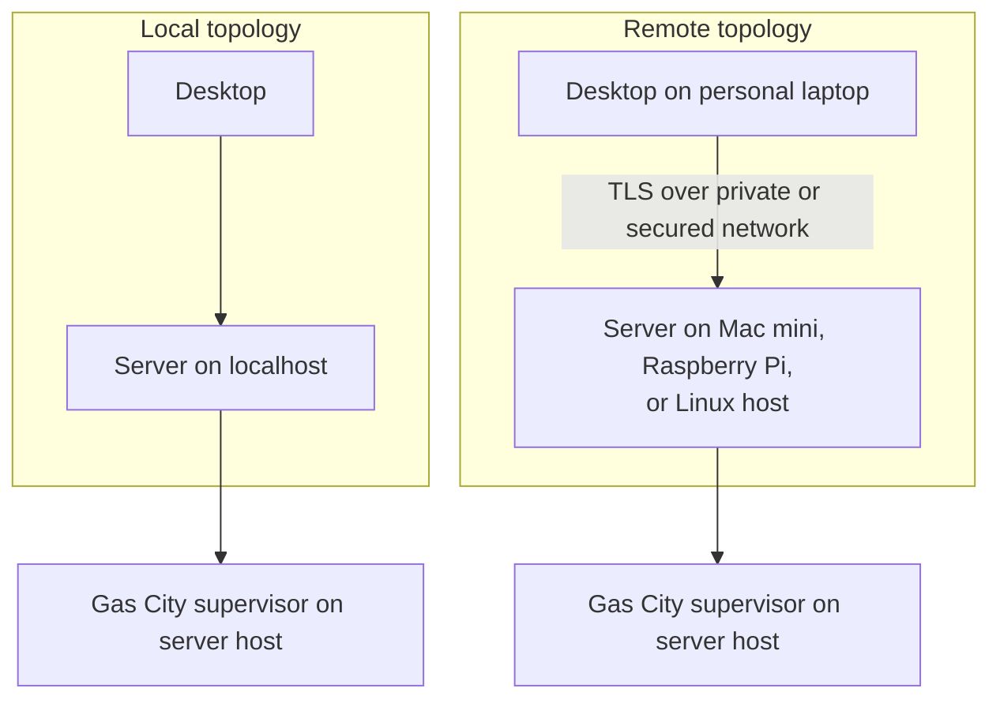
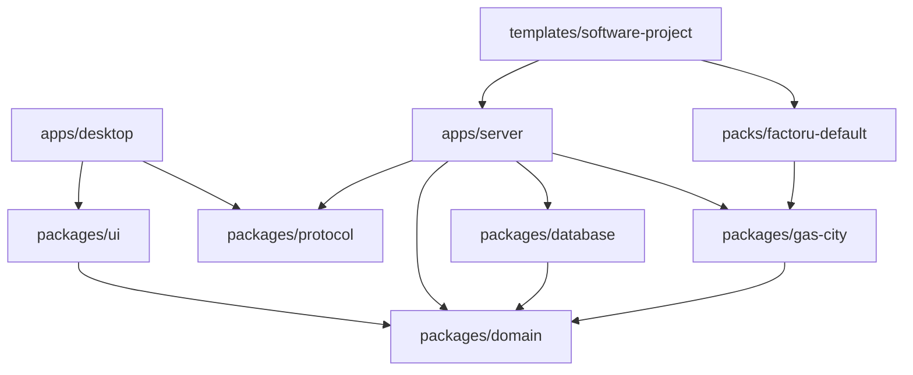
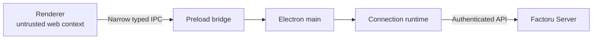
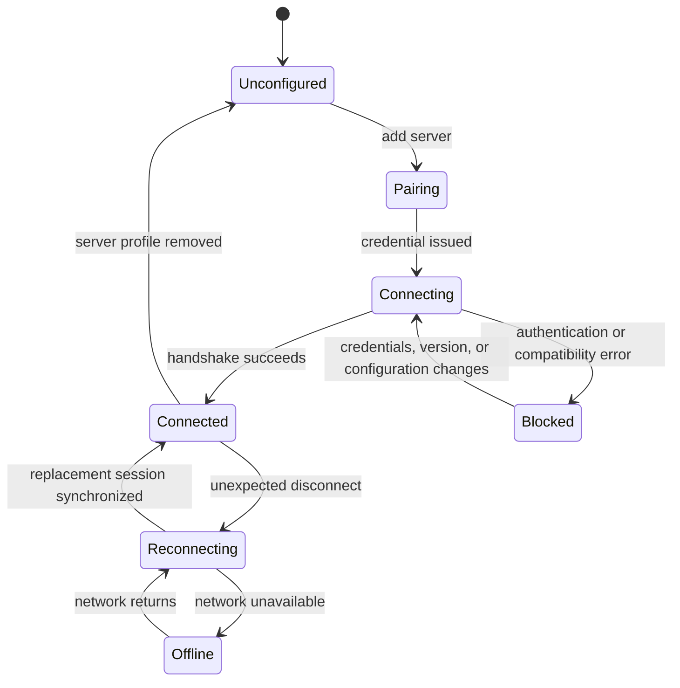
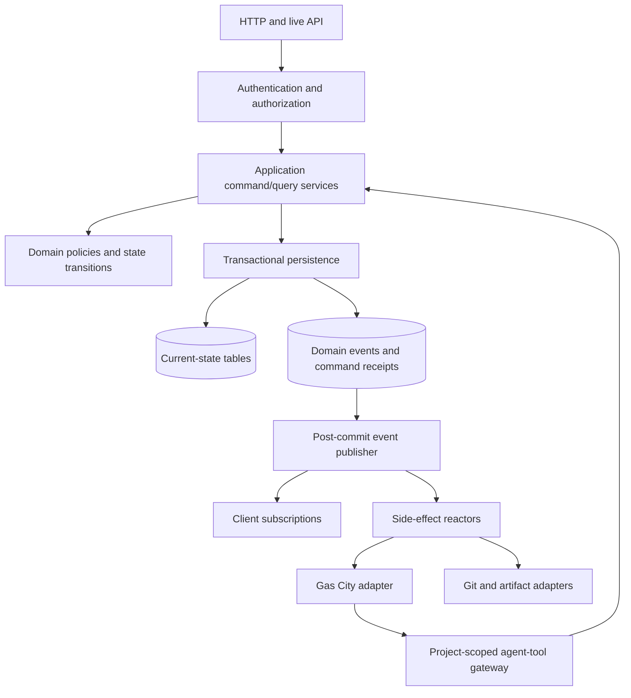
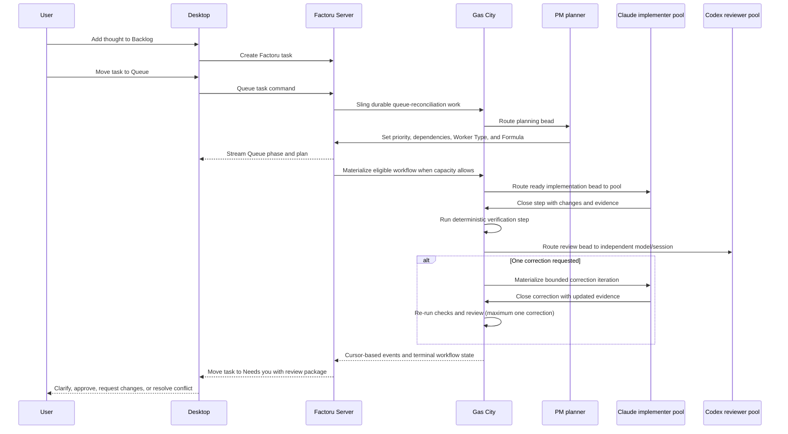

# Factoru Architecture

> Document type: living implementation map
> Last reviewed: 2026-08-04
> Runtime implementation status: not yet scaffolded

This document describes both the architecture Factoru intends to build and the
parts that actually exist. It must change with the code. Product scope and
delivery order live in [ROADMAP.md](./ROADMAP.md); the deferred graph vision
lives in [future/graph-orchestration.md](./future/graph-orchestration.md).

## Status legend

Every architectural component and major capability uses one of these labels:

| Label | Meaning |
| --- | --- |
| **Implemented** | Production code exists, is connected to the real system, and has proportionate verification. |
| **Partial** | Some production code exists, but the described boundary or behavior is incomplete. |
| **Planned** | Accepted architecture for a roadmap milestone, but no production implementation exists. |
| **Deferred** | Product direction intentionally outside the current milestones. |
| **Validate** | A spike or decision is required before this can become the accepted architecture. |

Do not interpret a diagram as proof that a component exists. The implementation
inventory below is authoritative.

## Current implementation inventory

| Area | Status | Current reality | Next proof |
| --- | --- | --- | --- |
| Monorepo | **Planned** | Only product and architecture documents exist. | Scaffold pnpm workspace and CI. |
| Factoru Desktop | **Planned** | No Electron application exists. | Render server health from a real local connection. |
| Factoru Server | **Planned** | No server runtime exists. | Expose versioned health and handshake operations. |
| Shared protocol | **Planned** | Conceptual contract only. | Validate a handshake on both sides from one schema. |
| Factoru database | **Planned** | SQLite/WAL is the accepted direction; no schema exists. | Migration creates and reopens the first database. |
| Authentication and pairing | **Planned** | Security requirements are documented only. | Pair a desktop and revoke its credential. |
| Projects | **Planned** | Domain definition exists only in documentation. | Persist and reopen one repository-backed project. |
| Project Manager chat | **Planned** | The visible role is mapped to a Gas City named chat session plus a separate planning agent; no runtime exists. | Keep chat responsive while a durable queue-reconciliation bead is processed. |
| Four-state tasks | **Planned** | Manual Backlog capture and Queue-trigger semantics are documented only. | User creates a Backlog item and moving it to Queue triggers idempotent PM triage. |
| Worker types | **Planned** | Factoru worker types and Gas City agent/formula composition are documented only. | Persist one worker type with prompt, memory policy, model bindings, tool policy, and concurrency policy. |
| Factoru Gas City pack | **Planned** | Pack contents and ownership are documented only. | Load PM chat/planner, implementer/reviewer agents, and default Formula v2 workflows from a pinned pack. |
| Gas City adapter | **Planned** | Gas City is selected and its typed REST/SSE surfaces are understood but unverified. | Create a dedicated city, add one rig, chat with a named session, and observe one real workflow. |
| Internal review | **Planned** | Fixed bounded workflow is documented only. | One implementation passes checks and internal review. |
| Human review | **Planned** | Needs-you semantics are documented only. | Review a real diff with evidence and choose an outcome. |
| Task-run capsule | **Planned** | One worktree-level capsule per task run is accepted for the single-task loop; no implementation exists. | Correlate one real Formula run, Gas City worktree, implementer, and reviewer to one capsule identity. |
| Service-container isolation | **Deferred** | Tier-two task-specific project services are defined but not scheduled before concurrency. | Run two capsules with distinct Compose, port, and database identities under resource limits. |
| Full-worker container | **Deferred** | Optional tier three, not the default or one container per session. | Prove provider hooks, credentials, caches, tools, ownership, and security on Linux. |
| Parallel orchestration | **Deferred** | The initial WIP limit is one. | Run two isolated tasks without increasing user effort. |
| Custom formulas | **Deferred** | Formula registry compatibility is a design constraint. | Define import, validation, trust, and versioning contract. |
| Graph Studio | **Deferred** | Described only in the future graph-orchestration note. | Revalidate after real formula and node usage exists. |

## Architectural drivers

1. **Remote-first execution.** The code, credentials, agents, and durable state
   may live on an always-on machine different from the desktop.
2. **Conversation-first control with manual capture.** Chat is the main control
   surface, while Backlog is a deliberately low-friction user-editable thought
   dump. Moving a thought to Queue asks the Project Manager to turn it into
   schedulable work.
3. **Durable autonomous work.** Desktop disconnects, server restarts, and agent
   failures must not erase accepted commands or completed work.
4. **One owner per mutable fact.** Factoru, Gas City, Git, and the operating
   system must not each maintain competing authoritative state.
5. **Typed and versioned boundaries.** Desktop and server may update at
   different times, so compatibility must be explicit.
6. **Isolation before concurrency.** Parallel work is enabled only after
   worktrees and runtime resources have deterministic ownership and cleanup.
7. **Human attention is constrained.** More workers are not useful if Needs you
   becomes a larger, noisier queue.
8. **Gas City primitives stay visible at the integration boundary.** Factoru
   adapts cities, rigs, agents, sessions, beads, formulas, packs, convoys, and
   events instead of rebuilding a second orchestration engine.
9. **One progressively capable experience.** Factoru presents an opinionated,
   formula-native UX with curated defaults. Formula, bead, session, and capsule
   detail is disclosed in the same project/task surfaces over time, not through
   separate simple and advanced product modes.

## System context

All components in this diagram are **Planned** unless the implementation
inventory says otherwise.



The server is the security and execution boundary. The desktop never receives
provider credentials and never performs direct database, Gas City, Git,
filesystem, or shell operations.

Factoru Server is also the boundary between Gas City agents and Factoru product
state. Agents receive narrow project-scoped tools; they never open Factoru's
SQLite database.

## Deployment model

Factoru has one runtime architecture and two ways to deploy it.



The same server artifact, protocol, persistence, and task semantics apply in
both modes. “Run on this device” is a desktop-managed installation and lifecycle
convenience, not an embedded alternate backend.

### Stable server identity

**Planned.** Each Factoru Server receives a stable `server_id` on first start.
Desktop connection profiles bind credentials and cached data to this identity,
not merely to a hostname that may change. Projects are server-local entities.

### Access and launch are separate

**Planned.** How the desktop reaches a server is distinct from how that server
was started:

- access may be localhost, private-network HTTPS, user-provided HTTPS, or later
  an SSH/tunnel adapter;
- launch may be a pre-existing service, desktop-managed local service,
  container, or later a desktop-assisted remote installation.

All access methods terminate at the same authenticated Factoru Server API.

### Gas City host compatibility

**Validate.** Gas City publishes macOS arm64/amd64 and Linux arm64/amd64 release
artifacts, but the `gc` binary is not the whole runtime. Current installation
documentation also requires Git, tmux, jq, Dolt, the Beads CLI (`bd`), and
`flock`, plus at least one configured agent harness. Factoru maintains a tested
compatibility manifest for the pinned Gas City release and dependencies rather
than accepting any binaries found on `PATH`.

Server readiness distinguishes: Factoru healthy, Gas City supervisor reachable,
dedicated city ready, bead store ready, required pack resolved, each rig healthy,
and each configured harness/model ready. A failed orchestration dependency must
not make project/task history unavailable.

## Monorepo and dependency boundaries



| Component | Status | Responsibility |
| --- | --- | --- |
| `apps/desktop` | **Planned** | Electron main/preload/renderer, connection profiles, secure local credential storage, and Factoru UI. |
| `apps/server` | **Planned** | Authentication, application services, commands, task policy, Project Manager integration/tools, orchestration coordination, and live events. |
| `packages/protocol` | **Planned** | Runtime-validated wire schemas, compatibility metadata, command/query/subscription contracts, and typed client. |
| `packages/domain` | **Planned** | Framework-independent IDs, entities, state transitions, policies, and ports/interfaces. |
| `packages/database` | **Planned** | SQLite connection policy, migrations, repositories, transactional event/outbox writes, backup, and recovery. |
| `packages/gas-city` | **Planned** | Factoru-owned orchestration port implemented using Gas City REST/SSE or another verified stable interface. |
| `packages/ui` | **Planned** | Factoru design tokens and reusable visual primitives; no transport or server logic. |
| `packs/factoru-default` | **Planned** | Versioned Gas City pack containing agent definitions, prompt templates, tool metadata/wiring assets, doctor checks, and built-in Formula v2 workflows. |
| `templates/software-project` | **Planned** | Built-in Factoru Factory Template manifest referencing the pinned pack plus Worker Types, model slots, tool/memory policies, Formula defaults, capsule requirements, and UI metadata. |

`packages/domain` must not know about Electron, React, SQLite drivers, network
transports, provider SDKs, or Gas City wire formats. Complexity belongs at the
adapter boundary.

## Desktop architecture

**Planned.** Electron has three trust levels:



- **Renderer:** React UI and local presentation state only. Node integration is
  disabled and context isolation is enabled.
- **Preload:** a small allowlisted API. It does not expose raw IPC, filesystem,
  shell, or arbitrary request construction.
- **Main:** windows, updates, OS credential storage, local server lifecycle, and
  connection-profile persistence.
- **Connection runtime:** one owner for authentication, retry/backoff, active
  session, snapshots, subscriptions, compatibility state, and offline caches.

React components do not create sockets, retries, or RPC clients. They consume
domain-specific query, command, and subscription interfaces.

### Connection state machine

**Planned.** Transport health and data synchronization are related but distinct.



Cached projects/tasks may remain visible while offline, but they must be labeled
as cached. A socket being open does not mean every subscription is synchronized.

## Server architecture

**Planned.** Factoru Server is a modular monolith. It should remain one process
and one deployment until evidence requires otherwise.



### Commands, state, and events

**Planned.** Factoru initially uses a transactional state-plus-event model:

1. Every mutation arrives as a typed command with a unique `command_id`.
2. Authentication and project authorization run before domain decisions.
3. Domain logic validates the transition without performing external side
   effects.
4. One short SQLite transaction updates authoritative state, appends audit/domain
   events, records the command receipt, and adds any outbox work.
5. Events become visible to subscribers only after commit.
6. Reactors consume committed intent and perform Gas City or Git side
   effects, reporting outcomes through new idempotent commands.

This adopts T3 Code's strongest reliability properties—total ordering where
needed, command receipts, pure decisions, transactional projection, and
post-commit side effects—without initially requiring every Factoru read model to
be rebuilt exclusively from an event log.

Never hold a database transaction open while waiting for a model, Gas City,
Git, a test process, or the network.

### SQLite ownership

**Planned.** Only Factoru Server opens the database file, which lives on local
server storage. Initial requirements:

- SQLite WAL mode using a pinned version containing applicable WAL fixes;
- foreign keys enabled;
- short serialized write transactions and configured busy handling;
- forward-only migrations with migration tests;
- online, consistent backups;
- explicit checkpoint and disk-full monitoring;
- stable IDs, optimistic entity versions, and idempotency keys;
- cursor pagination and indexes matching real UI queries;
- large logs, diffs, and artifacts stored outside rows with durable metadata.

Initial logical tables include projects, conversations, messages, tasks, task
dependencies, task events, worker types, worker model/agent bindings, project
and role memories, run references, projection cursors, trusted devices, command
receipts, outbox items, and migrations.

### Worker types, agents, models, memory, and tools

**Planned.** A Factoru **Worker Type** is a product-level factory profile, not a
Gas City primitive. Gas City still launches every live agent. A worker type may
compose several Gas City agent templates and a formula:

| Worker Type field | Purpose |
| --- | --- |
| Identity | Stable Factoru ID, name, description, and project scope |
| Agent bindings | Gas City templates used for chat, planning, implementation, review, or synthesis |
| Prompt policy | Versioned pack prompt plus Factoru project/role instructions |
| Model bindings | Named slots such as `chat`, `planning`, `implementation`, and `review`, each resolved to a Gas City harness/model/upstream configuration |
| Tool policy | Allowlisted Factoru tools and repository/runtime capabilities per agent binding |
| Memory policy | Which project, role, task, and run memories the binding may read or propose updates to |
| Workflow | Default Formula v2 and validated variables/routes used when work is assigned to this type |
| Capacity | Factoru execution cap plus mapped Gas City agent/rig/workspace session ceilings |

A versioned **Factoru Factory Template** is the accessible configuration bundle
that composes one pinned Gas City pack with Factoru Worker Types, named model
slots, tool/memory policies, Formula defaults, capsule requirements, and UI
metadata. The first template is built in and uses `factoru-default`; later
templates and user formulas extend the same schema rather than creating a
different product mode.

Initial Factoru tool policy is role-specific:

| Agent binding | Factoru tools |
| --- | --- |
| PM chat | Read project/task status, create/edit Backlog thoughts, request Queue movement, search memory, propose memory updates |
| PM planner | Search/reconcile/merge/split tasks, set priority/order/dependencies/resource intent, assign Worker Type/formula, inspect capacity/runs, request clarification |
| Software implementer | Read immutable task/run plan, inspect capsule/config, report progress/evidence/artifacts, search permitted memory |
| Software reviewer | Read request/plan/diff/check evidence, submit structured verdict/findings, search permitted memory; no task-priority or merge authority |

Repository editing, tests, and Git operations remain explicit harness/capsule
capabilities rather than generic Factoru database tools.

The visible **Project Manager** type maps to two rig-scoped Gas City agents: an
always-on named `project-manager-chat` session and an on-demand
`project-manager-planner` with a maximum of one active planning session. The
visible **Software Engineer** type maps initially to an `implementer` pool and
an independent `reviewer` pool. A worker type can therefore use Claude for its
`implementation` model binding and Codex for `review`; a formula routes each
step to the corresponding agent. One Gas City agent still has one effective
harness/model configuration for a session.

Gas City-managed agents/sessions are Factoru's durable worker boundary; Factoru
does not introduce a separate `Subagent` entity. If a provider harness spawns a
native Claude/Codex subagent inside one step, that helper remains opaque and
bounded by the parent step's capsule, permissions, retry budget, and cost. Work
that needs independent status, scheduling, model choice, memory, recovery,
review, or isolation must instead become a bead routed to a Gas City agent/pool.

Gas City separates five runtime axes: harness (historically the agent
`provider` field), model, upstream model service, transport (`tmux` or ACP where
supported), and city-wide session runtime. Provider-specific model names and
option schemas remain inside `packages/gas-city`; unsupported combinations fail
validation before config is activated.

“Worker memory” is not a shared context window. Pool sessions are independent
processes and Gas City deliberately gives them no direct shared memory or
handles. Factoru defines four durable layers:

1. **Project memory:** repository facts, decisions, conventions, and user goals
   shared according to policy.
2. **Role memory:** lessons and preferences scoped to one Worker Type in one
   project.
3. **Task/run context:** the task snapshot, bead history, artifacts, decisions,
   and handoffs for one execution.
4. **Session transcript:** Gas City/provider conversation history for one live
   identity; useful for resume and audit but not the sole durable memory.

Project and role memories are Factoru entities with provenance, versions, and
bounded retrieval. Agents use scoped `memory.search` and `memory.propose_update`
tools; models do not silently append permanent memory. Prompt rendering injects
only a bounded relevant summary, while beads carry current work and handoffs.

Tool delivery is **Validate**. Gas City can catalog pack MCP configuration, but
its current active materializer does not automatically attach configured MCP
servers to every harness. `packages/gas-city` must prove harness-specific MCP,
provider hooks, or a narrow Factoru command/HTTP bridge and present one stable
role-scoped tool contract above those mechanisms. Raw tools are never granted
merely because a model requested them.

## Protocol architecture

**Planned; transport library requires an ADR.** Use a small HTTP surface for
health, pairing, token exchange, and operational downloads plus a typed live
connection for commands, queries, and subscriptions.

The protocol must provide:

- runtime schema validation on both sides;
- `server_id`, protocol version, application version, and capability handshake;
- method-level authorization rather than “connected means fully trusted”;
- unary queries distinct from durable subscriptions;
- command IDs and idempotent retry behavior;
- monotonic event sequence/cursor and snapshot-plus-delta resynchronization;
- bounded subscriptions by project/task instead of full-database broadcasts;
- structured errors that distinguish retryable transport failures from blocked
  authentication, configuration, and compatibility states;
- forward-compatible decoding for additive server capabilities where safe.

Desktop/server compatibility should be negotiated, not inferred from identical
package versions. A deployment may update one side before the other.

## Core product flows

### Pair a desktop

**Planned.** A short-lived, one-time pairing credential is exchanged for a
revocable device session. Long-lived credentials are stored in the desktop OS
credential store, not renderer storage. WebSocket authentication uses a
short-lived connection ticket so long-lived tokens do not appear in URLs.

### Backlog capture and Queue reconciliation

**Planned.** Backlog is a user-editable thought dump. A user can create or edit
a Backlog card directly with minimal structure, and the Project Manager may add
cards from conversation. No Gas City execution bead is required while an item
remains in Backlog.

Moving a card from Backlog to Queue is an explicit command meaning “turn this
into planned, schedulable work.” In one Factoru transaction it changes the
status, records the user action, and enqueues an idempotent
`queue_reconciliation_requested` outbox item. The reactor creates or reuses a
durable Gas City planning bead routed to `project-manager-planner`; it does not
nudge or interrupt the chat session.

Repeated edits and bursts of Queue changes coalesce by project/version into one
pending reconciliation pass. The planner may use scoped tools to:

```text
search/merge/split tasks
clarify acceptance criteria
set priority and Queue order
add/remove task dependencies and resource locks
select Worker Type and Formula
mark ready, waiting for dependency/capacity, or needs clarification
inspect workers, runs, capsules, and capacity
```

The four Kanban statuses remain stable. Queue planning detail is a separate
machine-managed phase—`awaiting_triage`, `triaging`, `ready`,
`waiting_dependency`, or `waiting_capacity`—shown as a card badge rather than a
new column. PM planning does not move the task to `in_progress`; that status is
reserved for accepted execution. If clarification is required, the task moves
to `needs_you` with an exact question.

The chat session and planning agent may run concurrently because they are
different Gas City identities. Queue reconciliation itself is serialized to one
planner per project to avoid racing priority, merge, and dependency decisions.
The planner is event-driven—Queue changes, dependency changes, run outcomes,
and newly available capacity request a pass—rather than an unbounded token-
consuming loop.

### Conversation to task

**Planned.** Each project conversation has a stable Factoru conversation ID and
is bound through Gas City's external-messaging protocol to that project's
Project Manager named session. Factoru Server registers the external client,
keeps its bearer credential server-side, subscribes before sending, reconnects
with `Last-Event-ID`, and persists accepted user and assistant messages in the
Factoru database. The desktop never receives a Gas City address or token.

The Project Manager uses a Factoru-owned, project-scoped tool surface to inspect
a bounded set of active/recent reconciliation candidates and request structured
intent:

```text
create task | update existing task | propose merge | ask clarification | no task
```

The chat agent may create a thought in Backlog or explicitly queue it when the
user asks. The tool gateway validates the agent identity and project scope, then
applies task changes through ordinary idempotent commands. A model never writes
the database or sends trusted SQL/commands directly. Ambiguous merges require the
user until reconciliation quality is measured. Chat prose is not parsed as the
authoritative mutation when a structured tool call exists.

### Task execution and review

**Planned.** The first production flow has a WIP limit of one.



The user configures the Software Engineer Worker Type's implementation and
review model bindings. “Multi-agent review” means independent agents, sessions,
and contexts; the reviewer is a binding inside the Software Engineer profile,
not necessarily a third top-level Worker card.

### Gas City boundary

**Planned and requires operational validation.** Factoru uses Gas City's native
model rather than treating it as a generic job runner.

#### Runtime topology

- A Gas City **supervisor** is a machine-level control plane and may host cities
  unrelated to Factoru. Factoru must not stop or reconfigure the entire
  supervisor as though it owns the host.
- Each Factoru Server creates or adopts exactly one dedicated **city**, named
  from its stable `server_id` and rooted under the Factoru server data directory.
- The Factoru city is the local root **pack** plus deployment details. It imports
  a version-pinned `factoru-default` pack. Portable behavior belongs in the
  pack; deployment choices belong in `city.toml`; machine-local paths and
  runtime state belong in `.gc/`/site bindings.
- Each initial Factoru project maps one-to-one to a Gas City **rig** registered
  against its repository path. Factoru persists the city name, rig name, and
  bead prefix as external references, not product identity.
- Gas City uses one city-level Dolt-backed bead store with hard prefix scoping
  for the city and its rigs. This store is separate from Factoru SQLite.

The integration deliberately preserves Gas City's three configuration layers:

| Layer | Factoru location/ownership | Contents |
| --- | --- | --- |
| Portable pack | Versioned `packs/factoru-default` source and pinned deployed import | Agents, prompts, formulas, tool metadata/harness wiring assets, commands, doctor checks, and reusable assets |
| City deployment | Factoru-managed city root | Root `pack.toml`, `city.toml`, rig declarations, provider/harness registrations, runtime policy, and import lock |
| Machine-local site/runtime | City `.gc/` and Gas City-managed runtime directories | Rig path bindings, caches, sockets, logs, sessions, generated state, and Gas City worktrees |

Registering a rig also creates Gas City/Beads metadata in the repository (for
example `.beads/` configuration pointing to the city endpoint). Project setup
must preview, verify, and document this mutation; project removal must not
silently delete it or user work.

Gas City's six primitives and related runtime concepts map to Factoru as follows:

| Gas City concept | Gas City meaning | Factoru use | Product/UI rule |
| --- | --- | --- | --- |
| City | Root pack plus one machine deployment | Dedicated orchestration environment for one Factoru Server | Hidden under server health/settings; not a user project |
| Rig | Registered external project/repository and bead namespace | One rig per repository-backed Factoru project initially | Factoru project remains the user-facing identity |
| Pack | Versioned agents, formulas, orders, prompts, commands, tools, and checks | `factoru-default` supplies Factoru's orchestration behavior | Custom packs are trusted code and require a later explicit trust flow |
| Agent | One configured runtime role: prompt, scope, harness, model, tools/hooks, work query, and pool policy | Low-level chat, planner, implementer, and reviewer bindings behind Factoru Worker Types | Workers edits the product profile; it does not expose raw TOML initially |
| Session | One live disposable instance of an agent | PM chat is always-on; planning is serialized on demand; implementer/reviewer roles scale on demand | A session is not a Worker Type or a Factoru device/login session |
| Bead | Durable universal work unit | Workflow root and step execution state | Never render every bead as a Kanban task |
| Formula | Reusable method compiled into a routed bead graph | Queue reconciliation and software-delivery methods composed from several agent roles | It defines the work flow, not the Worker Type |
| Convoy | Grouping bead with `tracks` edges | Later groups decomposed work and feeds drain/fan-out | Not an MVP task list or status column |
| Event | Immutable sequenced observation | Source for run projection, recovery, logs, and health | Factoru translates it into bounded product events |
| Order | Trigger plus formula or trusted exec action | Later scheduled maintenance/automation | Not used to select user tasks; Factoru owns Queue/WIP policy |

#### Agent and session shape

The default pack contains rig-scoped `project-manager-chat`,
`project-manager-planner`, `software-implementer`, and `software-reviewer`
agents. Gas City's current configuration supports rig-scoped named sessions, so
the chat template is declared as `mode="always"` once per rig. The planner has
`max_active_sessions=1`; implementer and reviewer templates are on-demand pools.
The foundation spike still verifies external-message routing and context
isolation end to end.

Do not configure a pool minimum on the chat template. Gas City treats an
always-on named session and `min_active_sessions` as independent sources of live
sessions and its doctor warns about accidental combinations. Chat continuity and
planning concurrency therefore use different agent templates even though the
Factoru UI groups them as one Project Manager Worker Type.

Agents coordinate indirectly through routed work, beads, and mail; Factoru does
not add direct agent-to-agent process handles. The Project Manager's exception is
not direct worker control: it calls Factoru product tools to reconcile tasks,
selects a Worker Type/formula, and expresses task dependencies. Gas City routes
ready formula steps to a role/pool and chooses concrete session identities. This
keeps authorization outside prompts and keeps runtime assignment in the
orchestrator.

#### Task and bead correlation

A Factoru task is product intent and may have zero, one, or many attempts. Each
`task_run` records at least the Gas City city/rig, formula identity and resolved
version, workflow-root bead ID, optional convoy ID, starting event cursor,
request/correlation IDs, terminal disposition, and artifact references. Formula
step beads stay Gas City-owned execution detail.

There is intentionally no one-to-one status mapping:

- Factoru `backlog` has no Gas City work; `queue` may have a correlated PM
  planning bead but no implementation workflow until its plan is accepted;
- Factoru enters `in_progress` only after a run is accepted and correlated;
- Gas City `open`, derived `blocked`/`deferred`, `in_progress`, and `closed`
  describe execution readiness, not Kanban policy;
- a closed workflow produces a review package and moves the Factoru task to
  `needs_you`; failed, cancelled, or exhausted workflows also move there with a
  precise requested action unless policy safely requeues them.

Duplicate-task reconciliation occurs before dispatch in Factoru. It must not be
implemented by merging arbitrary Gas City beads.

#### Formula and run lifecycle

The `factoru-default` pack initially supplies two Formula v2 methods:

- `queue-reconcile` routes durable planning work to the serialized PM planner;
- `software-delivery` routes independently executable steps to the Software
  Engineer Worker Type's implementer and reviewer bindings.

`software-delivery` has independently routable steps and durable `needs` edges.
Its accepted contract is:

1. prepare and validate the task/run inputs;
2. implement through the Worker Type's `implementation` model binding;
3. run deterministic checks without constructing shell from task text;
4. review through its independent `review` model binding/session;
5. allow at most one correction iteration, then re-run checks and review;
6. finalize to a structured terminal result for Factoru to package.

Use `check` for bounded judgment/correction loops and `retry` only for classified
transient failures. Retried bodies must be idempotent because Gas City's control
plane is idempotent but an agent's external side effects are not. The formula's
compiler requirement, resolved pack/formula version, variables, routes, and
budgets are validated and recorded before dispatch.

A Formula owns the reusable execution method, not the whole user experience.
Factoru continues to own chat, Backlog and Kanban state, Worker Types, Factory
policy, permissions, durable memory, human decisions, and the task/run
projection around it. The UI initially shows concise stages and evidence, then
progressively exposes the selected run's Formula graph, beads, sessions,
dependencies, and controls in those same surfaces. There is no simple/advanced
mode boundary or alternate state model.

#### Parallelism and capacity

**Deferred until capsules, but part of the accepted model.** The project Factory
setting is `max_parallel_implementation_workers`. Setting it to three means at
most three `software-implementer` sessions may execute three eligible task units
at once; it does not promise three will always run.

The Project Manager decides logical eligibility by recording Factoru task
dependencies, resource conflicts/locks, Worker Type, formula, and priority. It
does not choose `SE 1` or `SE 2`. Factoru validates the plan and admits ready
tasks up to the project cap. Gas City then enforces materialized `needs` edges,
routes ready beads to the implementer pool, and scales concrete sessions up to
the mapped `max_active_sessions` limit.

Gas City also has rig- and workspace-level total session caps. Factoru reserves
capacity for the PM chat, serialized planner, reviewers, and control sessions so
the user-facing implementation cap is not accidentally consumed by the
always-on PM. The effective limit is always the minimum of Factoru policy, Gas
City role/rig/workspace caps, provider quotas, healthy capsule capacity, and
host CPU, memory, storage-I/O, and service pressure.

Four cloud-model implementation sessions on an 8 GB Raspberry Pi-class Linux
host are a benchmark target, not an architectural guarantee. The Linux arm64
spike must measure representative builds and task-specific services from one
through four sessions; runtime admission reduces effective capacity when host
headroom is insufficient.

Cross-task dependencies remain authoritative Factoru product relations. When a
run or convoy is materialized, the adapter snapshots them into Gas City `needs`
edges; that execution snapshot is then Gas City-owned and is not separately
edited from both systems. Formula v2 drain with `context="separate"` is the
preferred later fan-out mechanism after tier-one capsules are proven.

Factoru dispatches accepted tasks explicitly with the typed supervisor control
plane (the equivalent of formula sling). Gas City **orders** do not consume the
Factoru Queue in the MVP, because that would create a second scheduler. Later,
orders may run maintenance or event-driven automation that has an explicit
Factoru policy.

#### Adapter contract

The adapter prefers Gas City's typed REST/SSE API and generated schemas. CLI JSON
may be used for installation/doctor operations only when the API lacks the
required lifecycle operation; human-readable CLI output is never parsed.

The adapter exposes Factoru-owned operations such as:

```text
validateInstallation
ensureSupervisor
ensureCity
installAndPinPack
registerRig
applyWorkerTypeBindings
ensureProjectManagerChatSession
sendProjectManagerTurn
observeProjectManagerReplies
requestQueueReconciliation
observePlanningWork
readCapacity
validateFormula
startRun
observeRun
cancelRun
recoverRuns
describeRun
```

Mutation requests carry Gas City's required anti-CSRF header; request IDs are
captured for diagnostics; Problem Details error codes are mapped to stable
Factoru errors. Event and reply SSE consumers persist sequence cursors and resume
with supported cursor/`Last-Event-ID` semantics. A `202 Accepted` is not treated
as completion; Factoru correlates the terminal request event or reconciles the
resource after restart.

Gas City IDs and payloads remain inside the adapter or dedicated persistence
records. The operational spike must test named-session chat, tool authorization,
event replay, duplicate delivery, restart adoption, cancellation, partial
failure, config reload, upgrades, `.beads/` effects on existing repositories,
and Linux arm64 before Raspberry Pi is declared supported.

### Worktree capsules

**Planned tier one; later tiers deferred.** A capsule is one Factoru-owned
resource-lease identity for one task run or independently scheduled Formula
unit. It is not created per ephemeral agent session. Implementation, checks, and
review for the same run use the same capsule/worktree, with role-appropriate
write permissions and auditable access.

| Tier | Isolation | Roadmap policy |
| --- | --- | --- |
| **1 — Worktree** | Git worktree/branch plus Factoru port, environment, process, log, health, lock, artifact, and cleanup leases | Required for the single-task production loop and before concurrency |
| **2 — Project services** | Tier one plus task-specific Docker Compose identity, application-service containers, networks, volumes, database namespace, and CPU/memory/log limits | Added for projects whose runtime services need isolation |
| **3 — Full worker** | Tier two plus the provider harness and agent tools inside the capsule container | Optional later hardening; never one container per ephemeral session by default |

The preferred ownership split is **Validate** until proven against a real Gas
City release:

- Gas City creates and removes Git worktrees for Formula v2 separate-context
  units and retains its machine-local worktree state;
- Factoru creates the stable capsule record and owns non-Git leases: ports,
  process supervision, service containers, databases, logs, limits, health,
  retention, and cleanup policy;
- Formula setup/teardown or scoped steps acquire and release the Factoru lease,
  correlated by task-run, workflow, and worktree identity;
- if the spike disproves this split, an ADR chooses a replacement, but no
  lifecycle operation may have two active owners.

Tier two keeps the Gas City/provider session on the host and containerizes the
project runtime. This avoids passing broad Docker access and provider credentials
into every worker while still isolating the services most likely to collide.
Tier three must prove provider hooks, authentication, caches, tool transport,
filesystem ownership, network policy, and Linux compatibility before adoption.
No worker receives the Docker socket or privileged mode merely to manage its own
capsule.

## State ownership

| State | Authoritative owner | Factoru may store |
| --- | --- | --- |
| Projects, conversations, tasks, task dependencies, Worker Types, model bindings, capacity policy | Factoru database | Authoritative records and history |
| Project and role memory | Factoru database/artifact store | Authoritative versioned entries, provenance, summaries, and retrieval metadata |
| Pairing credentials and sessions | Factoru Server authentication store | Authoritative hashes/metadata; secrets in appropriate secret stores |
| Project Manager message history | Factoru database | Authoritative product transcript; Gas City transcript/binding references for delivery and recovery |
| Gas City city, rig, pack, agent, and session runtime | Gas City configuration/supervisor | Desired Factoru configuration, external IDs, health, and last reconciliation result |
| Formula execution and bead readiness | Gas City | Workflow/convoy/bead IDs, versions, cursors, cached projection, summarized evidence |
| Commits, branches, and diffs | Git | References, intended lifecycle, cached summaries |
| Worktree lifecycle | Gas City, if the preferred split validates | Task/capsule/run correlation, path reference, health, and cleanup outcome |
| Capsule identity, resource leases, limits, and retention policy | Factoru database | Authoritative desired allocation and lifecycle history |
| Live processes, containers, ports, networks, volumes, and database instances | OS/container runtime | Runtime handles/PIDs, observed health, usage, and reconciliation state |
| Provider credentials | Server secret store/provider CLI | References and redacted availability only |
| Large logs and artifacts | Server artifact storage | Metadata, content hash, size, retention, and access policy |
| Desktop connection profiles | Desktop main process | Server identity, endpoint hints, credential references, cache cursors |

Cached external state must be reconstructible. No UI projection may become an
independently editable second truth.

## Reliability and recovery

**Planned.** Build recovery behavior with the first feature rather than adding it
after orchestration:

- idempotent commands survive retries after uncertain responses;
- accepted intent is persisted before external work starts;
- server startup replays incomplete outbox work and reconciles active Gas City
  runs, the dedicated city, rig registrations, and Project Manager sessions;
- Gas City event and external-message streams resume from persisted cursors and
  tolerate duplicate delivery;
- repeated Queue changes coalesce without running concurrent planners for the
  same project/version, and stale planning writes fail optimistic checks;
- permanent memory updates retain source/provenance and cannot silently
  overwrite a newer user or agent revision;
- subscriptions resume from a cursor or request a fresh bounded snapshot;
- task/run state changes include causation and correlation IDs;
- every retry and agent correction loop is bounded and observable;
- cancellation is a durable requested state followed by a confirmed outcome;
- task completion is not inferred solely from a provider stream ending;
- online backups and restore drills are milestone acceptance criteria;
- logs and metrics identify server, project, task, run, and command without
  including secrets or raw sensitive prompts by default.

## Security boundaries

**Planned.** The server binds to localhost by default. Remote use requires
authentication and protected transport. Authorization is enforced per operation
and project, even after a connection is authenticated.

Initial trust boundaries:

- the renderer is untrusted relative to Electron main;
- every desktop/server payload is untrusted until decoded;
- backlog text, task fields, bead/mail content, memory proposals, and all model
  output are untrusted data and can only request allowlisted domain tools;
- every agent-tool credential is short-lived or revocable, bound to one project
  and role, and accepted only on a server-local/internal listener;
- repository paths are validated against registered project roots;
- project commands are declared configuration, not arbitrary model-generated
  shell strings;
- pairing links are short-lived secrets and sessions are revocable;
- provider/repository credentials never enter renderer state or normal logs;
- artifact download paths use opaque IDs rather than filesystem paths;
- Factory Template manifests, city config, Formula v2 files, pack commands, MCP
  configuration, imported packs, and exec/session-provider scripts are trusted
  configuration or executable dependencies; they must be pinned, reviewed, and
  never assembled from untrusted task text.

## What Factoru learns from T3 Code

This analysis reviewed T3 Code's repository and maintainer documentation on
2026-08-04. T3 Code remains a reference; no source code or dependency is copied
by this decision.

| T3 Code approach | Lesson for Factoru | Decision |
| --- | --- | --- |
| Server owns providers, Git, terminals, filesystem, and durable sessions; clients use one authenticated RPC boundary. | A remote-capable agent product needs one clear execution boundary. | **Adopt.** Factoru Desktop remains an unprivileged client. |
| Shared runtime-validated contracts and typed unary/streaming RPC. | Schema drift and ad-hoc push messages become expensive quickly. | **Adopt the principle.** Select the smallest suitable TypeScript library in an ADR. |
| One connection supervisor owns retries, offline state, credentials, and session replacement. | Multiple retry owners create lying UI and duplicate work. | **Adopt.** Keep transport attempts single-shot underneath it. |
| Stable environment identity is separate from changing endpoints. | Hostnames and LAN addresses are not durable identities. | **Adopt** as `server_id` plus client connection profiles. |
| Access method is separate from server launch method. | SSH, Tailscale, localhost, and tunnels should not fork product semantics. | **Adopt.** Start with localhost and user-secured remote HTTPS. |
| Method-level scopes plus one-time pairing and revocable sessions. | Possessing a socket must not authorize every privileged action. | **Adopt**, initially with a smaller Factoru scope set. |
| Commands become persisted events and projections in one transaction; command receipts make retries idempotent. | This gives strong crash/retry behavior and ordered state changes. | **Adapt.** Use authoritative state tables plus event/outbox and receipts first; consider full event sourcing only with evidence. |
| Side effects run in queue-backed reactors after intent is committed. | Provider/Git failures should not corrupt domain transactions. | **Adopt.** Outcomes re-enter through commands. |
| Provider driver registry normalizes several agent runtimes. | Worker roles must not be coupled to one provider protocol. | **Adapt.** Gas City owns provider runtimes; Factoru normalizes Worker Type model bindings and capabilities at its adapter. |
| Hidden Git checkpoints bracket agent turns and support exact diff/revert. | Review and recovery need durable baselines, not only working-tree snapshots. | **Adapt.** Evaluate checkpoints together with task worktrees and Gas City ownership. |
| Worktree-specific state and stable derived development ports. | Development tooling itself must not collide across worktrees. | **Adopt during Milestone 0**, including per-worktree server data directories. |
| Bounded subscriptions and cached/offline projections. | Broadcasting or hydrating all history will eventually hurt responsiveness. | **Adopt.** Design cursor pagination and project/task subscriptions initially. |
| Electron is a shell around a separately runnable server/web runtime. | Local and remote operation should share one backend artifact. | **Adopt the deployment principle**, while building Factoru's original UI. |
| Effect, Effect RPC, Atom state, and a fully event-sourced orchestration engine. | These solve real problems but introduce a substantial conceptual stack. | **Do not copy automatically.** Choose them only if a focused spike beats simpler alternatives. |
| Web, desktop, mobile, relays, SSH launch, multiple VCS hosts, terminals, and many providers. | Mature breadth is useful evidence, but it is not Factoru's starting scope. | **Defer.** Protect the single-task product loop. |

Two especially important operational lessons:

1. T3 Code's repository rules isolate development state inside each worktree and
   derive stable ports from the worktree. Factoru must do this for its own
   monorepo before it tries to offer capsules to users.
2. T3 Code has already needed to bound catch-up replay and avoid full-database
   snapshot hydration. Factoru should begin with cursor-based bounded sync rather
   than discover that constraint after accumulating task history.

T3 Code's current documents are not perfectly synchronized: an older provider
architecture page says only Codex is implemented, while its maintained overview,
README, package dependencies, and provider registry describe five built-in
drivers. Factoru therefore treats architecture status as a maintained inventory,
not prose that can remain untouched after implementation changes.

## Decisions still requiring ADRs or spikes

| Decision | Status | Required evidence |
| --- | --- | --- |
| Server framework and runtime | **Validate** | Local/remote streaming slice, packaging, cancellation, and Linux arm64 viability. |
| Protocol/RPC library | **Validate** | Runtime validation, subscriptions, auth hooks, reconnection, and generated/inferred client ergonomics. |
| SQLite driver and migration tool | **Validate** | Native packaging across targets, WAL configuration, backup, and load/recovery benchmark. |
| Worker Type binding compiler | **Validate** | Apply prompt, model-slot, tool, memory, formula, and capacity settings to the correct Gas City agents without leaking raw config into the domain. |
| Gas City supervision/install strategy | **Validate** | macOS and Linux installs, version pinning, upgrades, health, and recovery. |
| Dedicated city and project-rig lifecycle | **Validate** | Coexist with unrelated supervisor cities, stable naming, rig add/remove, repository `.beads/` effects, and safe recovery. |
| Project Manager session isolation | **Validate** | Rig-qualified always-on sessions, external-message binding/replay, concurrent project chats, and no context leakage. |
| Project Manager chat/planner split | **Validate** | Chat remains responsive while one serialized durable queue-reconciliation bead runs, with shared Factoru memory but no assumed shared context window. |
| Factoru agent-tool transport | **Validate** | Harness-specific MCP, provider hooks, or equivalent local bridge with project/role-scoped credentials and auditable calls; do not assume Gas City auto-attaches catalogued MCP. |
| Durable memory storage/retrieval | **Validate** | Provenance, optimistic updates, bounded prompt injection, relevance, deletion, and resistance to poisoned task/model content. |
| Capacity mapping | **Validate** | Factoru implementation cap maps correctly to agent/rig/workspace session caps while reserving PM, reviewer, and control capacity. |
| Factory Template manifest | **Validate** | Small versioned schema composing a pinned pack, Worker Types, models, tools/memory, Formula defaults, capsule requirements, and UI metadata without duplicating Gas City config. |
| Default pack installation and patching | **Validate** | Pinned import/lock behavior, worker model updates, config reload, rollback, and doctor checks. |
| Gas City API compatibility policy | **Validate** | Pin a tested release/OpenAPI schema and detect incompatible server versions before mutation. |
| Gas City versus Factoru capsule lifecycle | **Validate** | Real `software-delivery` run where Gas City owns one shared Git worktree and Factoru owns one correlated non-Git lease without dual ownership. |
| Tier-two container policy | **Validate** | Compose identity, ports, volumes/databases, limits, logs, secrets, health, recovery, and cleanup on macOS and Linux without exposing the Docker socket to workers. |
| Raspberry Pi capacity | **Validate** | Linux arm64 benchmark with representative builds/services and one through four cloud-model sessions on an 8 GB host; derive safe dynamic admission thresholds. |
| Local server lifecycle | **Validate** | Login service versus managed process versus container UX and failure recovery. |
| Remote TLS onboarding | **Validate** | Secure path that remains understandable for personal-server users. |

Record accepted choices as ADRs under `docs/adr/` and update this document's
status and diagrams in the same change.

## References

- [T3 Code repository](https://github.com/pingdotgg/t3code)
- [T3 Code architecture overview](https://github.com/pingdotgg/t3code/blob/main/docs/internals/overview.md)
- [T3 Code workspace layout](https://github.com/pingdotgg/t3code/blob/main/docs/internals/workspace-layout.md)
- [T3 Code connection runtime](https://github.com/pingdotgg/t3code/blob/main/docs/architecture/connection-runtime.md)
- [T3 Code remote architecture](https://github.com/pingdotgg/t3code/blob/main/docs/internals/remote.md)
- [T3 Code environment authentication](https://github.com/pingdotgg/t3code/blob/main/docs/internals/environment-auth.md)
- [T3 Code source control](https://github.com/pingdotgg/t3code/blob/main/docs/user/source-control.md)
- [T3 Code repository instructions](https://github.com/pingdotgg/t3code/blob/main/AGENTS.md)
- [Gas City documentation](https://docs.gascity.com/)
- [Gas City tutorials](https://docs.gascity.com/tutorials)
- [How Gas City works](https://docs.gascity.com/getting-started/how-gas-city-works)
- [Gas City installation and runtime dependencies](https://docs.gascity.com/getting-started/installation)
- [Gas City connected clients](https://docs.gascity.com/guides/connected-clients)
- [Gas City context, state, history, roles, and identity](https://docs.gascity.com/guides/capabilities-for-coding-agent-users)
- [Gas City configuration reference](https://docs.gascity.com/reference/config)
- [Gas City packs](https://docs.gascity.com/guides/understanding-packs)
- [Gas City agents tutorial](https://docs.gascity.com/tutorials/02-agents)
- [Gas City sessions tutorial](https://docs.gascity.com/tutorials/03-sessions)
- [Gas City formulas](https://docs.gascity.com/guides/understanding-formulas)
- [Gas City Formula v2 specification](https://docs.gascity.com/reference/specs/formula-spec-v2)
- [Gas City supervisor API](https://docs.gascity.com/reference/api)
- [Gas City bead storage topology](https://docs.gascity.com/reference/internal/beads-topology)
- [Gas City command trust boundaries](https://docs.gascity.com/reference/trust-boundaries)
- [Docker resource constraints](https://docs.docker.com/engine/containers/resource_constraints/)
- [Factoru roadmap](./ROADMAP.md)
- [Factoru deferred graph orchestration](./future/graph-orchestration.md)
