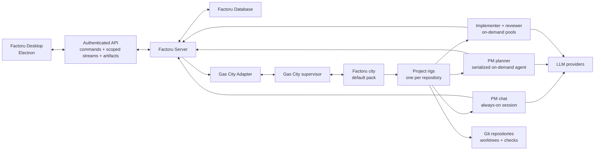
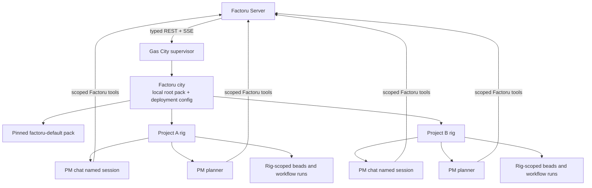
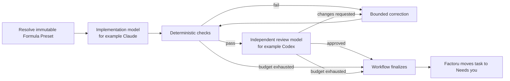

# Factoru Roadmap

> Status: Milestone 7 implementation complete; provider/remote acceptance pending; Milestone 8 is next
> Last updated: 2026-08-12

This is the single delivery roadmap for Factoru. It intentionally starts with a
small, coherent product and keeps the broader graph-orchestration vision as a
later direction. The
[future graph-orchestration note](./future/graph-orchestration.md) is not a
second implementation plan. [ARCHITECTURE.md](./ARCHITECTURE.md) is the living
map of planned and implemented system boundaries.

## Product statement

Factoru is a personal development team that runs on infrastructure the user
controls.

The user installs **Factoru Server** on an always-on machine such as a Mac mini,
Raspberry Pi, Linux server, or their own laptop. They install the **Factoru
Desktop** Electron app on their personal Mac or Linux computer and connect it to
that server. Running both applications on the same machine is a supported
one-click setup, not a different architecture.

Inside each project, the user primarily talks to a Project Manager. The Project
Manager turns conversation into tasks, reconciles repeated requests, orders the
work, and delegates implementation. The user does not have to maintain the
board manually. The Tasks and Team views make the Project Manager's actions
visible and configurable.

The initial promise is deliberately narrow:

> Tell the Project Manager about one change—or capture it in Backlog and queue
> it—then let a Software Engineer implement and internally review it through Gas
> City and receive a useful result in **Needs you**.

## Product vision

The MVP is intentionally serial and constrained, but it must grow toward seven
defining product capabilities:

1. **Automatic orchestration for all tasks.** The user describes a bug, feature,
   or requirement to the Project Manager or drops a rough thought into Backlog.
   When the user queues it, Factoru turns it into durable planned work,
   determines dependencies and safe parallelism, delegates it through Gas City,
   verifies the result, and runs internal multi-agent review before asking the
   user to review anything. The user can inspect and interrupt this process but
   should not have to coordinate it manually.
2. **Live, durable conversation.** Project Manager chat should feel immediate
   without making transient provider output a second source of truth. Text,
   structured tool activity, and images stream through resumable, bounded
   subscriptions; reconnect reconstructs the exact durable turn without missing
   or duplicating content. Images are the first attachment type on a general
   server-owned artifact foundation.
3. **Automatic task reconciliation.** Every new request is compared with active
   and recent work before a task is created. A repeated bug report should merge
   into the existing task as new evidence or scope rather than create a
   duplicate. Uncertain matches are explained and brought to the user instead
   of being merged silently.
4. **Tiered task-run capsules.** Each concurrently executing task run or
   independently scheduled Formula unit receives one managed capsule; ephemeral
   agent sessions do not receive competing capsules. Isolation grows from a Git
   worktree and resource leases, to containerized project services, and only
   later to a fully containerized worker where justified. A capsule can own its
   branch, ports, processes, environment, Docker Compose identity, databases,
   logs, artifacts, health checks, and safe cleanup.
5. **A visual Kanban control surface.** Backlog is a user-editable thought dump:
   the user can add rough items without first explaining or structuring them.
   Moving an item to Queue explicitly asks the Project Manager to reconcile,
   clarify, prioritize, plan dependencies, and assign a Team role/Formula Preset.
   The board remains Backlog, Queue, In progress, and Needs you.
6. **Configurable teams.** A Team role profile owns versioned prompt policy,
   durable role memory, one or more model bindings, scoped Factoru tools, a
   default Formula Preset, and capacity policy. Project Factory settings cap
   parallel implementation workers while the Project Manager decides which
   tasks are logically safe to run together.
7. **One formula-native experience.** Factoru gives Gas City a coherent product
   UX rather than separate simple and advanced modes. Curated Project Blueprints
   and Formula Presets make the product immediately usable; the same interface
   progressively gains Formula selection, run inspection, and safe customization
   without forcing users to understand raw Gas City configuration.

The **Project Manager** is Factoru's Mayor-equivalent coordinator. It is not the
upstream `gc.mayor`: that unrestricted role can create beads and launch work
directly, bypassing Factoru-owned task admission and audit history. Factoru
defines PM behavior and durable product responsibilities, while Gas City
provides the underlying formula-driven execution through authenticated
Factoru tools and server-owned scheduling.

## Decisions already made

1. Factoru is one monorepo with two independently deployable applications:
   `factoru-desktop` and `factoru-server`.
2. The desktop is a client. Persistent product data and autonomous work live on
   the server.
3. Gas City is a core server-side orchestration dependency behind a narrow
   Factoru adapter.
4. T3 Code is a reference for interaction and implementation ideas. Factoru
   will have its own UI and will not begin as a T3 fork.
5. macOS is the first desktop target. Linux desktop packaging follows later.
   The server must target macOS and Linux early because remote installations are
   part of the initial architecture.
6. The first visible Team role profiles are **Project Manager** and **Software
   Engineering**. A role profile may bind multiple Gas City agents/models: the
   Software Engineering profile exposes separate design, implementation, and
   review model slots.
7. Projects and tasks are Factoru entities stored by their authoritative home
   Factoru Server. Gas City execution records are linked to tasks but do not
   replace the product model.
8. The board has exactly four active statuses: **Backlog**, **Queue**,
   **In progress**, and **Needs you**.
9. The first execution path is serial with a work-in-progress limit of one.
   Parallelism is added only after the single-task loop is trustworthy.
10. Every agent runtime, including the Project Manager chat agent, is launched
    and managed through Gas City. Factoru will not build a parallel provider
    session runtime.
11. One Factoru Server initially manages one dedicated Gas City city. Each
    Factoru project contains one or more repository-backed rigs in that city;
    the first repository is its primary execution rig until task-to-rig routing
    is explicitly introduced. The machine-level Gas City supervisor may also
    host unrelated cities.
12. Factoru ships a versioned default Gas City pack. It contains the role
    prompts, agent definitions, doctor checks, tool wiring, and Formula v2
    workflows that make Gas City behave like Factoru.
13. Backlog is directly editable by the user. Moving a card to Queue is the
    explicit trigger for durable Project Manager reconciliation; it does not
    immediately promise execution.
14. Project Manager chat and queue planning are separate Gas City agent
    identities grouped into one visible Team role. Chat stays always-on while
    queue reconciliation is serialized and event-driven.
15. Factoru has one progressively disclosed interface. It does not fork into
    beginner and expert modes as Formula and run controls are added.
16. Gas City agents and sessions are the durable worker boundary. Native
    Claude/Codex subagents may assist inside a bounded step, but they are not
    independently scheduled or presented as Factoru workers.
17. A capsule belongs to a task run or independently scheduled Formula unit,
    not to an implementer or reviewer session. Implementer and reviewer steps
    for one run operate on the same capsule, with role-appropriate permissions.
18. The host-local Gas City supervisor and its reachable cities are one trusted,
    single-operator runtime domain for the MVP. Rig prefixes are logical scopes,
    not adversarial isolation; Gas City and Dolt listeners are never exposed to
    the desktop or proxied through Factoru's remote API.
19. Desktop presents one factory-independent project catalog. A compound
    factory/project reference routes each command to the project's one home
    factory; factory selection filters the catalog and never becomes a second
    owner of project state ([ADR 0017](./adr/0017-factory-independent-project-catalog.md)).

## Product experience

### First launch

Desktop automatically enrolls **Local Factory** when its private loopback
descriptor is available and otherwise keeps the built-in local entry visible as
offline. On first launch, a skippable introduction explains how to add a remote
factory; local and remote deployments use the same Factoru Server artifact and
secure pairing model.

Desktop remembers trusted servers and maintains independent connections to the
local server and every added remote server. The collapsed factory control reports
aggregate health; its expanded list filters projects and manages pairing,
reconnect, trusted devices, rename, and remote-profile removal. The project list
defaults to all factories, and choosing a filter does not replace the open
workspace. Friendly factory names are Desktop-local preferences, while the
factory filter resets to **All factories** on launch. Local Factory cannot be
forgotten.

### Main workspace

The initial layout follows the supplied mockup while remaining Factoru's own
design:

- **Left sidebar:** aggregate factory status and filtering, project list with
  home-factory labels, project activity summary, add project, and settings.
- **Center:** the selected project's Project Manager conversation and message
  composer.
- **Right pane:** switchable **Tasks** and **Team** tabs.
- **Tasks:** four columns—Needs you, In progress, Queue, and Backlog—with compact
  cards and worker/run indicators.
- **Team:** Project Manager and Software Engineering profiles with prompt,
  memory, provider-backed model-slot pickers, tool, workflow, health, and
  capacity summaries.
- **Factory settings:** maximum parallel implementation workers, initially
  locked to one until capsules are proven.
- **Workflow/run detail:** the selected task can progressively expose its
  Formula, beads, dependencies, sessions, evidence, and capsule resources in
  the same workspace. There is no separate operational mode.

The shell uses a 48px integrated Electron drag region with native platform
window controls and follows system light/dark appearance. The project sidebar
and Tasks/Team inspector are pointer- and keyboard-resizable within one exported
layout policy; their widths and the explicit sidebar-collapse choice are
versioned renderer-local preferences. The conversation always retains at least
480px. When the minimum panes no longer fit, the sidebar and then the inspector
become focus-managed overlay drawers at thresholds derived from those same
layout constants. Responsive drawer selection does not change the user's saved
collapse choice. These are presentation preferences only: authoritative project,
conversation, task, Team, and run state continues to come from Factoru Server.

The conversation is the primary control surface for direction. Backlog is the
intentional exception: a fast manual capture surface. Queue and later columns
remain orchestrated rather than requiring the user to schedule workers.
Factoru remains opinionated rather than becoming a generic Gas City dashboard:
native runtime detail is translated into project and task language and disclosed
where it helps explain or control the current work.

Conversation becomes a live, durable surface in Milestone 7. Assistant text and
structured tool activity render incrementally, while the final Factoru
transcript remains authoritative after reconnect. Messages use versioned content
parts so text and project-scoped artifacts can coexist. The first attachment UX
supports images selected from the picker, pasted, or dragged into the composer;
arbitrary files, audio, and video remain later extensions of the same artifact
boundary.

### Projects

A Factoru project initially contains:

- a name and optional description;
- one authoritative home factory selected from the connected Desktop profiles;
- one stable home-factory directory under `$HOME/factoru-projects`, reserved for
  the project's repositories and later project-level instruction files;
- one or more Git repositories below that directory's `repositories/` child,
  each with a default branch and Gas City rig binding;
- a primary repository/rig used by the serial task-execution path;
- one versioned Project Blueprint, Project Manager and Software Engineering Team settings;
- allowed Formula Presets plus a project default and optional locked task overrides;
- project Factory capacity and resource policy;
- versioned project and per-Worker-Type memory;
- one Project Manager conversation;
- tasks and their conversation links;
- Gas City city plus repository/rig bindings, formula selection, and run references;
- commands for setup, verification, and tests.

Project creation selects one connected home factory, asks for the project name,
and lets the user add multiple repositories before confirming. Repository roots,
previews, cloning, and creation route to that factory. Local Factory can use the
native macOS folder picker; the selected path is validated by Factoru Server
against approved repository roots and is never exposed as a general renderer
filesystem capability. Remote factories use their approved-root browser or
HTTPS/SSH repository URLs. The chosen server validates each URL
non-interactively before Desktop stages it and rechecks all URLs before project
persistence, then clones them asynchronously into the project's managed folder.
Choosing an existing server repository imports its committed state into the
same folder; it must be clean so local-only work cannot be silently omitted. URLs
containing credentials are rejected. Repository access comes from the
unprivileged server account's standard OpenSSH configuration, agent, known
hosts, or HTTPS credential helper; Factoru diagnoses that setup but never
stores Git keys or tokens.

Repository provisioning reports each failed attempt with its actionable error
and next automatic retry time. Partial Gas City initialization in a managed
project clone is recoverable only when the staged paths are known
Factoru/Gas City setup files; unrelated staged work remains protected.

### Task lifecycle

The user or Project Manager may create and edit Backlog items. The user may move
a Backlog item to Queue to request orchestration. From Queue onward, the Project
Manager normally owns reconciliation, splitting/merging, priority, dependencies,
allowed Formula Preset selection for unlocked tasks, and readiness; direct user
control remains an explicit, user-locked override rather than routine scheduling
work.

The active statuses mean:

| Status | Meaning |
| --- | --- |
| **Backlog** | User-editable thought dump; may be incomplete, duplicated, or unplanned. |
| **Queue** | Requested for Project Manager reconciliation and eventual execution; may still be triaging, dependency-blocked, or capacity-waiting. |
| **In progress** | An accepted Gas City implementation workflow is actively executing. |
| **Needs you** | Waiting for user clarification, approval, or review. |

Completion does not require a fifth column. Accepted, rejected, cancelled, and
superseded tasks receive a terminal resolution and leave the active board while
remaining searchable in history.

Queue cards show a phase badge without adding columns: Awaiting triage,
Triaging, Ready, Waiting for dependency, or Waiting for capacity. Queueing and
edits trigger an idempotent, coalesced Project Manager planning bead. A separate
planner identity handles it so the always-on chat session remains responsive.

Before creating a task, the Project Manager compares the request with active and
recent tasks. It may create a new task, update an existing task, link related
work, or ask the user to clarify. Automatic semantic merging is a later feature;
the first version may use a simple candidate search plus explicit reasoning.

### Team profiles, models, memory, prompts, and tools

The first two configurable Team role profiles are:

- **Project Manager:** an always-on chat agent plus a separate on-demand planner
  limited to one concurrent queue-reconciliation pass. Both use the same
  project/role memory and tool policy, but they do not pretend to share a live
  context window.
- **Software Engineering:** design, implementer, and independent reviewer
  bindings. Standard Build uses all three; Fast Patch uses implementation and
  review.

Each Team role profile owns:

- a versioned base system prompt from the Factoru pack plus project overrides;
- named model bindings—Project Manager `chat`/`planning`, and Software
  Engineering `design`/`implementation`/`review`;
- allowlisted Factoru tools for its individual agent bindings;
- project-scoped durable role memory with provenance and explicit updates;
- allowed Formula Presets and bounded retry/correction policy;
- capacity and health information.

For example, a user can configure Claude for `implementation` and Codex for
`review`. Those are two Gas City agents/sessions coordinated by a formula, not
one worker process changing models mid-session. Provider credentials remain
server secrets and are never returned to the renderer.

Factoru automatically loads the configured factory providers and each
provider's safe model choices from Gas City's public provider catalog. Team
slots use linked selectors instead of requiring provider/model identifiers to
be typed manually; choosing a provider preselects its effective configured default.
Provider commands, flags, environment, and credentials remain inside Gas City
and Factoru Server.

Memory is layered: project memory, Team-role memory, task/run state in
Factoru plus beads/artifacts, and per-session transcripts. Pool instances share
durable state through scoped tools and beads, not shared in-process memory.
Permanent memory writes are proposed with source/provenance and validated rather
than silently appended by a model.

## System architecture



### Monorepo shape

```text
factoru/
├── apps/
│   ├── desktop/          # Electron application
│   └── server/           # Always-on Factoru service
├── packages/
│   ├── protocol/         # Shared API schemas, events, and client contract
│   ├── domain/           # Framework-independent product types and rules
│   ├── database/         # Schema, migrations, and repositories
│   ├── gas-city/         # Narrow Gas City adapter
│   ├── ui/               # Factoru design system and shared UI primitives
│   └── config/           # Shared build and lint configuration
├── packs/
│   └── factoru-default/  # Agents, prompts, tools, checks, and Formula v2
├── templates/
│   ├── software-project/ # Standard Software Project Blueprint manifest
│   └── fast-patch/       # Fast Patch Blueprint manifest
├── docs/
│   ├── ARCHITECTURE.md
│   ├── ROADMAP.md
│   └── future/
│       └── graph-orchestration.md
└── AGENTS.md
```

The intended starting toolchain is TypeScript, pnpm workspaces, Electron, and a
React renderer. Exact server and database libraries should be selected during
the first vertical slice and recorded as architecture decisions.

### Deployment topologies

Both topologies use the same protocol:

1. **Local:** desktop connects to Factoru Server on localhost.
2. **Remote:** desktop connects to Factoru Server on an always-on device over a
   private network or user-configured secure endpoint.

The server is distributed independently as a container and, where practical, a
native service. Initial server targets are macOS arm64 and Linux arm64/x86_64.
Raspberry Pi support depends on validating Gas City and all of its runtime
dependencies on Linux arm64; this is an early technical risk, not an assumed
fact.

### Connection and security baseline

- Bind to localhost by default.
- Require authentication for every non-local connection.
- Use a short-lived pairing code to issue a revocable device credential.
- Require TLS for traffic outside localhost, either directly or through a
  documented private-network/reverse-proxy setup.
- Expose only Factoru Server remotely. Keep Gas City supervisor/controller,
  dashboard, and managed Dolt listeners host-local; Gas City's read plane is not
  a substitute for Factoru authentication and must not be reverse-proxied to
  desktop clients.
- Keep provider credentials, repository credentials, and command execution on
  the server.
- Never expose arbitrary server filesystem access through the renderer.
- Record important task and execution changes in an audit/event log.
- Carry live state through authenticated, bounded subscriptions with heartbeat,
  cursor replay, gap detection, and scoped recovery rather than broad database
  broadcasts.
- Authorize every artifact upload and download by factory, project,
  conversation, and role; never expose server filesystem paths or provider
  attachment URLs to the renderer.

### Persistence and source-of-truth boundaries

Use an embedded transactional database—initially SQLite in WAL mode—for Factoru
product data. It is fast, portable, easy to back up, and appropriate for one
user operating an always-on personal server. A server database adapter keeps a
future migration possible.

Factoru Server owns:

- trusted clients and connection settings;
- projects and repository configuration;
- conversations and messages;
- conversation turns, message content parts, attachment metadata, authorization,
  hashes, provenance, and retention policy;
- task identity, status, Queue phase, priority/order, cross-task dependencies,
  resource intent, resolution, and user-facing history;
- Project Blueprint identity/version, Team prompt/model/tool/memory policies,
  allowed Formula Presets, project workflow default, task selection/lock, and
  project Factory capacity;
- versioned project and role memory with provenance;
- links between tasks and Gas City runs;
- cached projections used by the UI.

Gas City owns:

- its dedicated city configuration and runtime;
- rig registration and bead namespace/prefix behavior;
- loaded packs, effective agent configuration, and live sessions;
- materialized formula execution;
- bead dependency/readiness state;
- agent assignment and execution progress;
- orchestration events and run artifacts represented by Gas City.

Git owns commits, branches, worktree contents, and diffs. In the connected serial
path, Factoru owns the task-run worktree/branch and correlated non-Git leases;
Gas City owns only worktrees it later creates for separately scheduled drain
units. The OS/container runtime owns actual live processes and service
resources. Factoru may cache external state, but there must be one authoritative
owner for every mutable field and lifecycle transition.

### Desktop/server protocol

The shared protocol package defines versioned schemas for commands, queries,
errors, and live events. The desktop should be able to:

- check compatibility and server health;
- pair, authenticate, and reconnect;
- list, create, and open projects;
- stream Project Manager messages and tool activity;
- observe task and worker updates;
- submit clarification, approval, and review decisions.

Milestone 7 evolves the live protocol into bounded subscriptions for the
factory/project shell, active workspace, conversation, and Formula run. Each
subscription establishes a snapshot, replays after a monotonic cursor, marks
the transition to live delivery, and falls back to a scoped snapshot when a gap
cannot be repaired. Conversation events distinguish assistant start, text
delta, completion, cancellation, and failure from structured tool activity.
Binary artifact transfer uses authenticated HTTP upload/download endpoints and
opaque handles; base64 image payloads do not travel through WebSocket events or
renderer caches.

The renderer never imports the database or Gas City adapter. All privileged
operations cross an Electron preload boundary and then the authenticated server
API.

## Gas City's role

Gas City is Factoru's agent and orchestration runtime, not the product database,
Kanban model, remote desktop API, or task-priority policy. Factoru Server is the
only product component that talks to it, through `packages/gas-city`.

### Gas City concept map

| Concept | How Factoru uses it |
| --- | --- |
| **Supervisor** | The local machine control plane. It can host unrelated cities, so Factoru manages only its own city. |
| **City** | One dedicated Gas City deployment per Factoru Server, stored below the server data root and named from `server_id`. |
| **Rig** | The Gas City registration and bead namespace for one repository. A Factoru project contains one or more rigs. |
| **Pack** | The versioned definition of Factoru's agents, prompts, tools, doctor checks, and formulas. The city imports the pinned default pack. |
| **Agent** | One configured runtime role. Factoru Team profiles bind lower-level chat, planner, designer, implementer, and reviewer agents; Gas City hardcodes none of them. |
| **Session** | One live agent instance. PM chat stays available, PM planning is serialized on demand, and implementer/reviewer pools scale on demand while bead work remains durable. |
| **Bead** | Gas City's durable execution unit. Formula roots and steps are beads, but Factoru tasks remain separate product entities. |
| **Formula v2** | A reusable routed work graph. A Factoru Formula Preset configures it; it does not define a Team profile by itself. |
| **Run** | One materialized Formula execution with stages, transcripts, usage, and related beads. Milestone 9 projects it into Factoru's task/run inspector rather than exposing the raw dashboard. |
| **Convoy** | A tracked group of beads. Later it can hold decomposed work and feed safe fan-out; it is not the Kanban board. |
| **Event** | A sequenced immutable observation consumed through SSE for projection, recovery, and diagnostics. |
| **Order** | A scheduled/event trigger for formulas or trusted exec work. Later useful for maintenance, but not the MVP Queue scheduler. |
| **Skills, mail, and nudges** | Later role-scoped capabilities and durable coordination signals inside bounded Formula units. They do not create new Factoru workers, bypass Formula dependencies, or expose direct process handles. |

The default topology is:



The Project Manager path is Gas City's external-messaging protocol. The
documented client-registration plus per-conversation SSE `subscribe` stream does
not exist in the pinned 1.4.0 release; the real surface registers an adapter,
binds a conversation to an **agent name** so the binding survives session
restarts, posts turns to `extmsg/inbound`, and registers a host-local Factoru
callback for replies. The Project Manager's pinned `gc factoru reply-current`
command posts to `extmsg/outbound`; Gas City calls the callback and records the
accepted reply before Factoru reads it from `extmsg/transcript` with
`after_sequence`, acknowledging through `transcript/ack`. Factoru persists both
sides of the conversation and forwards them to the desktop. That transcript
sequence is a durable cursor on both sides, which is a better fit for resumable
delivery than a subscription would have been. Neither the Gas City endpoint nor
the Factoru callback leaves the server. The Project Manager maintains Factoru tasks through a
narrow project-scoped tool interface, not by editing SQLite or treating chat
text as a database command. The exact transport must be proven per harness:
Gas City currently catalogs MCP but does not automatically attach every
catalogued server to agent sessions.

A Backlog task has no Gas City work. Moving it to Queue creates or reuses a
durable `queue-reconcile` planning bead for the serialized PM planner. After the
plan is accepted and capacity/dependencies allow execution, Factoru records a
`task_run` linking the task to the city, rig, resolved Blueprint and Formula
Preset versions, formula name/hash, variables, pack-lock digest, source/root
beads, event cursor, and request ID. That snapshot is immutable once launched.
Child step beads and Gas City's `open → in_progress → closed` lifecycle remain
execution detail. A terminal workflow becomes a Factoru review package and moves
the task to Needs you; it does not become a fifth Kanban column.

The `factoru-default` 0.4 pack supplies `queue-reconcile` and two selectable
Formula Presets:

- **Standard Build** (recommended) launches `standard-build` in attached mode.
  It is a thin Factoru overlay on the pinned upstream `build-basic`, preserving
  requirements, design, plan review, decomposition, serial implementation,
  upstream review, finalization, and disabled publishing. The overlay binds no
  more than 20 implementation units to the Factoru task capsule and inserts a
  trusted two-attempt verification step before upstream review.
- **Fast Patch** launches the existing `software-delivery` formula in standalone
  mode with implement → deterministic check → independent review → finalize and
  its existing two-attempt correction bound.

Both run with WIP one, autonomous gates, no automatic push or pull request, and
one Factoru-owned task capsule. Standard Build uses the upstream same-session
shared drain; Gas City-created per-unit worktrees remain deferred until project
concurrency is introduced.



The formulas use real `needs` dependencies and route each step to the Team
profile's selected agent/model binding. A Formula is the workflow; a Formula
Preset is Factoru's pinned, policy-bounded configuration of it. A Gas City agent
remains one configured runtime role; Factoru's Software Engineering profile
composes design, implementation, review, tools, memory policy, model slots,
capacity, and allowed presets.

Use a Gas City `check` budget of two total review attempts (initial attempt plus
one correction) and narrow `retry` only for transient, idempotent failures. The
reviewer is a dedicated on-demand agent/session using the Software Engineer
profile's `review` model binding. Exhausted runs still finalize into Needs you
with the exact failure, evidence, and requested action.

Gas City has no separate subagent primitive in Factoru's model. Work that needs
its own status, scheduling, model, memory, recovery, review, or capsule becomes a
durable bead routed to a Gas City agent/pool. A provider such as Claude or Codex
may spawn native subagents inside one implementation step, but those helpers
remain opaque, bounded implementation detail under the parent session and
capsule. They do not consume a separately configurable Factoru worker slot or
replace Formula fan-out.

Factoru dispatches user work explicitly—the typed API equivalent of slinging a
formula—after its Queue and WIP policy accepts it. It does not use an Order to
watch the Factoru database, because two schedulers would disagree. Later Formula
v2 drain/convoy patterns can fan decomposed work into separate contexts, but the
MVP keeps one active implementation run.

Later, `max_parallel_implementation_workers=3` maps to an implementer-pool cap
of three, while higher rig/workspace safety caps reserve room for PM chat,
planning, review, and control sessions. The Project Manager decides task-level
dependencies, resource conflicts, priority, and an allowed Formula Preset. Gas
City decides which materialized beads are ready and assigns concrete pool sessions.
Three is therefore a ceiling, not an instruction to force three tasks to run.

The adapter must remain narrow enough to test against a real Gas City instance
and replace without rewriting product code. It should prefer the documented
typed REST/SSE API, resume event and reply streams from persisted cursors, wait
for terminal request events after asynchronous `202` responses, and map Gas City
Problem Details codes into Factoru errors. CLI JSON is acceptable for install or
doctor gaps; human-readable CLI output is not an integration contract.

We must operationally validate installation and pinned versions, coexistence
with other cities, city/rig recovery, named-session chat isolation, config
reload, event duplication/replay, cancellation, `.beads/` changes inside an
existing repository, worktree ownership, upgrades, and Linux arm64 support.

Factoru's UI is formula-native but does not treat the whole product experience
as a Formula. Chat, Backlog, Kanban state, Team profiles, permissions, memory,
Factory policy, and human review remain Factoru product concepts around durable
Formula runs. The initial UI renders the useful projection of those runs; over
time the same task and Worker surfaces reveal more of the underlying graph and
controls without introducing a separate mode.

The accessible distribution unit is a versioned **Project Blueprint**. It
combines pinned packs with Factoru Team profiles, named model slots, tool and
memory policies, allowed Formula Presets, a recommended default, capsule
requirements, and UI metadata. **Standard Software Project** is recommended for
new projects; **Fast Patch** is the alternate Blueprint. The Blueprint default
seeds the project default, the project default applies when a task has no
override, a user-locked task choice wins, and the PM may select an allowed
preset only for an unlocked task.

Custom formulas remain part of the product vision. Customization should progress
through the same interface: choose a built-in Blueprint, clone its safe settings,
select or parameterize a validated Formula, and later import or author raw
Formula v2. Every chosen Formula/version is visible per project and run.
Importing a whole third-party pack is more powerful—it can contain commands,
MCP configuration, scripts, and runtime providers—so it requires pinning,
provenance, review, capability disclosure, and an explicit trusted-code warning.
The MVP avoids hardcoded step IDs in product logic so this progression can be
added without replacing the initial UX.

## Delivery roadmap

There is one sequence. Each milestone should leave behind a demonstrable
vertical slice and automated checks. Do not begin a later milestone merely
because the earlier UI looks complete.

### Delivered Foundation — former Milestones 0–6

**Status: Complete through the development-from-source serial path
(2026-08-12).** This milestone consolidates the historical delivery sequence;
the original milestone names and evidence remain in ADRs and spike reports.

- **Implemented:** the pnpm/TypeScript monorepo, Electron/Desktop and Fastify
  Server boundary, protocol v3, SQLite migrations and transactional outbox,
  remote pairing/authentication, managed multi-repository projects, guarded Gas
  City rig provisioning, Project Blueprints, Team model slots, Formula Presets,
  PM chat/planner identities, four-state tasks, audited role-scoped tools,
  WIP-one admission, task-run capsules, deterministic checks, independent
  review, Needs-you evidence, cancellation, and restart recovery.
- **Verified against real providers:** Fast Patch completed ten disposable
  benchmark tasks plus one PM-chat-originated task that reached human acceptance
  across Factoru service reconstruction. The run left source repositories and
  user worktrees intact and recorded review, checks, usage, and failure evidence.
- **Implemented with acceptance pending:** the Blueprint-driven catalog,
  immutable Formula Run snapshot, attached Standard Build adapter path, and
  Milestone 7 scoped-stream/rich-conversation/image-artifact path are connected
  and automated-test covered. Standard Build and live Claude/Codex image
  delivery have not completed their pinned-runtime real-provider matrices.
- **Partial operational surfaces:** Desktop packaging, managed Server lifecycle,
  restore/recovery drills, remote-host acceptance, and concurrency remain future
  milestones.

Evidence: [Gas City feasibility gate](./spikes/milestone-1-gas-city-gate.md),
[Milestones 5–6 acceptance](./spikes/milestones-5-6-acceptance.md),
[Milestone 7 implementation and acceptance](./spikes/milestone-7-acceptance.md),
[Blueprint and Formula Preset boundary](./adr/0019-blueprints-formula-presets-and-project-manager-boundary.md),
and [current implementation inventory](./ARCHITECTURE.md#current-implementation-inventory).

### Milestone 7 — Live Conversation and Resilient Client Sync

**Implementation status:** Complete in production code and automated contract,
migration, lifecycle, adapter, HTTP, Desktop, and component tests. The existing
authenticated WebSocket was selected in
[ADR 0021](./adr/0021-scoped-streams-over-existing-websocket.md). Operational
exit evidence remains pending for mid-response remote reconnect and real image
delivery through both Claude and Codex. The 2026-08-12 local acceptance attempt
found Claude unauthenticated and the Homebrew Gas City dependency set
(`dolt 2.2.3`, `bd 1.2.1`) unable to initialize a fresh Gas City 1.4.0 city due
to Beads' cross-era Dolt-workspace guard; no provider result was inferred from
that failed environment.

#### Transport and synchronization

- Replace generic project-event workspace refetching with one supervised,
  authenticated connection carrying bounded subscriptions for the
  factory/project shell, active workspace, conversation, and Formula run.
- Give every subscription a defined snapshot, monotonic sequence/cursor replay,
  explicit catch-up-to-live marker, heartbeat, bounded buffers, backpressure,
  history pagination, gap detection, and scoped snapshot fallback. Reconnect
  must not hydrate unrelated projects or replay an unbounded event log.
- Record the transport choice in an ADR after a focused spike compares extending
  the existing typed WebSocket protocol with the smallest suitable typed
  streaming RPC. Do not adopt T3 Code's Effect stack by default.

#### Conversation model and Gas City boundary

- Add versioned conversation turns and message content parts. Model assistant
  start, text delta, completion, cancellation, and failure separately from
  structured tool start/update/completion events; expose model usage without raw
  chain-of-thought.
- Keep the final Factoru transcript authoritative. Partial output is an
  explicitly replaceable projection that reconciles to the durable completed
  message after reconnect without missing or duplicating text or tool state.
- Validate the served Gas City OpenAPI and runtime behavior for output streaming
  and attachments through both supported Claude and Codex harnesses. If 1.4.0
  cannot supply a supported path, select the first compatible stable release and
  upgrade only behind the adapter compatibility suite. Never parse tmux or
  provider-terminal output and never add a direct provider session runtime.

#### Images and chat experience

- Introduce project- and conversation-scoped artifact IDs. Store metadata,
  content hash, MIME type, dimensions, provenance, authorization, and retention
  in Factoru while keeping binary content in server artifact storage outside
  SQLite.
- Transfer images through authenticated HTTP upload/download endpoints, not
  base64 WebSocket messages or Desktop caches. Enforce signature/MIME checks,
  dimension and size limits, project/user quotas, redacted paths, cleanup, and
  authorization on every read and write.
- Support picker, paste, drag-and-drop, thumbnails, upload progress, retry,
  cancellation, accessible previews, text-plus-image, and image-only messages.
  Project attachment handles reach Gas City only through the adapter and only
  when the selected model/harness advertises a proven vision capability;
  unsupported configurations fail before dispatch with a useful action.
- Render sanitized Markdown, code blocks, tables, lists, links, streaming state,
  collapsible tool activity, errors, usage, stop/retry controls, stable
  autoscroll, manual-scroll preservation, unread state, keyboard operation,
  screen-reader announcements, and reduced motion.

T3 Code is a reference for bounded shell/resource subscriptions, cursor replay,
and message-delta presentation—not a Factoru dependency or provider runtime.
See [its architecture overview](https://github.com/pingdotgg/t3code/blob/main/docs/internals/overview.md)
and [orchestration contract](https://github.com/pingdotgg/t3code/blob/main/packages/contracts/src/orchestration.ts).

Exit: local and remote tests disconnect during a provider response and recover
the exact text/tool state without gaps or duplicates; bounded catch-up does not
refetch the whole active workspace; image upload, cancellation, rejection,
authorization, retention, and delivery pass through every supported Claude and
Codex configuration; chat remains responsive while planning or execution runs.

### Milestone 8 — Packaging and Dependable Operation

- Ship a signed and notarized macOS Desktop, Server native archives and a
  container for supported macOS/Linux targets, the existing operator CLI, the
  RUverse Homebrew formula, and explicit service installation/removal paths.
- Make Desktop-managed local setup and authenticated private HTTPS/SSH remote
  setup use the same Server artifact, protocol, migration, and recovery model.
- Add negotiated application/protocol upgrade policy, rollback boundaries,
  packaged logs and diagnostics, service-account repository credentials,
  secret-store integration, audited command policy, and artifact retention.
- Complete packaged SQLite backup/restore plus Gas City/Dolt recovery drills.
  Monitor store/backup growth per run, free-space and compaction headroom,
  quarantine, last successful maintenance, and full-GC scratch-space needs.
- Complete the pinned-runtime real-provider Standard Build matrix before release;
  do not treat static/adapter validation as production acceptance.
- Revalidate tool bootstrap, authentication, remote proxying, migrations,
  cancellation, restart adoption, and rich conversation from packaged installs.

Exit: a non-author machine installs a supported Server and Desktop, completes
rich chat with an image and a serial Standard Build task, restarts services,
restores a backup, upgrades compatibly, and produces a redacted diagnostic
bundle without exposing Gas City, Dolt, repository, or provider secrets.

### Milestone 9 — Gas City-Native Orchestration Depth

- Extend `packages/gas-city` to consume served run, Formula preview, bead,
  convoy, agent/session stream, structured transcript, stage, usage, and cost
  surfaces. Prefer typed API state to inferred logs; keep raw Gas City DTOs and
  configuration behind the adapter.
- Add a progressively disclosed run inspector inside Tasks/Team showing the
  Formula stage ladder, dependencies, sessions, checks, artifacts, review
  evidence, token/cost totals, failures, retry budgets, cancellation, and
  recovery. It is a Factoru projection, not an embedded raw Gas City dashboard.
- Extend Standard Build to durable task decomposition through a convoy and
  bounded same-capsule Formula units while global autonomous WIP remains one.
  Handoffs use schema-validated artifacts and durable bead dependencies.
- Add curated, bounded read-only specialist review lanes, synthesis,
  deterministic checks, and at most the configured correction budget. No model
  may create an unbounded review/correction loop.
- Improve PM reconciliation with deliberate splitting, dependency/resource
  intent, semantic duplicate candidates requiring confirmation when uncertain,
  and bounded project/role memory retrieval with provenance and poisoning
  defenses.
- Preserve ownership: Factoru owns projects, Queue intent, cross-task
  dependencies before materialization, Team profiles, capacity, authorization,
  and product presentation; Gas City owns the materialized run, readiness, and
  concrete session assignment.

The implementation should use the proven capabilities exposed by the served
runtime, guided by the [Gas City API](https://docs.gascity.com/reference/api),
[Formula guide](https://docs.gascity.com/guides/understanding-formulas), and
[runtime model](https://docs.gascity.com/getting-started/how-gas-city-works).

Exit: one nontrivial task is reconciled and decomposed into multiple durable
units, independently reviewed and synthesized, and survives restart,
cancellation, and bounded retry with every useful state visible through Factoru
and no raw Gas City configuration required from the user.

### Milestone 10 — Safe Concurrency and Capsules

- Raise cross-task WIP only after Milestone 9 is dependable, first to two and
  then three independently admitted workflows. Gas City chooses concrete
  agents/pool sessions; prompts and users never name instances such as `SE 1`.
- Preserve one Factoru-owned worktree/capsule per task run for the first
  cross-task concurrency. Resolve separate-context drain Git/worktree ownership
  in one explicit ADR before enabling intra-task fan-out; no worktree or cleanup
  operation may have two owners.
- Complete tier-one leases for ports, environment, processes, logs, health,
  locks, artifacts, and retention. Add tier-two task-specific Compose services,
  networks, volumes/database namespaces, limits, and cleanup only for projects
  whose runtime services need isolation.
- Keep Factoru task dependencies and resource locks authoritative until an
  admitted run snapshots them into Gas City `needs` edges/convoys. Never expose
  two independently editable dependency graphs.
- Reserve rig/workspace capacity for PM chat, planning, review, integration, and
  recovery. Reduce effective capacity under CPU, memory, storage, I/O, provider,
  or review-pressure limits even when the configured ceiling is higher.
- Serialize integration/rebase/final checks and test port/database collisions,
  conflicting files, cancellation, restart, partial failure, exhausted
  resources, cleanup, and review routing at each capacity step.
- Benchmark one through four cloud-model sessions on a representative 8 GB
  Linux arm64 host with builds and services. Four is a measurement target, not
  a support guarantee.

Exit: a tested cap of three runs three eligible independent tasks concurrently
while dependencies and conflicts remain gated, without resource collision,
context leakage, double scheduling, unsafe cleanup, or increased review
confusion.

### Milestone 11 — Adaptive Workflows and Trusted Extensibility

- After capsule ownership is proven, add intra-task fan-out through
  convoys/drain with one capsule per independently scheduled Formula unit and an
  explicit owner for its branch, integration, cancellation, and cleanup.
- Add curated specialist Team profiles and model slots with role-scoped prompts,
  memory, skills, and tools. Use durable beads, artifacts, mail, and nudges for
  coordination rather than direct process/session handles.
- Support built-in, cloned, and project Formula Presets with schema validation,
  bounded parameters, pinned versions, preview/diff, capability disclosure, and
  rollback. Preserve the immutable selection on every active run.
- Permit third-party packs only as explicitly trusted executable code with
  provenance, review, pinning, upgrade diff, capability disclosure, and safe
  rollback. Never assemble Formula, pack, MCP, or exec configuration from task
  text.
- Use Orders only for opt-in maintenance, health, and patrol workflows; never
  make them a hidden second scheduler for the Factoru Queue.
- Progress from run inspection to authoring only after repeated real workflows
  satisfy the activation criteria in
  [the deferred graph note](./future/graph-orchestration.md). Keep one product
  experience with progressive disclosure rather than simple/advanced modes.

Exit: an operator can preview and run a trusted custom preset with bounded
fan-out/review, inspect every durable unit and capability, and roll back its
version; an explicitly enabled maintenance Order runs without changing Factoru
task or Queue ownership.

## Later roadmap

After Milestone 11 proves the extensibility boundary:

- Linux Electron desktop distribution;
- terminal, file, and source-control conveniences inspired by T3 Code;
- trust policies for automatic low-risk integration;
- additional execution factories attached to one home-owned project, after
  server-to-server trust, per-factory repository mappings, task placement,
  cancellation, health, and recovery are proven without database replication;
- multi-user collaboration only if the personal-server model demonstrates a
  real need for it.

## Explicit early non-goals

- T3 Code fork or upstream synchronization
- separate beginner/simple and expert/advanced product modes
- visual graph editor
- formula marketplace
- unlimited autonomous correction loops
- multiple simultaneous implementation workers before Milestone 10 gates pass
- Docker/database/port capsule automation before Milestone 10 requires it
- one full container per ephemeral agent session as the default isolation model
- automatic merging without review policy
- mobile and web clients
- Windows support
- hosted Factoru cloud

## Success measures

The product succeeds by reducing user coordination and review effort, not by
maximizing concurrent agent count. Track from the first executable task:

- percentage of tasks accepted with no or minor changes;
- median time the user spends reviewing a task;
- time tasks wait in Needs you;
- useful versus noisy internal-review findings;
- cost and token usage per accepted task;
- test pass/fail and correction-loop counts;
- duplicate-task and reconciliation decisions;
- Queue-to-plan latency, coalesced versus duplicate planning passes, and chat
  responsiveness while planning runs;
- time to first visible assistant output and sustained stream-delivery latency;
- conversation replay gaps, duplicate deltas, scoped-snapshot fallbacks, and
  whole-workspace refetches per reconnect;
- attachment upload/delivery latency, rejection accuracy, orphan cleanup, and
  unauthorized-read prevention;
- tool-activity freshness and message-history pagination cost;
- useful versus stale/incorrect memory retrievals and permanent-memory changes;
- requested versus effective implementation capacity and idle/blocked reasons;
- worktree, integration, and merge-conflict failures;
- crashes or restarts that require manual recovery.

## Remaining open decisions

- How should the server discover, install, pin, and upgrade Gas City?
- Does the served Gas City contract provide supported text deltas and image
  delivery for both initial harnesses, or must Factoru upgrade to a later stable
  release before Milestone 7 can exit?
- Can the existing typed WebSocket surface gain bounded resource subscriptions
  cleanly, or does a small typed streaming RPC layer materially reduce protocol
  and recovery risk?
- What image size, dimension, project quota, retention, and orphan-cleanup
  defaults are safe for a personal server and understandable in Desktop?
- Should Factoru require a dedicated OS user/supervisor when the host also runs
  unrelated cities whose contents must not be readable by Factoru agents?
- Which facts belong in project memory versus role memory, and what approval,
  provenance, retention, and poisoning defenses govern permanent updates?
- How should implementation, review, and total rig/workspace caps reserve enough
  capacity to keep PM chat and review responsive?
- Who owns Git worktree lifecycle for separately scheduled
  `drain context = "separate"` units once intra-task fan-out is activated?
- What packaged backup/restore and Gas City/Dolt recovery workflow is safe and
  understandable for a single operator?
- Which macOS and Linux installation/service mechanisms provide dependable
  upgrades without disturbing unrelated Gas City cities?
- Which projects benefit from tier-two service containers, and what CPU, memory,
  log, network, cache, and secret defaults remain safe on personal servers?
- Can Gas City's session-runtime/provider axis supply tier-three container or
  pod isolation with default-deny access to Factoru, supervisor, and Dolt
  listeners, or must Factoru provide an additional runtime adapter?
- Can the complete Gas City dependency chain run dependably on Raspberry Pi
  class Linux arm64 hardware, and how many representative cloud-model workers
  fit an 8 GB host under measured build and service load?
- Which additional Gas City harnesses should join the initially supported
  Codex/Claude matrix after their safe public model catalogs and real workflow
  behavior are verified?
- Should local setup run the server as a login service, managed child process,
  or container?
- What packaged remote-access acceptance matrix is sufficient for private HTTPS
  overlays and loopback reverse proxies on supported hosts?

Resolve these with small architecture decisions and executable spikes, not by
expanding the roadmap.

## Reference material

- [Gas City documentation](https://docs.gascity.com/)
- [Gas City tutorials](https://docs.gascity.com/tutorials)
- [How Gas City works](https://docs.gascity.com/getting-started/how-gas-city-works)
- [Gas City dashboard and security posture](https://docs.gascity.com/getting-started/dashboard)
- [Gas City installation and runtime dependencies](https://docs.gascity.com/getting-started/installation)
- [Gas City cities and rigs tutorial](https://docs.gascity.com/tutorials/01-cities-and-rigs)
- [Gas City agents tutorial](https://docs.gascity.com/tutorials/02-agents)
- [Gas City sessions tutorial](https://docs.gascity.com/tutorials/03-sessions)
- [Gas City communication tutorial](https://docs.gascity.com/tutorials/04-communication)
- [Gas City beads tutorial](https://docs.gascity.com/tutorials/06-beads)
- [Gas City connected-client guide](https://docs.gascity.com/guides/connected-clients)
- [Gas City context, state, skills, history, roles, and identity](https://docs.gascity.com/guides/capabilities-for-coding-agent-users)
- [Gas City configuration reference](https://docs.gascity.com/reference/config)
- [Gas City packs](https://docs.gascity.com/guides/understanding-packs)
- [Gas City formulas](https://docs.gascity.com/guides/understanding-formulas)
- [Gas City API](https://docs.gascity.com/reference/api)
- [Gas City bead storage topology](https://docs.gascity.com/reference/internal/beads-topology)
- [Gas City command trust boundaries](https://docs.gascity.com/reference/trust-boundaries)
- [Gas City formula specification v2](https://docs.gascity.com/reference/specs/formula-spec-v2)
- [Gas City direct-hardened deployment](https://docs.gascity.com/runbooks/remote-hardened-city)
- [Gas City Dolt bloat recovery](https://docs.gascity.com/troubleshooting/dolt-bloat-recovery)
- [Docker resource constraints](https://docs.docker.com/engine/containers/resource_constraints/)
- [Docker storage and copy-on-write](https://docs.docker.com/engine/storage/drivers/)
- [T3 Code repository](https://github.com/pingdotgg/t3code)
- [T3 Code architecture overview](https://github.com/pingdotgg/t3code/blob/main/docs/internals/overview.md)
- [T3 Code orchestration contract](https://github.com/pingdotgg/t3code/blob/main/packages/contracts/src/orchestration.ts)
- [Factoru living architecture](./ARCHITECTURE.md)
- [Future graph orchestration](./future/graph-orchestration.md)
