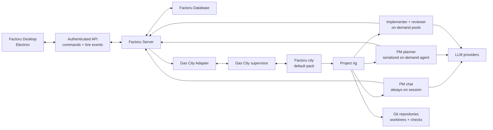
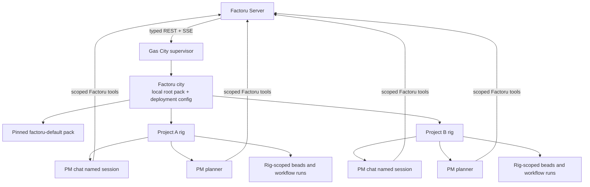
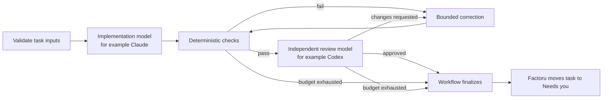

# Factoru Roadmap

> Status: implementation starting point
> Last updated: 2026-08-04

This is the single delivery roadmap for Factoru. It intentionally starts with a
small, coherent product and keeps the broader graph-orchestration vision as a
later direction. The
[future graph-orchestration note](./future/graph-orchestration.md) is not a
second implementation plan. [ARCHITECTURE.md](./ARCHITECTURE.md) is the living
map of planned and implemented system boundaries.

## Product statement

Factoru is a personal development team that runs on infrastructure the user
controls.

The user installs **Factoru Server** on an always-on machine such as a Mac mini,
Raspberry Pi, Linux server, or their own laptop. They install the **Factoru
Desktop** Electron app on their personal Mac or Linux computer and connect it to
that server. Running both applications on the same machine is a supported
one-click setup, not a different architecture.

Inside each project, the user primarily talks to a Project Manager. The Project
Manager turns conversation into tasks, reconciles repeated requests, orders the
work, and delegates implementation. The user does not have to maintain the
board manually. The Tasks and Workers views make the Project Manager's actions
visible and configurable.

The initial promise is deliberately narrow:

> Tell the Project Manager about one change—or capture it in Backlog and queue
> it—then let a Software Engineer implement and internally review it through Gas
> City and receive a useful result in **Needs you**.

## Product vision

The MVP is intentionally serial and constrained, but it must grow toward six
defining product capabilities:

1. **Automatic orchestration for all tasks.** The user describes a bug, feature,
   or requirement to the Project Manager or drops a rough thought into Backlog.
   When the user queues it, Factoru turns it into durable planned work,
   determines dependencies and safe parallelism, delegates it through Gas City,
   verifies the result, and runs internal multi-agent review before asking the
   user to review anything. The user can inspect and interrupt this process but
   should not have to coordinate it manually.
2. **Automatic task reconciliation.** Every new request is compared with active
   and recent work before a task is created. A repeated bug report should merge
   into the existing task as new evidence or scope rather than create a
   duplicate. Uncertain matches are explained and brought to the user instead
   of being merged silently.
3. **Tiered task-run capsules.** Each concurrently executing task run or
   independently scheduled Formula unit receives one managed capsule; ephemeral
   agent sessions do not receive competing capsules. Isolation grows from a Git
   worktree and resource leases, to containerized project services, and only
   later to a fully containerized worker where justified. A capsule can own its
   branch, ports, processes, environment, Docker Compose identity, databases,
   logs, artifacts, health checks, and safe cleanup.
4. **A visual Kanban control surface.** Backlog is a user-editable thought dump:
   the user can add rough items without first explaining or structuring them.
   Moving an item to Queue explicitly asks the Project Manager to reconcile,
   clarify, prioritize, plan dependencies, and assign a Worker Type/formula.
   The board remains Backlog, Queue, In progress, and Needs you.
5. **Configurable worker factories.** A Worker Type owns versioned prompt policy,
   durable role memory, one or more model bindings, scoped Factoru tools, a
   default formula, and capacity policy. Project Factory settings cap parallel
   implementation workers while the Project Manager decides which tasks are
   logically safe to run together.
6. **One formula-native experience.** Factoru gives Gas City a coherent product
   UX rather than separate simple and advanced modes. Curated Factory Templates
   make the product immediately usable; the same interface progressively gains
   Formula selection, run inspection, and safe customization without forcing
   users to understand raw Gas City configuration.

The **Project Manager** is Factoru's user-facing master-agent role. Factoru
defines its behavior and durable product responsibilities; Gas City provides
the underlying formula-driven orchestration for autonomous task execution. It
is not presented as a built-in Gas City primitive.

## Decisions already made

1. Factoru is one monorepo with two independently deployable applications:
   `factoru-desktop` and `factoru-server`.
2. The desktop is a client. Persistent product data and autonomous work live on
   the server.
3. Gas City is a core server-side orchestration dependency behind a narrow
   Factoru adapter.
4. T3 Code is a reference for interaction and implementation ideas. Factoru
   will have its own UI and will not begin as a T3 fork.
5. macOS is the first desktop target. Linux desktop packaging follows later.
   The server must target macOS and Linux early because remote installations are
   part of the initial architecture.
6. The first visible Worker Types are **Project Manager** and **Software
   Engineer**. A Worker Type may bind multiple Gas City agents/models: the
   Software Engineer initially exposes separate implementation and review model
   slots.
7. Projects and tasks are Factoru entities stored by Factoru Server. Gas City
   execution records are linked to tasks but do not replace the product model.
8. The board has exactly four active statuses: **Backlog**, **Queue**,
   **In progress**, and **Needs you**.
9. The first execution path is serial with a work-in-progress limit of one.
   Parallelism is added only after the single-task loop is trustworthy.
10. Every agent runtime, including the Project Manager chat agent, is launched
    and managed through Gas City. Factoru will not build a parallel provider
    session runtime.
11. One Factoru Server initially manages one dedicated Gas City city, while each
    repository-backed Factoru project maps to one rig in that city. The
    machine-level Gas City supervisor may also host unrelated cities.
12. Factoru ships a versioned default Gas City pack. It contains the role
    prompts, agent definitions, doctor checks, tool wiring, and Formula v2
    workflows that make Gas City behave like Factoru.
13. Backlog is directly editable by the user. Moving a card to Queue is the
    explicit trigger for durable Project Manager reconciliation; it does not
    immediately promise execution.
14. Project Manager chat and queue planning are separate Gas City agent
    identities grouped into one visible Worker Type. Chat stays always-on while
    queue reconciliation is serialized and event-driven.
15. Factoru has one progressively disclosed interface. It does not fork into
    beginner and expert modes as Formula and run controls are added.
16. Gas City agents and sessions are the durable worker boundary. Native
    Claude/Codex subagents may assist inside a bounded step, but they are not
    independently scheduled or presented as Factoru workers.
17. A capsule belongs to a task run or independently scheduled Formula unit,
    not to an implementer or reviewer session. Implementer and reviewer steps
    for one run operate on the same capsule, with role-appropriate permissions.
18. The host-local Gas City supervisor and its reachable cities are one trusted,
    single-operator runtime domain for the MVP. Rig prefixes are logical scopes,
    not adversarial isolation; Gas City and Dolt listeners are never exposed to
    the desktop or proxied through Factoru's remote API.

## Product experience

### First launch

The desktop opens to a connection screen with two paths:

- **Connect to a Factoru Server** using a server address and a secure pairing
  flow.
- **Run on this device** by installing or starting the same Factoru Server
  distribution locally and connecting over localhost.

The desktop remembers trusted servers and clearly shows which server is active.
Changing servers changes the visible projects because projects belong to the
server, not the laptop.

### Main workspace

The initial layout follows the supplied mockup while remaining Factoru's own
design:

- **Left sidebar:** server state, project list, project activity summary, add
  project, and settings.
- **Center:** the selected project's Project Manager conversation and message
  composer.
- **Right pane:** switchable **Tasks** and **Workers** tabs.
- **Tasks:** four columns—Needs you, In progress, Queue, and Backlog—with compact
  cards and worker/run indicators.
- **Workers:** Project Manager and Software Engineer profiles with prompt,
  memory, model-slot, tool, workflow, health, and capacity summaries.
- **Factory settings:** maximum parallel implementation workers, initially
  locked to one until capsules are proven.
- **Workflow/run detail:** the selected task can progressively expose its
  Formula, beads, dependencies, sessions, evidence, and capsule resources in
  the same workspace. There is no separate operational mode.

The conversation is the primary control surface for direction. Backlog is the
intentional exception: a fast manual capture surface. Queue and later columns
remain orchestrated rather than requiring the user to schedule workers.
Factoru remains opinionated rather than becoming a generic Gas City dashboard:
native runtime detail is translated into project and task language and disclosed
where it helps explain or control the current work.

### Projects

A Factoru project initially contains:

- a name and optional description;
- one server-local Git repository path;
- a default branch;
- Project Manager and Software Engineer settings;
- project Factory capacity and resource policy;
- versioned project and per-Worker-Type memory;
- one Project Manager conversation;
- tasks and their conversation links;
- Gas City city/rig binding, formula selection, and run references;
- commands for setup, verification, and tests.

Remote Git cloning and multi-repository projects can come later. For the first
version, a repository must already be available to Factoru Server.

### Task lifecycle

The user or Project Manager may create and edit Backlog items. The user may move
a Backlog item to Queue to request orchestration. From Queue onward, the Project
Manager normally owns reconciliation, splitting/merging, priority, dependencies,
Worker Type/formula assignment, and readiness; direct user control remains an
explicit override rather than routine scheduling work.

The active statuses mean:

| Status | Meaning |
| --- | --- |
| **Backlog** | User-editable thought dump; may be incomplete, duplicated, or unplanned. |
| **Queue** | Requested for Project Manager reconciliation and eventual execution; may still be triaging, dependency-blocked, or capacity-waiting. |
| **In progress** | An accepted Gas City implementation workflow is actively executing. |
| **Needs you** | Waiting for user clarification, approval, or review. |

Completion does not require a fifth column. Accepted, rejected, cancelled, and
superseded tasks receive a terminal resolution and leave the active board while
remaining searchable in history.

Queue cards show a phase badge without adding columns: Awaiting triage,
Triaging, Ready, Waiting for dependency, or Waiting for capacity. Queueing and
edits trigger an idempotent, coalesced Project Manager planning bead. A separate
planner identity handles it so the always-on chat session remains responsive.

Before creating a task, the Project Manager compares the request with active and
recent tasks. It may create a new task, update an existing task, link related
work, or ask the user to clarify. Automatic semantic merging is a later feature;
the first version may use a simple candidate search plus explicit reasoning.

### Worker Types, models, memory, prompts, and tools

The first two configurable Worker Types are:

- **Project Manager:** an always-on chat agent plus a separate on-demand planner
  limited to one concurrent queue-reconciliation pass. Both use the same
  project/role memory and tool policy, but they do not pretend to share a live
  context window.
- **Software Engineer:** an implementer pool plus an independent reviewer pool.
  Its default `software-delivery` formula routes implementation, deterministic
  checks, review feedback, bounded correction, and finalization.

Each Worker Type owns:

- a versioned base system prompt from the Factoru pack plus project overrides;
- named model bindings—for example Project Manager `chat`/`planning`, and
  Software Engineer `implementation`/`review`;
- allowlisted Factoru tools for its individual agent bindings;
- project-scoped durable role memory with provenance and explicit updates;
- a default formula and bounded retry/correction policy;
- capacity and health information.

For example, a user can configure Claude for `implementation` and Codex for
`review`. Those are two Gas City agents/sessions coordinated by a formula, not
one worker process changing models mid-session. Provider credentials remain
server secrets and are never returned to the renderer.

Memory is layered: project memory, Worker-Type role memory, task/run state in
Factoru plus beads/artifacts, and per-session transcripts. Pool instances share
durable state through scoped tools and beads, not shared in-process memory.
Permanent memory writes are proposed with source/provenance and validated rather
than silently appended by a model.

## System architecture



### Monorepo shape

```text
factoru/
├── apps/
│   ├── desktop/          # Electron application
│   └── server/           # Always-on Factoru service
├── packages/
│   ├── protocol/         # Shared API schemas, events, and client contract
│   ├── domain/           # Framework-independent product types and rules
│   ├── database/         # Schema, migrations, and repositories
│   ├── gas-city/         # Narrow Gas City adapter
│   ├── ui/               # Factoru design system and shared UI primitives
│   └── config/           # Shared build and lint configuration
├── packs/
│   └── factoru-default/  # Agents, prompts, tools, checks, and Formula v2
├── templates/
│   └── software-project/ # Built-in Factoru Factory Template manifest
├── docs/
│   ├── ARCHITECTURE.md
│   ├── ROADMAP.md
│   └── future/
│       └── graph-orchestration.md
└── AGENTS.md
```

The intended starting toolchain is TypeScript, pnpm workspaces, Electron, and a
React renderer. Exact server and database libraries should be selected during
the first vertical slice and recorded as architecture decisions.

### Deployment topologies

Both topologies use the same protocol:

1. **Local:** desktop connects to Factoru Server on localhost.
2. **Remote:** desktop connects to Factoru Server on an always-on device over a
   private network or user-configured secure endpoint.

The server is distributed independently as a container and, where practical, a
native service. Initial server targets are macOS arm64 and Linux arm64/x86_64.
Raspberry Pi support depends on validating Gas City and all of its runtime
dependencies on Linux arm64; this is an early technical risk, not an assumed
fact.

### Connection and security baseline

- Bind to localhost by default.
- Require authentication for every non-local connection.
- Use a short-lived pairing code to issue a revocable device credential.
- Require TLS for traffic outside localhost, either directly or through a
  documented private-network/reverse-proxy setup.
- Expose only Factoru Server remotely. Keep Gas City supervisor/controller,
  dashboard, and managed Dolt listeners host-local; Gas City's read plane is not
  a substitute for Factoru authentication and must not be reverse-proxied to
  desktop clients.
- Keep provider credentials, repository credentials, and command execution on
  the server.
- Never expose arbitrary server filesystem access through the renderer.
- Record important task and execution changes in an audit/event log.

### Persistence and source-of-truth boundaries

Use an embedded transactional database—initially SQLite in WAL mode—for Factoru
product data. It is fast, portable, easy to back up, and appropriate for one
user operating an always-on personal server. A server database adapter keeps a
future migration possible.

Factoru Server owns:

- trusted clients and connection settings;
- projects and repository configuration;
- conversations and messages;
- task identity, status, Queue phase, priority/order, cross-task dependencies,
  resource intent, resolution, and user-facing history;
- Worker Types, prompt overrides, named model bindings, tool/memory policies,
  and project Factory capacity;
- versioned project and role memory with provenance;
- links between tasks and Gas City runs;
- cached projections used by the UI.

Gas City owns:

- its dedicated city configuration and runtime;
- rig registration and bead namespace/prefix behavior;
- loaded packs, effective agent configuration, and live sessions;
- materialized formula execution;
- bead dependency/readiness state;
- agent assignment and execution progress;
- orchestration events and run artifacts represented by Gas City.

Git owns commits, branches, worktree contents, and diffs. The preferred validated
split gives Gas City worktree lifecycle and Factoru the correlated capsule's
non-Git leases; the OS/container runtime owns actual live processes and service
resources. Factoru may cache external state, but there must be one authoritative
owner for every mutable field and lifecycle transition.

### Desktop/server protocol

The shared protocol package defines versioned schemas for commands, queries,
errors, and live events. The desktop should be able to:

- check compatibility and server health;
- pair, authenticate, and reconnect;
- list, create, and open projects;
- stream Project Manager messages and tool activity;
- observe task and worker updates;
- submit clarification, approval, and review decisions.

The renderer never imports the database or Gas City adapter. All privileged
operations cross an Electron preload boundary and then the authenticated server
API.

## Gas City's role

Gas City is Factoru's agent and orchestration runtime, not the product database,
Kanban model, remote desktop API, or task-priority policy. Factoru Server is the
only product component that talks to it, through `packages/gas-city`.

### Gas City concept map

| Concept | How Factoru uses it |
| --- | --- |
| **Supervisor** | The local machine control plane. It can host unrelated cities, so Factoru manages only its own city. |
| **City** | One dedicated Gas City deployment per Factoru Server, stored below the server data root and named from `server_id`. |
| **Rig** | The Gas City registration and bead namespace for one repository-backed Factoru project. |
| **Pack** | The versioned definition of Factoru's agents, prompts, tools, doctor checks, and formulas. The city imports the pinned default pack. |
| **Agent** | One configured runtime role. Factoru Worker Types bind lower-level chat, planner, implementer, and reviewer agents; Gas City hardcodes none of them. |
| **Session** | One live agent instance. PM chat stays available, PM planning is serialized on demand, and implementer/reviewer pools scale on demand while bead work remains durable. |
| **Bead** | Gas City's durable execution unit. Formula roots and steps are beads, but Factoru tasks remain separate product entities. |
| **Formula v2** | A reusable routed work graph. It coordinates agent roles/models and dependencies; it does not define a Worker Type by itself. |
| **Convoy** | A tracked group of beads. Later it can hold decomposed work and feed safe fan-out; it is not the Kanban board. |
| **Event** | A sequenced immutable observation consumed through SSE for projection, recovery, and diagnostics. |
| **Order** | A scheduled/event trigger for formulas or trusted exec work. Later useful for maintenance, but not the MVP Queue scheduler. |

The default topology is:



The Project Manager path is Gas City's external-messaging protocol. The
documented client-registration plus per-conversation SSE `subscribe` stream does
not exist in the pinned 1.4.0 release; the real surface registers an adapter,
binds a conversation to an **agent name** so the binding survives session
restarts, posts turns to `extmsg/inbound`, and reads replies from
`extmsg/transcript` with `after_sequence`, acknowledging through
`transcript/ack`. Factoru persists both sides of the conversation and forwards
them to the desktop. That transcript sequence is a durable cursor on both sides,
which is a better fit for resumable delivery than a subscription would have
been. The Gas City endpoint never leaves the server. The Project Manager maintains Factoru tasks through a
narrow project-scoped tool interface, not by editing SQLite or treating chat
text as a database command. The exact transport must be proven per harness:
Gas City currently catalogs MCP but does not automatically attach every
catalogued server to agent sessions.

A Backlog task has no Gas City work. Moving it to Queue creates or reuses a
durable `queue-reconcile` planning bead for the serialized PM planner. After the
plan is accepted and capacity/dependencies allow execution, Factoru records a
`task_run` linking the task to the city, rig, resolved pack/formula version,
workflow-root bead, event cursor, and request ID.
Child step beads and Gas City's `open → in_progress → closed` lifecycle remain
execution detail. A terminal workflow becomes a Factoru review package and moves
the task to Needs you; it does not become a fifth Kanban column.

The `factoru-default` pack supplies `queue-reconcile` and the first
`software-delivery` Formula v2 workflow:



The formula uses real `needs` dependencies and routes each step to the Worker
Type's selected agent/model binding. It is the workflow, not the worker
definition. A Gas City agent remains one configured runtime role; Factoru's
Software Engineer profile composes the implementer, reviewer, tools, memory
policy, model slots, capacity, and formula.

Use a Gas City `check` budget of two total review attempts (initial attempt plus
one correction) and narrow `retry` only for transient, idempotent failures. The
reviewer is a dedicated on-demand agent/session using the Software Engineer
profile's `review` model binding. Exhausted runs still finalize into Needs you
with the exact failure, evidence, and requested action.

Gas City has no separate subagent primitive in Factoru's model. Work that needs
its own status, scheduling, model, memory, recovery, review, or capsule becomes a
durable bead routed to a Gas City agent/pool. A provider such as Claude or Codex
may spawn native subagents inside one implementation step, but those helpers
remain opaque, bounded implementation detail under the parent session and
capsule. They do not consume a separately configurable Factoru worker slot or
replace Formula fan-out.

Factoru dispatches user work explicitly—the typed API equivalent of slinging a
formula—after its Queue and WIP policy accepts it. It does not use an Order to
watch the Factoru database, because two schedulers would disagree. Later Formula
v2 drain/convoy patterns can fan decomposed work into separate contexts, but the
MVP keeps one active implementation run.

Later, `max_parallel_implementation_workers=3` maps to an implementer-pool cap
of three, while higher rig/workspace safety caps reserve room for PM chat,
planning, review, and control sessions. The Project Manager decides task-level
dependencies, resource conflicts, priority, Worker Type, and formula. Gas City
decides which materialized beads are ready and assigns concrete pool sessions.
Three is therefore a ceiling, not an instruction to force three tasks to run.

The adapter must remain narrow enough to test against a real Gas City instance
and replace without rewriting product code. It should prefer the documented
typed REST/SSE API, resume event and reply streams from persisted cursors, wait
for terminal request events after asynchronous `202` responses, and map Gas City
Problem Details codes into Factoru errors. CLI JSON is acceptable for install or
doctor gaps; human-readable CLI output is not an integration contract.

We must operationally validate installation and pinned versions, coexistence
with other cities, city/rig recovery, named-session chat isolation, config
reload, event duplication/replay, cancellation, `.beads/` changes inside an
existing repository, worktree ownership, upgrades, and Linux arm64 support.

Factoru's UI is formula-native but does not treat the whole product experience
as a Formula. Chat, Backlog, Kanban state, Worker Types, permissions, memory,
Factory policy, and human review remain Factoru product concepts around durable
Formula runs. The initial UI renders the useful projection of those runs; over
time the same task and Worker surfaces reveal more of the underlying graph and
controls without introducing a separate mode.

The accessible distribution unit is a versioned **Factoru Factory Template**,
initially built in. It combines a pinned Gas City pack with Factoru Worker
Types, named model slots, tool and memory policies, Formula defaults, capsule
requirements, and UI metadata. The built-in software template supplies
`queue-reconcile` and `software-delivery` so a user can select models and start
without authoring orchestration.

Custom formulas remain part of the product vision. Customization should progress
through the same interface: choose a built-in template, clone its safe settings,
select or parameterize a validated Formula, and later import or author raw
Formula v2. Every chosen Formula/version is visible per project and run.
Importing a whole third-party pack is more powerful—it can contain commands,
MCP configuration, scripts, and runtime providers—so it requires pinning,
provenance, review, capability disclosure, and an explicit trusted-code warning.
The MVP avoids hardcoded step IDs in product logic so this progression can be
added without replacing the initial UX.

## Delivery roadmap

There is one sequence. Each milestone should leave behind a demonstrable
vertical slice and automated checks. Do not begin a later milestone merely
because the earlier UI looks complete.

### Milestone 0 — Walking skeleton

- Create the pnpm monorepo and the intended app/package boundaries.
- Add formatting, linting, typechecking, unit-test, and CI foundations.
- Define the first protocol handshake and compatibility response.
- Start an empty server and connect an empty Electron client to it locally.
- Give every development worktree a deterministic, collision-free server data
  directory and derived development ports from the beginning.
- Record architecture decisions for the server framework, API transport,
  database library, migrations, and packaging.

Exit: the desktop displays the health and version of a local Factoru Server
using shared runtime-validated protocol types, and the same checks run locally
and in CI.

### Milestone 1 — Gas City feasibility gate

Prove the core dependency and its vocabulary against a disposable repository
before designing durable Factoru product behavior around it. Everything in this
milestone is a thin probe or adapter seam, not a second orchestration runtime.

- Pin a tested Gas City binary/CLI release and the authoritative OpenAPI schema.
  **Resolved:** pinned to 1.4.0 (`>=1.4.0 <1.5.0`); the authoritative contract is
  the document the running supervisor serves at `/openapi.json`, which diverges
  from the documentation site. See
  [ADR 0007](./adr/0007-gas-city-compatibility-and-transport.md) and the
  [gate record](./spikes/milestone-1-gas-city-gate.md).
- Add installation/readiness checks for `gc`, Git, tmux, jq, Dolt, Beads, flock,
  and at least one configured agent harness. Enforce the pinned release's Dolt
  floor (current Gas City operations documentation requires final Dolt 2.1.0 or
  newer) rather than accepting any executable on `PATH`.
- Reuse the machine supervisor safely, provision a dedicated Factoru city under
  the server data root, verify an unrelated city remains untouched, and report
  that all host-reachable cities share the supervisor's single-operator trust
  domain. Keep all Gas City and Dolt listeners host-local.
- Implement the narrowest useful `packages/gas-city` adapter spike. Record which
  operations use typed REST/SSE, validated config generation/reload, or—only for
  a proven API gap—pinned `gc --json`; keep all raw DTOs inside the adapter.
- Before treating prompts, tools, or Worker Types as stable, prove one minimal
  authenticated Factoru tool round trip through both initial Claude and Codex
  harnesses. **Resolved:** both harnesses called a role-scoped probe tool.
  Gas City catalogues a pack's `mcp/` directory but never delivers it to a live
  session, so Factoru writes each harness's MCP config itself from
  `session_setup_script`, with an absolute server path and a per-session
  credential held by the server rather than the agent —
  [ADR 0010](./adr/0010-agent-tool-transport.md).
- Create a provisional `packs/factoru-default` skeleton with the four intended
  agent roles, doctor checks, and one tiny implement-then-independent-review
  Formula. Keep queue/task semantics out of this probe.
- Install the provisional pack through a pinned import/lock and verify config
  reload and rollback.
- Register one disposable repository as a rig and document every `.beads/` and
  Git working-tree change Gas City makes. **Resolved, with a defect:**
  `gc rig add` creates a git commit in the target repository and captured a
  user's staged change. The guard that refuses a dirty index and discloses every
  mutation exists and is tested in `packages/gas-city`; wiring it into an actual
  project-registration operation lands with projects in Milestone 2 —
  [ADR 0009](./adr/0009-rig-registration-safety.md).
- Start a rig-scoped, always-on Project Manager chat named session and complete
  external-message register/subscribe/send/reconnect through Factoru Server.
- Cook and run the tiny Formula as real beads, observe implementer-to-reviewer
  dependency routing, and verify that its worktree behavior matches or disproves
  the preferred ownership split. **Routing proven; the worktree split is
  disproven** — Gas City creates worktrees only for `drain` fan-out units, so
  Factoru owns worktree lifecycle for the single-task loop
  ([ADR 0008](./adr/0008-worktree-ownership.md)).
- Every agent Factoru binds to a Formula step must carry Gas City's
  `gc-role-worker` prompt fragment. Without it an agent completes its work and
  exits without closing its bead, and the workflow stalls with no error
  anywhere. This is a permanent constraint on the Worker Type contract.
- Consume the city event stream, persist its cursor, restart both processes, and
  resume without losing or duplicating the observed operation. A temporary
  probe store is sufficient; durable Factoru persistence begins in Milestone 2.

Exit: Factoru Server can provision a disposable city/rig, chat through a Gas
City named session, run and observe one real implement/review Formula across a
restart, and tear down only what it owns. Both initial harnesses call one scoped
Factoru probe tool, the adapter's transport map and worktree owner are recorded,
and there is enough evidence to make an explicit go/no-go decision before
building the product model.

> **Result: pass. The decision is go.** Every criterion was met against a real
> Gas City 1.4.0 installation, including an authenticated, role-scoped Factoru
> tool call from both the Claude and Codex harnesses. Gas City's own pack
> `mcp/` projection turned out never to reach a live session, so Factoru
> installs each harness's MCP config itself from `session_setup_script`
> ([ADR 0010](./adr/0010-agent-tool-transport.md)). Several architectural
> assumptions were disproven — worktree ownership, named-session scoping, and
> the external-client protocol — and are corrected here and in
> `ARCHITECTURE.md`. See the [gate record](./spikes/milestone-1-gas-city-gate.md).

### Milestone 2 — Persistence, projects, and remote connection

Build durable Factoru ownership only after the Gas City feasibility gate passes.

- Add SQLite connection policy, forward migrations, migration tests, command
  receipts, domain events, and the transactional outbox foundation.
- Implement stable server identity, pairing, device tokens, authorization, and
  revocation.
- Add local and remote server profiles to first launch; require TLS outside
  localhost and expose only the authenticated Factoru API.
- Persist projects and their Gas City city/rig binding in SQLite.
- Add/list/open projects from the desktop.
- Validate a server-local repository path and default branch before registering
  or reconciling its rig through the adapter.
- Stream bounded project changes to connected clients and resume from cursors.
- Reconcile projects, rigs, and connection state idempotently after Desktop,
  Server, or Gas City restart without making Gas City the source of truth for
  Factoru projects.

Exit: a Mac desktop securely connects to a server on another test machine,
creates a durable project around an existing repository, provisions its rig,
restarts all involved processes, and recovers the same authorized project state
without exposing Gas City or Dolt listeners remotely.

### Milestone 3 — Product shell and persistent Project Manager

- Build the project sidebar, center conversation, and right Tasks/Workers pane.
- Establish Factoru's visual tokens rather than copying T3 Code's UI.
- Promote the provisional pack's agent definitions into versioned Project
  Manager chat/planner and Software Engineer implementer/reviewer contracts.
- Create the built-in `templates/software-project` Factory Template manifest
  and persist its initial Worker Types, named model slots, prompt/tool/memory
  policies, capacity defaults, and eventual Formula binding points.
- Bind each Factoru conversation to the isolated Gas City Project Manager
  session using a stable conversation ID.
- Persist user/assistant messages in Factoru and resume both Factoru and Gas City
  SSE streams from cursors.
- Route a durable planner probe to the separate serialized PM planner while the
  named chat session remains responsive; production Queue reconciliation lands
  in Milestone 4.
- Store provider credentials only on the server and apply Project Manager and
  Software Engineer named model bindings as validated Gas City config.
- Persist versioned Worker Type prompt overrides, tool policies, and minimal
  project/role memory with explicit provenance.
- Show token usage, tool activity, Gas City/session health, errors,
  cancellation, and reconnect behavior without exposing Gas City credentials.
- Establish progressive disclosure inside the same workspace so later Formula,
  bead, and capsule detail extends these surfaces instead of creating another
  product mode.

Exit: the user can hold a persistent Project Manager conversation while a
separate planning bead runs, configure implementation/review models, and retain
bounded project/role memory without exposing credentials or losing history.

### Milestone 4 — Project Manager and four-state tasks

- Add the task schema, status invariants, terminal resolutions, event log, and
  task-run correlation records.
- Add the production `queue-reconcile` Formula to `factoru-default` and bind it
  as the Project Manager Worker Type's planning workflow.
- Let the user create/edit rough Backlog cards directly and move them to Queue.
- Make every Queue transition/edit create or coalesce one idempotent
  `queue-reconcile` planning bead; show its Queue phase on the card.
- Render the four-column board from Factoru state; do not project raw bead
  statuses as columns.
- Expose project-scoped Project Manager tools to search, create, update, move,
  queue, merge/propose-merge, and resolve tasks.
- Authenticate every agent-tool call by project and role and record it in the
  Factoru audit trail.
- Add simple candidate matching so the Project Manager can recognize likely
  duplicate requests before creating a task.
- Require explicit user confirmation for ambiguous merges initially.
- Add Queue capacity policy with an execution WIP limit of one.

Exit: both chat and direct Backlog capture create persistent tasks; Queueing
triggers one serialized PM planning pass that can merge/split, prioritize, set
dependencies, and select a Worker Type/formula without blocking chat or
duplicating/crossing project state.

### Milestone 5 — `software-delivery` Formula v2 operational spike

Run the real `software-delivery` workflow from the `factoru-default` pack against
at least ten small tasks in disposable test repositories before coupling it to
the production board loop.

- Replace the Milestone 1 probe Formula with the versioned production candidate
  and bind it to the Software Engineer Worker Type in the built-in template.
- Validate formula variables, routes, compiler requirements, pack/formula
  version capture, and workflow-root correlation before dispatch.
- Add Factoru-side semantic validation for the pinned Formula v2 release:
  enforce variable types, reject inert `until`/gate/waits-for behavior, prefer
  `drain` over deprecated fan-out, enforce drain limits, refuse v2 converge, and
  cook/sling rig-scoped work in the target rig's store.
- Materialize and observe implementation, deterministic checks, independent
  review, one bounded correction, and workflow finalization as beads with real
  `needs` edges.
- Verify that engineer/reviewer sessions can die or be adopted without losing
  bead progress.
- Exercise API duplicate requests, event replay, cancellation, process restart,
  config reload, transient retry, exhausted budgets, and partial failure.
- Run each task in a clean worktree and validate the preferred ownership split:
  Gas City owns Git worktree creation/cleanup, while Factoru owns the correlated
  capsule identity and non-Git resource leases. Adopt a different split only if
  the real integration disproves it.
- Measure acceptance quality, human review time, model cost, review usefulness,
  test outcomes, and merge/conflict failures.
- Test macOS arm64 and Linux arm64/x86_64 where available.

Exit: at least 6 of 10 representative tasks are accepted with no or minor user
changes, median user review takes under 10 minutes, no repository is damaged,
review feedback is meaningfully useful, and cost is visible. If the result is
poor, refine the pack or integration boundary before adding parallelism.

### Milestone 6 — Single-task production loop

- Admit one PM-planned ready task from Queue to In progress when Factoru policy,
  dependencies, and capacity allow.
- Sling it through the validated Gas City adapter and selected Formula v2.
- Persist city, rig, formula/pack version, workflow root, request ID, and event
  cursor on the task run.
- Create one worktree-level capsule identity for the task run and keep its
  implementer and reviewer steps correlated to that same capsule.
- Stream stage, logs, checks, cost, and failure state into the task card while
  keeping raw step beads in a run-details view.
- Build a Needs you review package containing the request, plan, diff, commits,
  checks, internal review, unresolved risks, and model usage.
- Support approve, request changes, retry, cancel, and archive.
- Serialize integration: update against the latest target branch, report or
  resolve conflicts, rerun checks, and only then request human approval.
- Apply backpressure while Needs you already contains unresolved review work.

Exit: one real task travels from conversation to reviewed diff without manual
board management and safely survives desktop, server, supervisor, and agent
restarts.

### Milestone 7 — Packaging and dependable operation

- Ship a signed/notarized macOS desktop build.
- Package the server for macOS and Linux with a pinned Gas City compatibility
  range and documented dependency installation.
- Add backup/restore for Factoru SQLite plus documented Gas City/Dolt recovery,
  migrations, diagnostics, logs, update policy, and health reporting.
- Monitor Dolt and Beads backup growth, free-space headroom, compaction status,
  quarantine, and store growth per task. Validate the pinned Dolt pack's
  maintenance order and a recovery drill that stops writers and budgets enough
  scratch space for full GC.
- Harden authentication, external-message token storage, agent-tool scoping,
  pack trust, secret storage, command policy, and audit history.
- Provide a clear local-server installation path from first launch.

Exit: a non-author machine can install the server on supported hardware,
connect the desktop, and complete the single-task production loop.

### Milestone 8 — Carefully add concurrency

- Complete tier-one capsules: Gas City-owned worktree/branch plus
  Factoru-owned ports, environment, process supervision, logs, health, locks,
  and cleanup/retention policy.
- Add tier-two isolation for projects that need it: keep the agent harness on
  the host while running task-specific application services under a unique
  Docker Compose project, database namespace/volume, and explicit resource
  limits.
- Treat a fully containerized worker as optional tier three. Validate provider
  authentication, hooks, caches, tool transport, filesystem ownership, and
  security before enabling it; do not require one container per agent session.
- Ensure Gas City and Factoru never manage the same worktree, container, port,
  process, or database lifecycle operation.
- Add explicit Factoru task dependencies/resource locks and correlate them to
  Gas City `needs` edges/convoys without creating two editable graphs.
- Enable `max_parallel_implementation_workers` in project Factory settings;
  map it to the implementer agent cap while reserving rig/workspace capacity for
  PM, planner, reviewer, and control sessions.
- Increase from one to two and then three independent tasks only after each
  level passes collision, recovery, and review-load checks.
- Keep integration serialized and rerun verification after rebasing.
- Display dependency, convoy, session, and capsule state without asking the user
  to schedule it.
- Compare throughput against accumulated Needs you time; parallelism is useful
  only if it reduces total user effort.
- On Linux arm64, benchmark an 8 GB Raspberry Pi-class host from one through
  four cloud-model implementation sessions with representative builds and
  services. Measure Dolt/backup growth per task and compaction cost as well as
  CPU, memory, and I/O. Four is a target measurement, not a support guarantee;
  admission must reduce effective capacity under CPU, memory, storage, or
  provider pressure.

Exit: setting the tested cap to three allows three eligible independent tasks to
run concurrently, while dependent/conflicting tasks remain gated, without
resource collision, context leakage, double scheduling, or increased review
confusion.

## Later roadmap

After the core loop proves useful:

- richer task reconciliation and automatic duplicate merging;
- additional Worker Types, specialist model slots, and multi-lane reviewers;
- task decomposition and dependency planning;
- a Formula v2 catalog with built-in, cloned, user-authored, and project-specific
  workflows, validation, parameterization, version pinning, run-time selection,
  and rollback in the same Factoru interface;
- explicitly trusted third-party pack imports only after provenance, review, and
  capability disclosure exist;
- Gas City Orders for opt-in maintenance/event automation, never as a hidden
  second owner of the Factoru Queue;
- progressively richer graph/run inspection and eventually visual Formula
  authoring inside the existing task and Worker experience;
- multi-repository projects;
- Linux Electron desktop distribution;
- terminal, file, and source-control conveniences inspired by T3 Code;
- trust policies for automatic low-risk integration;
- multi-user collaboration only if the personal-server model demonstrates a
  real need for it.

## Explicit early non-goals

- T3 Code fork or upstream synchronization
- separate beginner/simple and expert/advanced product modes
- visual graph editor
- formula marketplace
- unlimited autonomous correction loops
- multiple simultaneous implementation workers
- Docker/database/port capsule automation before concurrency
- one full container per ephemeral agent session as the default isolation model
- automatic merging without review policy
- mobile and web clients
- Windows support
- hosted Factoru cloud

## Success measures

The product succeeds by reducing user coordination and review effort, not by
maximizing concurrent agent count. Track from the first executable task:

- percentage of tasks accepted with no or minor changes;
- median time the user spends reviewing a task;
- time tasks wait in Needs you;
- useful versus noisy internal-review findings;
- cost and token usage per accepted task;
- test pass/fail and correction-loop counts;
- duplicate-task and reconciliation decisions;
- Queue-to-plan latency, coalesced versus duplicate planning passes, and chat
  responsiveness while planning runs;
- useful versus stale/incorrect memory retrievals and permanent-memory changes;
- requested versus effective implementation capacity and idle/blocked reasons;
- worktree, integration, and merge-conflict failures;
- crashes or restarts that require manual recovery.

## Open decisions

- Which TypeScript server framework and live-event transport best support both
  localhost and remote operation?
- Which SQLite library and migration tool work across the target server
  platforms?
- How should the server discover, install, pin, and upgrade Gas City?
- Should Factoru require a dedicated OS user/supervisor when the host also runs
  unrelated cities whose contents must not be readable by Factoru agents?
- Can rig-qualified always-on Project Manager sessions provide strict
  per-project chat isolation through the connected-client API?
- Which harness-specific MCP, provider-hook, or local bridge gives Gas City
  agents revocable, auditable, project/role-scoped Factoru tools, given that Gas
  City does not currently auto-attach catalogued MCP entries?
- Which facts belong in project memory versus role memory, and what approval,
  provenance, retention, and poisoning defenses govern permanent updates?
- What coalescing/version rule guarantees one PM planning pass without dropping
  Queue edits that arrive while it runs?
- How should implementation, review, and total rig/workspace caps reserve enough
  capacity to keep PM chat and review responsive?
- How should Factoru register an existing repository as a rig while explaining
  and safely managing Gas City's `.beads/` files?
- Can Factoru patch harness/model settings and reload the city without dropping
  or misrouting active conversations and runs?
- Can Gas City own worktree creation/cleanup while Factoru reliably binds one
  non-Git capsule lease to the same Formula unit and keeps implementer/reviewer
  steps in that shared worktree?
- What is the minimum Factoru Factory Template manifest needed to compose a
  pinned Gas City pack with Worker Types, model slots, memory/tools, Formula
  defaults, capsule requirements, and UI metadata?
- Which projects benefit from tier-two service containers, and what CPU, memory,
  log, network, cache, and secret defaults remain safe on personal servers?
- Can Gas City's session-runtime/provider axis supply tier-three container or
  pod isolation with default-deny access to Factoru, supervisor, and Dolt
  listeners, or must Factoru provide an additional runtime adapter?
- Can the complete Gas City dependency chain run dependably on Raspberry Pi
  class Linux arm64 hardware, and how many representative cloud-model workers
  fit an 8 GB host under measured build and service load?
- Which Gas City harnesses/models are the supported initial compatibility
  matrix, and how does Factoru expose discovery without leaking raw option
  schemas into its domain?
- What is the safest practical TLS/private-network onboarding experience for a
  personal server?
- Should local setup run the server as a login service, managed child process,
  or container?

Resolve these with small architecture decisions and executable spikes, not by
expanding the roadmap.

## Reference material

- [Gas City documentation](https://docs.gascity.com/)
- [Gas City tutorials](https://docs.gascity.com/tutorials)
- [How Gas City works](https://docs.gascity.com/getting-started/how-gas-city-works)
- [Gas City dashboard and security posture](https://docs.gascity.com/getting-started/dashboard)
- [Gas City installation and runtime dependencies](https://docs.gascity.com/getting-started/installation)
- [Gas City cities and rigs tutorial](https://docs.gascity.com/tutorials/01-cities-and-rigs)
- [Gas City agents tutorial](https://docs.gascity.com/tutorials/02-agents)
- [Gas City sessions tutorial](https://docs.gascity.com/tutorials/03-sessions)
- [Gas City communication tutorial](https://docs.gascity.com/tutorials/04-communication)
- [Gas City beads tutorial](https://docs.gascity.com/tutorials/06-beads)
- [Gas City connected-client guide](https://docs.gascity.com/guides/connected-clients)
- [Gas City context, state, skills, history, roles, and identity](https://docs.gascity.com/guides/capabilities-for-coding-agent-users)
- [Gas City configuration reference](https://docs.gascity.com/reference/config)
- [Gas City packs](https://docs.gascity.com/guides/understanding-packs)
- [Gas City formulas](https://docs.gascity.com/guides/understanding-formulas)
- [Gas City API](https://docs.gascity.com/reference/api)
- [Gas City bead storage topology](https://docs.gascity.com/reference/internal/beads-topology)
- [Gas City command trust boundaries](https://docs.gascity.com/reference/trust-boundaries)
- [Gas City formula specification v2](https://docs.gascity.com/reference/specs/formula-spec-v2)
- [Gas City direct-hardened deployment](https://docs.gascity.com/runbooks/remote-hardened-city)
- [Gas City Dolt bloat recovery](https://docs.gascity.com/troubleshooting/dolt-bloat-recovery)
- [Docker resource constraints](https://docs.docker.com/engine/containers/resource_constraints/)
- [Docker storage and copy-on-write](https://docs.docker.com/engine/storage/drivers/)
- [T3 Code repository](https://github.com/pingdotgg/t3code)
- [Factoru living architecture](./ARCHITECTURE.md)
- [Future graph orchestration](./future/graph-orchestration.md)
