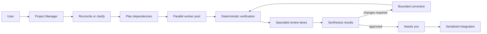

# Future Graph Orchestration

> Status: deferred design direction
> Last reviewed: 2026-08-04
> Implementation authority: none until the activation criteria below are met

This note preserves the long-term case for graph-based orchestration without
making it part of Factoru's current implementation scope. The current system
architecture and implementation status live in
[ARCHITECTURE.md](../ARCHITECTURE.md); delivery order lives in
[ROADMAP.md](../ROADMAP.md).

## Why this may be needed

The fixed Project Manager → Software Engineer → verification → internal review
workflow is enough to test Factoru's central value. If the product succeeds,
real projects may eventually require:

- several specialist workers with different responsibilities;
- task dependencies and safe parallel execution;
- deterministic checks and conditional routing;
- fan-out to independent workers and fan-in of their results;
- human clarification or approval at specific points;
- bounded correction and retry loops;
- exclusive access to ports, containers, databases, or environments;
- failure escalation and partial-result handling;
- reusable, versioned workflow definitions.

A typed graph can make those relationships explicit. Loops remain useful inside
individual nodes, but they are not sufficient to describe the organization of
an entire development workflow.

## Possible future product model

- **Task:** one durable bug, feature, or desired outcome.
- **Graph definition:** a versioned set of typed nodes, edges, policies, and
  model/resource bindings.
- **Formula:** the Gas City execution definition associated with or generated
  from a Factoru graph.
- **Factory Template:** the Factoru bundle that selects a pinned Gas City pack,
  Worker Types, model/tool/memory defaults, Formulas, and capsule requirements.
- **Run:** one immutable execution snapshot for one task and graph version.
- **Capsule:** the resource lease assigned to an implementation unit, including
  its worktree and runtime isolation.
- **Kanban:** the user-facing projection of tasks and their active runs—not the
  graph-authoring interface.

Users continue talking to the Project Manager and observing the board. Formula
inspection and later authoring are progressively disclosed in those same task
and Worker surfaces; Factoru does not introduce separate simple and advanced
modes or require graph manipulation for normal work.

## Illustrative ideal graph

This diagram is a design hypothesis, not an accepted implementation plan.

The production graph may be smaller or structurally different. It should emerge
from observed workflow needs rather than this diagram.

## Candidate node categories

| Category | Purpose | Examples |
| --- | --- | --- |
| **Agent** | Model-driven judgment or implementation | planner, engineer, reviewer |
| **Tool** | Deterministic operation | tests, typecheck, security scan, diff generation |
| **Control** | Workflow semantics | fan-out, join, route, retry budget, timeout |
| **Human** | Explicit user decision | clarification, approval, conflict resolution |
| **Resource** | Acquire and release isolated capacity | worktree capsule, port lease, database namespace |
| **Integration** | Apply or publish accepted work | rebase, merge, push, pull request |

These categories are provisional. Do not create a generalized node framework
until real workflows demonstrate which distinctions matter.

## Candidate edge semantics

| Edge | Meaning |
| --- | --- |
| `needs` | Target cannot start before source succeeds. |
| `artifact` | Source output becomes typed target input. |
| `fan_out` | Create independently routable work units. |
| `join` | Wait for a defined set of upstream results. |
| `route` | Choose a branch from an explicit outcome. |
| `feedback` | Return to an earlier node under a bounded correction policy. |
| `escalate` | Move unresolved work to a human or higher-authority role. |
| `resource_lock` | Prevent overlapping use of a named resource. |

Edges must represent durable semantics, not visual decoration. Every edge type
needs defined persistence, cancellation, recovery, and UI behavior.

## Relationship to Gas City

Factoru should not build a second scheduler. A future graph is the product and
authoring model; Gas City remains the execution substrate wherever its formula
and bead semantics fit.

| Factoru concept | Possible Gas City representation |
| --- | --- |
| Saved graph | Versioned formula plus Factoru metadata and supporting pack assets |
| Task run | Materialized formula workflow correlated to a Factoru task/run ID |
| Dependency | Bead `needs` relationship |
| Parallel worker set | Formula v2 routing and separate-context drain |
| Sequential lane | Shared-context or explicit dependency chain |
| Deterministic check | Formula step/check or allowlisted script |
| Bounded correction | Explicit feedback edge with attempt budget |
| Run progress | Gas City events projected into Factoru state |
| Human decision | Factoru-owned Needs-you state resumed through an adapter operation |

The mapping must be verified against a real Gas City installation. Factoru may
need metadata that Gas City does not natively model, but it must not duplicate
Gas City's mutable execution state.

Custom raw Gas City formulas remain a later extension of the same experience.
Imports require versioning, validation, capability declarations, trust policy,
and enough metadata to produce a useful task/run projection.

## Capsule representation

Capsules may eventually appear as resource nodes or resource-lock edges. One
capsule belongs to one task run or independently scheduled Formula unit, not to
each ephemeral implementer/reviewer session. It can include:

- Git worktree and branch;
- allocated ports and environment variables;
- supervised frontend/backend processes;
- Docker Compose identity, containers, networks, and volumes;
- isolated database file, schema, or namespace;
- logs, health checks, and test artifacts;
- safe cleanup and retention policy.

Isolation is tiered: worktree plus host resource leases first, task-specific
project-service containers second, and an optional fully containerized worker
only after its additional security and compatibility costs are justified. The
preferred ownership split gives Gas City the Git worktree lifecycle and Factoru
the correlated non-Git resource lease. The architecture spike must prove that
split; only one component may own a resource transition.

## Activation criteria

Graph implementation may enter the roadmap only after the serial product loop
is working and evidence shows that fixed orchestration is constraining useful
work. Before creating a node framework or graph editor, Factoru should have:

1. A dependable single-task Gas City workflow with bounded internal review.
2. Measured user acceptance, review time, model cost, and failure recovery.
3. Two-task concurrency proven with isolated capsules and serialized
   integration.
4. Several real workflows that cannot be expressed cleanly by configuration of
   the fixed formula.
5. Operational evidence about Gas City formula versioning, event correlation,
   cancellation, and restart behavior.
6. A written decision that a separate Factoru graph definition provides value
   beyond a Gas City formula plus Factoru metadata.

Until then:

- ship one built-in Factoru Factory Template around the `factoru-default` pack
  with fixed `queue-reconcile` and `software-delivery` formulas;
- keep the formula registry boundary replaceable;
- expose no drag-and-drop graph editor;
- add no arbitrary node-plugin system;
- avoid speculative per-node model and prompt settings.

## Questions to answer later

- Is a Factoru graph definition necessary, or is a Gas City formula plus typed
  Factoru metadata sufficient?
- Which node and edge types appeared repeatedly in real task histories?
- Where do immutable graph and model snapshots live for each run?
- Which custom-formula capabilities can be trusted on a personal server?
- How are active runs migrated—or deliberately not migrated—when definitions
  change?
- Does additional parallelism reduce total user effort or merely grow Needs you?
- What is the smallest useful inspector before considering visual authoring?

## References

- [Factoru architecture](../ARCHITECTURE.md)
- [Factoru roadmap](../ROADMAP.md)
- [Gas City formula specification v2](https://docs.gascity.com/reference/specs/formula-spec-v2)
- [Gas City formula guide](https://docs.gascity.com/guides/understanding-formulas)
